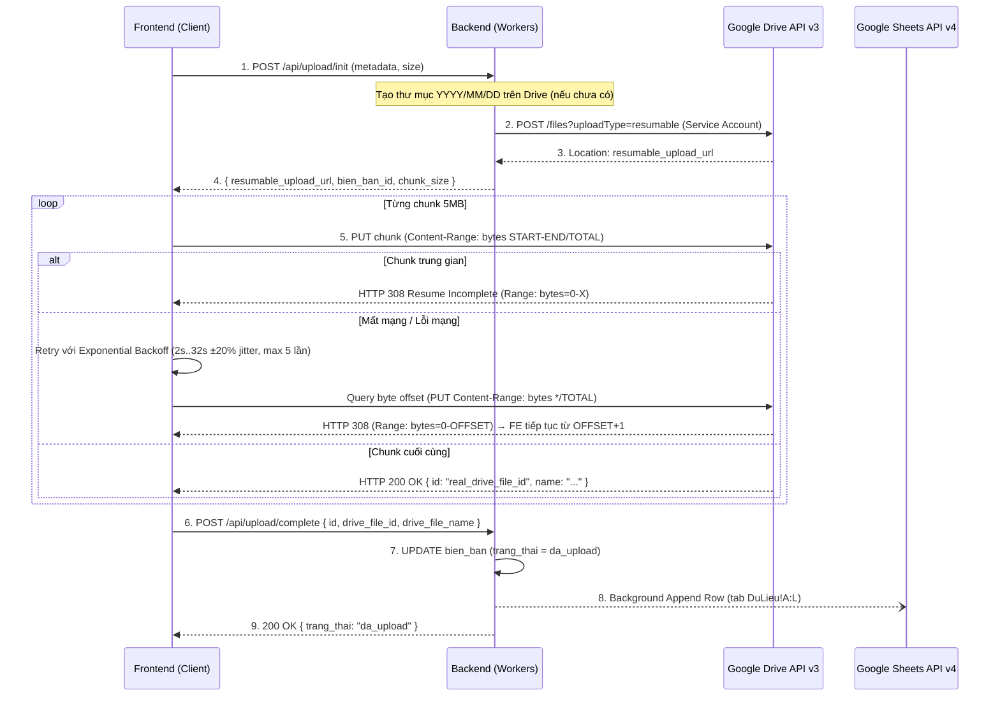

# 04 — TÍCH HỢP GOOGLE DRIVE & MÔ HÌNH DỮ LIỆU

## 1. Phương án kết nối Google Drive

**Khuyến nghị: Service Account + Shared Drive**, quản lý qua Backend trung gian (không phải OAuth cá nhân từng nhân viên):

1. Admin tạo project trên Google Cloud Console, bật Google Drive API.
2. Tạo **Service Account**, tải file JSON credentials — chỉ lưu ở Backend (biến môi trường/secret manager), **không bao giờ đưa vào code frontend**.
3. Tạo một **Shared Drive** (Drive dùng chung) trong Google Workspace của công ty, thêm Service Account làm thành viên có quyền "Content Manager" (ghi được file).
4. Backend dùng Service Account để gọi Drive API thay mặt hệ thống — không phụ thuộc tài khoản cá nhân nào, không mất quyền khi nhân viên nghỉ việc.

> Lưu ý: nếu công ty dùng Google Drive cá nhân (không phải Google Workspace), Service Account **không tự có dung lượng lưu trữ riêng** — bắt buộc phải dùng Shared Drive (yêu cầu gói Google Workspace) hoặc chia sẻ một thư mục cụ thể từ tài khoản admin cho Service Account. Cần xác nhận công ty đã có Google Workspace trước khi triển khai.

---

## 2. Cấu trúc thư mục trên Drive

```
[Shared Drive] DongGoi_Videos/
 └── 2026/
      └── 09/
           └── 14/
                ├── DongGoi_GHN0123456789_GHN_NV003_20260914_143022.webm
                └── KhuiHang_GHN0123456789_GHN_NV003_20260914_150501.webm
```

**Quy tắc đặt tên file:**
```
{LoaiBienBan}_{MaVanDon}_{DonViVC}_{MaNhanVien}_{YYYYMMDD_HHmmss}.webm
```
*(Trong đó `LoaiBienBan` là `DongGoi` hoặc `KhuiHang`).*

---

## 3. Mô hình dữ liệu

### 3.1 Bảng `bien_ban` (metadata, lưu ở Backend — Cloudflare D1)

| Trường | Kiểu | Ghi chú |
|---|---|---|
| id | UUID | khoá chính |
| ma_van_don | string | mã quét được |
| don_vi_vc | string | GHN/GHTK/J&T/VTP/Ninja Van/Shopee Express/khác |
| loai_bien_ban | enum | dong_goi / khui_hang |
| ma_nhan_vien | string | |
| thiet_bi | string | "mobile" / "pc_webcam" / "laptop" — phục vụ thống kê sau này |
| thoi_gian_tao | datetime | |
| thoi_luong_video | int (giây) | |
| kich_thuoc_bytes | int | |
| drive_file_id | string | ID file thật trên Drive trả về sau khi tải chunk cuối |
| drive_file_name | string | Tên file vật lý lưu trên Drive |
| trang_thai | enum | cho_upload / dang_upload / da_upload / loi |
| thoi_gian_upload | datetime | Thời điểm upload thành công |

### 3.2 Đồng bộ ra Google Sheet (Dashboard tra cứu nhanh)
- Mỗi khi 1 bản ghi chuyển trạng thái `da_upload`, Backend kích hoạt tác vụ nền ghi thêm 1 dòng vào tab `DuLieu` của Google Sheet qua Sheets API v4.
- Không chặn luồng hoàn tất của client (non-blocking) — ghi nhận log `sheet_appended` hoặc `sheet_error` trong bảng `upload_log`.

---

## 4. Luồng upload chi tiết (Resumable Upload Protocol)

Hệ thống tuân thủ nghiêm ngặt giao thức **Google Drive Resumable Upload**:



### 4.1 Chi tiết các bước kỹ thuật:
1. **Khởi tạo session (`/api/upload/init`)**:
   - Backend kiểm tra cấu hình Service Account. Nếu chưa cấu hình, fallback sang URL mock (`https://mock-drive-upload.googleapis.com/upload/{id}`) để phục vụ dev local.
   - Đệ quy tìm hoặc tạo thư mục ngày `YYYY/MM/DD` trong Shared Drive.
   - Ký JWT OAuth2 nội bộ gửi Google OAuth2 lấy `access_token`.
   - Gửi yêu cầu khởi tạo session tới Google Drive API v3 với metadata file. Google trả về URL resumable trong header `Location`.
2. **Tải dữ liệu trực tiếp (Client-to-Drive)**:
   - Video được chia thành các chunk 5MB (`UPLOAD_CHUNK_SIZE = 5242880`).
   - Gửi từng chunk bằng phương thức `PUT` thẳng đến URL resumable kèm header `Content-Range: bytes {start}-{end}/{total}`.
   - Tránh việc video đi qua Backend làm cạn kiệt tài nguyên CPU/Bandwidth của Cloudflare Workers.
3. **Cơ chế phục hồi theo Byte Offset (Resumable Recovery)**:
   - Khi mất mạng giữa chừng hoặc ứng dụng bị reload, client lấy lại `resumable_session_url` đã lưu trong IndexedDB.
   - Client gửi `PUT` rỗng với header `Content-Range: bytes */{total_size}` tới Drive URL.
   - Google Drive phản hồi HTTP `308 Resume Incomplete` kèm header `Range: bytes=0-{offset}`.
   - Client tính `start = offset + 1` và tiếp tục tải từ vị trí byte bị đứt, **tuyệt đối không tải lại từ đầu**.
4. **Chiến lược Retry (Exponential Backoff & Jitter)**:
   - Thời gian chờ: 2s, 4s, 8s, 16s, 32s kèm jitter ngẫu nhiên `±20%` (tránh đồng loạt dồn tải khi mạng có lại).
   - Tối đa **5 lần thử lại liên tiếp**. Vượt quá 5 lần: chuyển trạng thái `loi`, dừng retry tự động và hiển thị nút "Thử lại thủ công" cho người dùng.
5. **Trích xuất Drive File ID thật**:
   - Khi hoàn tất chunk cuối, Drive trả về HTTP 200 kèm body JSON chứa ID vật lý thực tế của file trên Google Drive.
   - Client gửi ID này lên `/api/upload/complete` để lưu chính xác vào D1 và Google Sheet.

---

## 5. Quyền xem lại video khi tra cứu

- Không đặt file Drive ở chế độ "Anyone with link" vĩnh viễn (rủi ro rò rỉ).
- Khi nhân viên/admin bấm xem video trong màn hình Lịch sử, Frontend gọi Backend → Backend sinh **link xem tạm thời có thời hạn** (ví dụ dùng `webContentLink`/`webViewLink` kèm token phiên, hoặc proxy stream qua Backend) → hết hạn sau vài phút.

---

## 6. Ước tính dung lượng & chi phí lưu trữ

Giả định: 500 đơn/ngày, video nén 720p ~2.5Mbps, trung bình 60 giây/video ⇒ ~18-19MB/video.

| Khoảng thời gian | Dung lượng ước tính |
|---|---|
| 1 ngày | ~9-9.5 GB |
| 1 tháng | ~270-285 GB |
| 6 tháng | ~1.6-1.7 TB |

→ Cần gói Google Workspace có dung lượng phù hợp (Business Standard trở lên hoặc mua thêm storage), và nên có **chính sách tự động xoá/lưu trữ lạnh** video cũ hơn X tháng để kiểm soát chi phí (đề xuất: giữ đầy đủ 6 tháng, sau đó chuyển sang lưu trữ giá rẻ hơn hoặc xoá nếu không còn giá trị đối soát).

---

## 7. Các bảng dữ liệu bổ sung (Backend — Cloudflare D1)

> Chi tiết schema SQL đầy đủ xem tại **07-database-schema.md**. Dưới đây tóm tắt các bảng ngoài `bien_ban`:

### 7.1 Bảng `nhan_vien`

| Trường | Kiểu | Ghi chú |
|---|---|---|
| ma | string (PK) | VD: NV001, ADMIN |
| ten | string | Tên đầy đủ |
| pin_hash | string | bcrypt hash của PIN 4 số |
| vai_tro | enum | admin / nhan_vien |
| trang_thai | enum | hoat_dong / vo_hieu_hoa / da_xoa |
| ngay_tao | datetime | |
| ngay_cap_nhat | datetime | |

### 7.2 Bảng `cau_hinh`

| Trường | Kiểu | Ghi chú |
|---|---|---|
| khoa | string (PK) | VD: drive_folder_id, bitrate_mbps |
| gia_tri | string | Giá trị cấu hình |
| ngay_cap_nhat | datetime | |

**Giá trị mặc định:** drive_folder_id, sheet_id, do_phan_giai (1280x720), bitrate_mbps (2.5), auto_scan (false), watermark (true), don_vi_vc_danh_sach, retention_thang (6).

### 7.3 Bảng `phien_dang_nhap`

| Trường | Kiểu | Ghi chú |
|---|---|---|
| id | UUID (PK) | |
| ma_nhan_vien | string (FK) | |
| thiet_bi | string | mobile / pc_webcam / laptop |
| ip_address | string | |
| thoi_gian_dang_nhap | datetime | |
| thoi_gian_het_han | datetime | +24h từ lúc login |
| con_hieu_luc | boolean | |

---

## 8. Google Sheet Template (chi tiết)

**Sheet name:** `DuLieu` (tab đầu tiên)
**Frozen row:** 1 (header cố định)
**Range đồng bộ backend:** `DuLieu!A:L`

| Cột | Header | Ví dụ |
|:---:|---|---|
| **A** | ID | `550e8400-e29b-41d4-a716-446655440000` |
| **B** | Mã vận đơn | `GHN0123456789` |
| **C** | ĐVVC | `GHN` |
| **D** | Loại biên bản | `dong_goi` / `khui_hang` |
| **E** | Mã nhân viên | `NV003` |
| **F** | Thời gian tạo | `2026-09-16T10:30:00Z` |
| **G** | Thời lượng (giây) | `65` |
| **H** | Dung lượng (bytes) | `18500000` |
| **I** | Drive File ID | `1BxiMVs0XRA5nFMdKvBdBZjgmUUqptlbs74...` |
| **J** | Tên file | `DongGoi_GHN0123456789_GHN_NV003_20260916_103000.webm` |
| **K** | Link xem | `https://drive.google.com/file/d/.../view` |
| **L** | Trạng thái | `Đã lưu` |

Backend tự động kích hoạt append 1 dòng mới vào Sheet trong background khi video upload thành công (`trang_thai = da_upload`).
> Xem hướng dẫn cấu hình chi tiết tại: [`12-huong-dan-ket-noi-google-drive-sheet.md`](file:///d:/TOOL%20AI/TOOL_QUAYVIDEO/docs/12-huong-dan-ket-noi-google-drive-sheet.md).

---

## 9. Chính sách Retention & Cleanup 2 Giai đoạn (Cập nhật)

Hệ thống quản lý vòng đời video tự động theo **2 giai đoạn** độc lập (tính theo đơn vị **ngày**):

| Giai đoạn | Thời gian mặc định | File trên Drive | Trạng thái D1 (`bien_ban`) | Cột L Google Sheet | Cột K Google Sheet |
|:---:|:---:|:---:|:---:|:---:|:---:|
| **Mới tải lên** | 0 – 30 ngày | Giữ nguyên | `da_upload` | `Đã lưu` | Giữ link video |
| **Giai đoạn 1: Lưu trữ (Archive)** | Sau **30 ngày** (`retention_archive_days`) | **Giữ nguyên vẹn** (không xoá) | `da_luu_tru` | `Đã lưu trữ` | Giữ link video |
| **Giai đoạn 2: Xoá vĩnh viễn (Delete)** | Sau **60 ngày** (`retention_delete_days`) | **Xoá file thật** trên Google Drive | `da_xoa` (clear `drive_file_id`) | `Đã xoá` | **Xoá link** (`""`) |

> **Lưu ý chuyển đổi cấu hình (Migration & Deprecation):**
> - Khóa cấu hình cũ `retention_thang` chính thức được **deprecate**.
> - Thay thế bằng 2 khóa mới trong bảng `cau_hinh`: `retention_archive_days` (mặc định `30`) và `retention_delete_days` (mặc định `60`).
> - Hệ thống tự động fallback: Nếu chưa thiết lập khóa mới mà còn khóa `retention_thang`, hệ thống quy đổi `retention_thang * 30 ngày` cho archive.

**Cơ chế thực thi:**
1. **Cron Trigger tự động (`wrangler.toml`):**
   ```toml
   [triggers]
   crons = ["0 2 * * *"] # 02:00 AM mỗi ngày
   ```
   Workers gọi `runRetentionCleanup(env)` theo lô (batch limit 50 video/lần) để tránh timeout tại Edge.
2. **Kích hoạt thủ công (Manual Trigger):**
   Admin có thể xem số lượng video chờ dọn dẹp và bấm **"Chạy dọn dẹp ngay"** trực tiếp từ trang Admin Settings qua API `POST /api/admin/retention/run`.
3. **Đồng bộ Google Sheet:**
   Sử dụng API `spreadsheets.values.batchUpdate` trong 1 request duy nhất để cập nhật cột K (link) và cột L (trạng thái) cho toàn bộ danh sách video xử lý.

---

*Xem tiếp:*
- [`05-trien-khai-kiemthu-rui-ro.md`](file:///d:/TOOL%20AI/TOOL_QUAYVIDEO/docs/05-trien-khai-kiemthu-rui-ro.md) (kế hoạch triển khai, kiểm thử theo từng nhóm thiết bị, rủi ro).
- [`12-huong-dan-ket-noi-google-drive-sheet.md`](file:///d:/TOOL%20AI/TOOL_QUAYVIDEO/docs/12-huong-dan-ket-noi-google-drive-sheet.md) (hướng dẫn tạo Service Account, kết nối Drive & Sheet).
