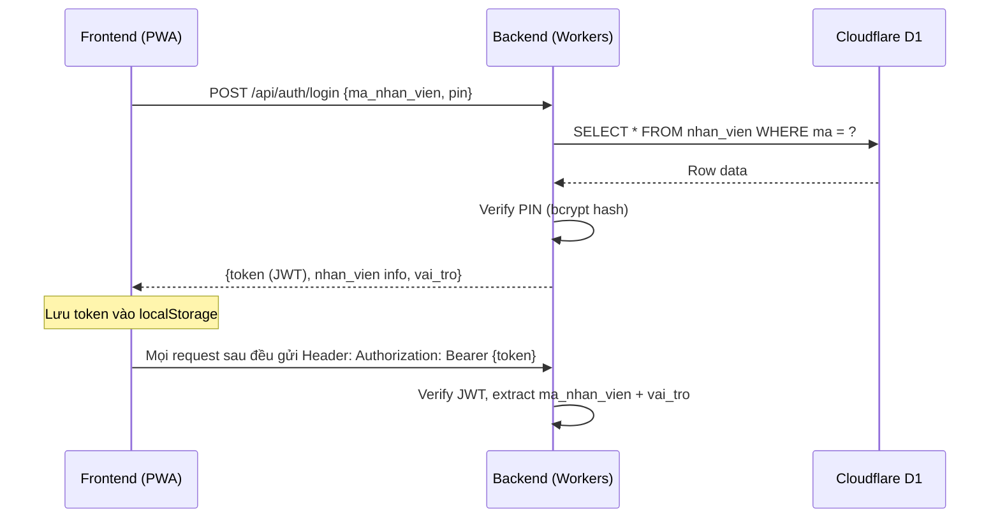
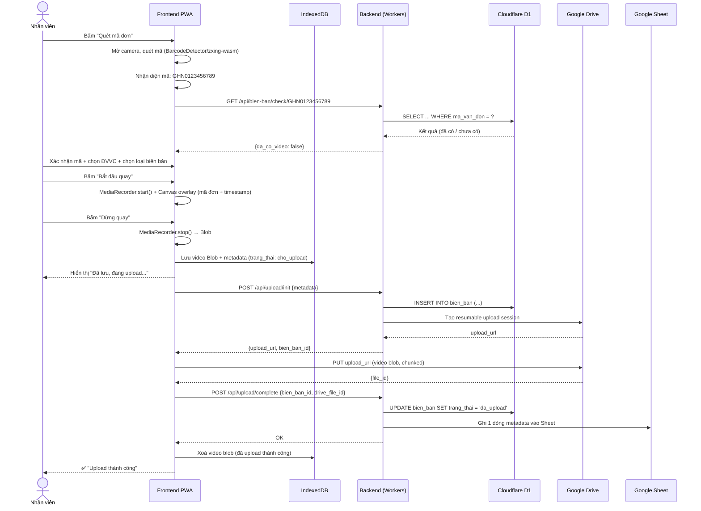
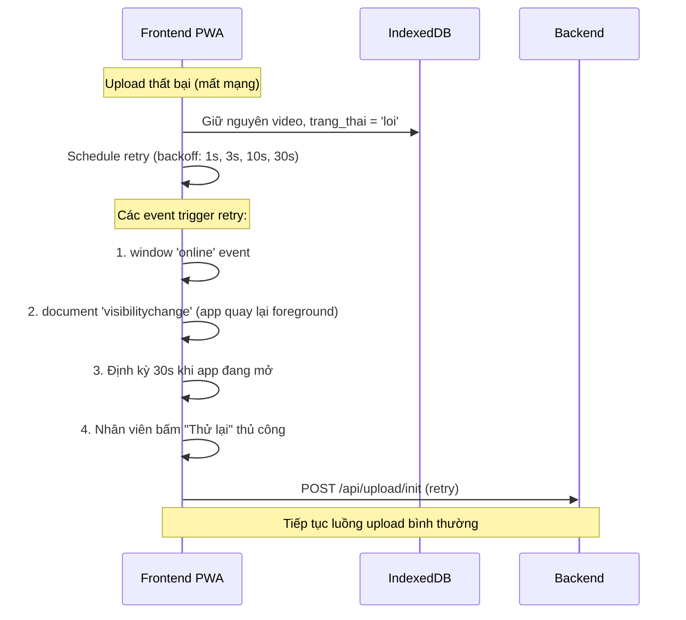

# 06 — API BACKEND SPECIFICATION

## Cloudflare Workers + Hono Framework

**Runtime:** Cloudflare Workers (Edge)
**Framework:** [Hono](https://hono.dev) — siêu nhẹ, tối ưu cho Workers, API tương tự Express
**Database:** Cloudflare D1 (SQLite tại Edge)
**Auth:** Token nội bộ (JWT đơn giản, không OAuth)

---

## 1. Base URL & Convention

```
Production:  https://api.quayvideo.{domain}.workers.dev
Development: http://localhost:8787
```

**Response format chuẩn (tất cả endpoints):**

```json
// Thành công
{
  "success": true,
  "data": { ... }
}

// Lỗi
{
  "success": false,
  "error": {
    "code": "INVALID_PIN",
    "message": "Mã PIN không đúng"
  }
}
```

**HTTP Status Codes sử dụng:**
| Code | Ý nghĩa |
|---|---|
| 200 | Thành công |
| 201 | Tạo mới thành công |
| 400 | Request không hợp lệ (thiếu field, sai format) |
| 401 | Chưa đăng nhập / token hết hạn |
| 403 | Không có quyền (VD: nhân viên truy cập API admin) |
| 404 | Không tìm thấy resource |
| 409 | Conflict (VD: mã nhân viên đã tồn tại) |
| 429 | Rate limited |
| 500 | Lỗi server |

---

## 2. Authentication Flow



**JWT Payload:**
```json
{
  "sub": "NV003",
  "ten": "Nguyễn Văn A",
  "vai_tro": "nhan_vien",
  "iat": 1726300000,
  "exp": 1726386400
}
```
- Token hết hạn sau **24 giờ** (1 ca làm việc dài).
- Không cần refresh token — đăng nhập lại bằng PIN rất nhanh.

---

## 3. API Endpoints

### 3.1 Auth

#### `POST /api/auth/login`

Đăng nhập bằng mã nhân viên + PIN.

**Request:**
```json
{
  "ma_nhan_vien": "NV003",
  "pin": "1234"
}
```

**Response 200:**
```json
{
  "success": true,
  "data": {
    "token": "eyJhbGciOiJIUzI1NiIs...",
    "nhan_vien": {
      "ma": "NV003",
      "ten": "Nguyễn Văn A",
      "vai_tro": "nhan_vien"
    }
  }
}
```

**Response 401:**
```json
{
  "success": false,
  "error": {
    "code": "INVALID_CREDENTIALS",
    "message": "Mã nhân viên hoặc PIN không đúng"
  }
}
```

#### `POST /api/auth/verify`

Kiểm tra token còn hợp lệ (dùng khi app mở lại).

**Headers:** `Authorization: Bearer {token}`

**Response 200:**
```json
{
  "success": true,
  "data": {
    "valid": true,
    "nhan_vien": { "ma": "NV003", "ten": "Nguyễn Văn A", "vai_tro": "nhan_vien" }
  }
}
```

---

### 3.2 Upload Video

#### `POST /api/upload/init`

Khởi tạo resumable upload session với Google Drive (kèm fallback Mock mode khi dev local).

**Headers:** `Authorization: Bearer {token}`

**Request:**
```json
{
  "id": "550e8400-e29b-41d4-a716-446655440000",
  "ma_van_don": "GHN0123456789",
  "don_vi_vc": "GHN",
  "loai_bien_ban": "dong_goi",
  "thiet_bi": "mobile",
  "thoi_luong_video": 65,
  "kich_thuoc_bytes": 15234099,
  "mime_type": "video/webm"
}
```

**Response 201:**
```json
{
  "success": true,
  "data": {
    "bien_ban_id": "550e8400-e29b-41d4-a716-446655440000",
    "resumable_upload_url": "https://www.googleapis.com/upload/drive/v3/files?uploadType=resumable&upload_id=ADPycd...",
    "target_file_name": "DongGoi_GHN0123456789_GHN_NV003_20260916_103000.webm",
    "chunk_size": 5242880
  }
}
```

> **Lưu ý Fallback:** Nếu chưa cấu hình `GOOGLE_SERVICE_ACCOUNT_JSON` hoặc `DRIVE_FOLDER_ID`, backend trả về URL mock `https://mock-drive-upload.googleapis.com/upload/{id}` để chạy giả lập không lỗi ở client.

**Logic Backend:**
1. Verify JWT → lấy `ma_nhan_vien` (`user.sub`).
2. Lưu bản ghi `bien_ban` vào D1 với `trang_thai = 'cho_upload'`.
3. Ghi log khởi tạo vào bảng `upload_log`.
4. Sinh tên file chuẩn `{Loai}_{MaVanDon}_{DVVC}_{MaNV}_{Timestamp}.webm`.
5. Đệ quy tìm hoặc tạo thư mục ngày `YYYY/MM/DD` trên Google Drive.
6. Ký JWT Service Account gọi Google Drive API v3 tạo resumable session, lấy Location URL.
7. Trả `resumable_upload_url` cho Frontend upload trực tiếp lên Drive.

#### `POST /api/upload/complete`

Frontend báo upload xong và gửi `drive_file_id` thật từ Drive API.

**Headers:** `Authorization: Bearer {token}`

**Request:**
```json
{
  "id": "550e8400-e29b-41d4-a716-446655440000",
  "drive_file_id": "1BxiMVs0XRA5nFMdKvBdBZjgmUUqptlbs74OgVE2upms",
  "drive_file_name": "DongGoi_GHN0123456789_GHN_NV003_20260916_103000.webm"
}
```

**Response 200:**
```json
{
  "success": true,
  "data": {
    "bien_ban_id": "550e8400-e29b-41d4-a716-446655440000",
    "trang_thai": "da_upload"
  }
}
```

**Logic Backend:**
1. Cập nhật D1: `trang_thai = 'da_upload'`, `drive_file_id`, `drive_file_name`, `thoi_gian_upload = now()`.
2. Ghi log `complete` vào `upload_log`.
3. Tác vụ ngầm (non-blocking): Kích hoạt `SheetService.appendRow` ghi 12 cột metadata vào Google Sheet tab `DuLieu!A:L`.
4. Ghi log `sheet_appended` hoặc `sheet_error` tương ứng vào D1.

#### `POST /api/upload/error`

Frontend báo upload lỗi sau khi đã hết số lần retry cho phép.

**Headers:** `Authorization: Bearer {token}`

**Request:**
```json
{
  "id": "550e8400-e29b-41d4-a716-446655440000",
  "loi_message": "Network timeout after 5 retries"
}
```

**Response 200:**
```json
{
  "success": true,
  "data": {
    "bien_ban_id": "550e8400-e29b-41d4-a716-446655440000",
    "trang_thai": "loi"
  }
}
```

---

### 3.3 Tra cứu / Lịch sử

#### `GET /api/bien-ban`

Danh sách biên bản có filter + phân trang.

**Headers:** `Authorization: Bearer {token}`

**Query params:**
| Param | Kiểu | Bắt buộc | Mô tả |
|---|---|---|---|
| `ma_van_don` | string | Không | Tìm chính xác hoặc partial match |
| `ngay_tu` | string (YYYY-MM-DD) | Không | Lọc từ ngày (mặc định: hôm nay) |
| `ngay_den` | string (YYYY-MM-DD) | Không | Lọc đến ngày (mặc định: hôm nay) |
| `don_vi_vc` | string | Không | GHN / GHTK / J&T / VTP / ... |
| `loai_bien_ban` | string | Không | dong_goi / khui_hang |
| `ma_nhan_vien` | string | Không | Lọc theo NV (admin mới dùng được, NV thường chỉ thấy của mình) |
| `trang_thai` | string | Không | cho_upload / dang_upload / da_upload / loi |
| `page` | int | Không | Trang (mặc định: 1) |
| `limit` | int | Không | Số bản ghi/trang (mặc định: 20, max: 100) |

**Response 200:**
```json
{
  "success": true,
  "data": {
    "items": [
      {
        "id": "550e8400-...",
        "ma_van_don": "GHN0123456789",
        "don_vi_vc": "GHN",
        "loai_bien_ban": "dong_goi",
        "ma_nhan_vien": "NV003",
        "ten_nhan_vien": "Nguyễn Văn A",
        "thoi_gian_tao": "2026-09-14T14:30:22+07:00",
        "thoi_luong_video": 65,
        "kich_thuoc_bytes": 15234099,
        "trang_thai": "da_upload",
        "drive_file_id": "1BxiMVs0..."
      }
    ],
    "pagination": {
      "page": 1,
      "limit": 20,
      "total": 156,
      "total_pages": 8
    }
  }
}
```

#### `GET /api/bien-ban/:id`

Chi tiết 1 biên bản.

**Response 200:** Trả 1 object biên bản (cùng format như item trong danh sách).

#### `GET /api/bien-ban/:id/view-url`

Lấy link xem video tạm thời (có thời hạn).

**Response 200:**
```json
{
  "success": true,
  "data": {
    "view_url": "https://drive.google.com/file/d/.../preview?authuser=0",
    "expires_in": 300
  }
}
```

**Logic Backend:** Dùng Service Account cấp quyền viewer tạm thời cho file trên Drive, trả link. Hoặc proxy stream qua Workers nếu muốn kiểm soát chặt hơn.

#### `GET /api/bien-ban/check/:ma_van_don`

Kiểm tra mã vận đơn đã có video chưa (gọi sau khi quét mã).

**Response 200:**
```json
{
  "success": true,
  "data": {
    "da_co_video": true,
    "so_luong_video": 1,
    "video_gan_nhat": {
      "id": "...",
      "loai_bien_ban": "dong_goi",
      "thoi_gian_tao": "2026-09-14T10:15:00+07:00",
      "ma_nhan_vien": "NV002"
    }
  }
}
```

---

### 3.4 Dashboard / Thống kê

#### `GET /api/dashboard/today`

Thống kê nhanh trong ngày (hiện trên Home screen).

**Headers:** `Authorization: Bearer {token}`

**Response 200:**
```json
{
  "success": true,
  "data": {
    "tong_don": 45,
    "da_upload": 42,
    "dang_cho": 2,
    "loi": 1,
    "tong_dung_luong_mb": 856,
    "nhan_vien_hom_nay": ["NV001", "NV003", "NV005"]
  }
}
```

---

### 3.5 Admin — Quản lý nhân viên

> Yêu cầu: `vai_tro = 'admin'`

#### `GET /api/admin/nhan-vien`

Danh sách nhân viên.

**Response 200:**
```json
{
  "success": true,
  "data": [
    {
      "ma": "NV001",
      "ten": "Trần Thị B",
      "vai_tro": "admin",
      "trang_thai": "hoat_dong",
      "ngay_tao": "2026-09-01"
    }
  ]
}
```

#### `POST /api/admin/nhan-vien`

Tạo nhân viên mới.

**Request:**
```json
{
  "ma": "NV006",
  "ten": "Lê Văn C",
  "pin": "5678",
  "vai_tro": "nhan_vien"
}
```

#### `PUT /api/admin/nhan-vien/:ma`

Cập nhật nhân viên (đổi tên, đổi PIN, đổi vai trò, vô hiệu hoá).

**Request:**
```json
{
  "ten": "Lê Văn C (Updated)",
  "trang_thai": "vo_hieu_hoa"
}
```

#### `DELETE /api/admin/nhan-vien/:ma`

Xoá nhân viên (soft delete — chuyển `trang_thai = 'da_xoa'`).

---

### 3.6 Admin — Cấu hình hệ thống

#### `GET /api/admin/cau-hinh`

Lấy cấu hình hiện tại.

**Response 200:**
```json
{
  "success": true,
  "data": {
    "drive_folder_id": "1abc...",
    "drive_ket_noi": true,
    "sheet_id": "1xyz...",
    "chat_luong_video": {
      "do_phan_giai": "1280x720",
      "bitrate_mbps": 2.5
    },
    "auto_scan": false,
    "quay_lien_tuc": false,
    "watermark": true,
    "don_vi_vc_mac_dinh": ["GHN", "GHTK", "J&T", "VTP", "Ninja Van", "Shopee Express", "Best Express"],
    "retention_archive_days": "30",
    "retention_delete_days": "60",
    "retention_thang": "6"
  }
}
```

> **Lưu ý**: Khóa `retention_thang` đã bị **deprecate**. Hệ thống sử dụng 2 khóa `retention_archive_days` (mặc định 30) và `retention_delete_days` (mặc định 60).

#### `PUT /api/admin/cau-hinh`

Cập nhật cấu hình đơn lẻ hoặc theo batch.

#### `POST /api/admin/cau-hinh/test-drive`

Kiểm tra kết nối Google Drive (tạo 1 file test, xoá ngay).

**Response 200:**
```json
{
  "success": true,
  "data": {
    "ket_noi_ok": true,
    "dung_luong_con_lai_gb": 456.7,
    "loai_drive": "shared_drive",
    "ten_drive": "DongGoi_Videos"
  }
}
```

---

### 3.7 Admin — Quản lý Vòng đời & Lưu trữ Video (Data Retention)

> Yêu cầu: `vai_tro = 'admin'`

#### `GET /api/admin/retention/status`

Lấy trạng thái tổng quan về hàng đợi dọn dẹp, số video chờ lưu trữ, số video chờ xoá.

**Response 200:**
```json
{
  "success": true,
  "data": {
    "retention_archive_days": 30,
    "retention_delete_days": 60,
    "retention_thang_deprecated": 6,
    "pending_archive_count": 12,
    "pending_delete_count": 3,
    "total_archived": 150,
    "total_deleted": 45,
    "last_run": "2026-09-18T02:00:00.000Z"
  }
}
```

#### `POST /api/admin/retention/run`

Kích hoạt dọn dẹp và lưu trữ thủ công ngay lập tức (không cần chờ Cron Trigger 02:00 AM).

**Response 200:**
```json
{
  "success": true,
  "data": {
    "archived_count": 12,
    "deleted_count": 3,
    "sheet_updated_count": 15,
    "errors": [],
    "execution_time_ms": 1240
  }
}
```

---

## 4. Sequence Diagrams — Luồng chính

### 4.1 Luồng quét mã → quay video → upload



### 4.2 Luồng upload retry khi mất mạng



---

## 5. Rate Limiting

| Endpoint group | Limit |
|---|---|
| `/api/auth/login` | 5 requests / phút / IP (chống brute-force PIN) |
| `/api/upload/*` | 30 requests / phút / token |
| `/api/bien-ban` (đọc) | 60 requests / phút / token |
| `/api/admin/*` | 30 requests / phút / token |

Sử dụng Cloudflare Workers rate limiting (built-in) hoặc custom counter trong D1.

---

## 6. CORS Configuration

```js
// Chỉ cho phép domain app gọi vào
const ALLOWED_ORIGINS = [
  'https://quayvideo.pages.dev',          // Production
  'https://quayvideo.{domain}.com',       // Custom domain
  'http://localhost:5173',                 // Dev (Vite)
];
```

---

## 7. Middleware Pipeline

```
Request
  → CORS check
  → Rate limiting
  → Auth middleware (verify JWT, extract user — bỏ qua cho /auth/login)
  → Role check (admin endpoints)
  → Route handler
  → Response formatter
```

---

*Xem tiếp: **07-database-schema.md** (schema D1 chi tiết), **08-frontend-architecture.md** (cấu trúc project React).*
