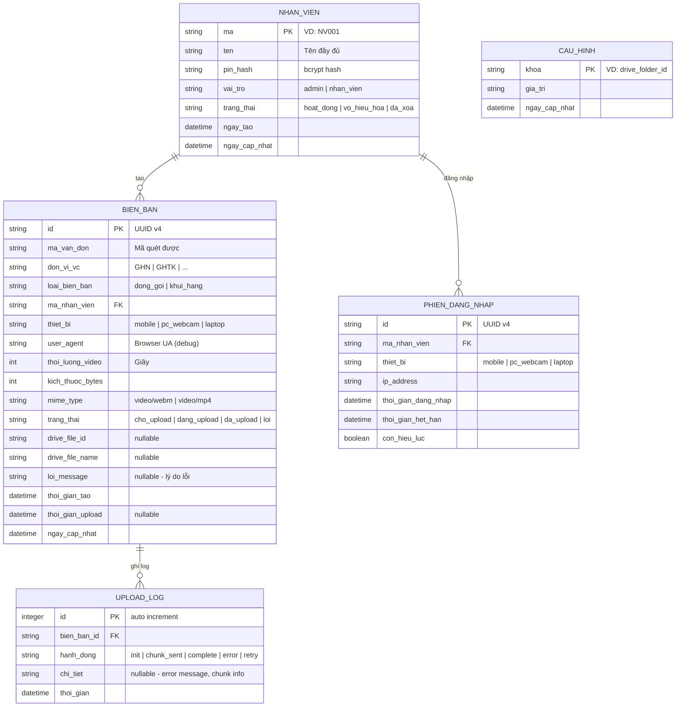

# 07 — DATABASE & DATA SCHEMA

## Cloudflare D1 (SQLite tại Edge)

**Lý do chọn D1:** Free tier 5GB, 5M reads/day, 100K writes/day — dư sức cho ~500 đơn/ngày. SQLite chuẩn, query quen thuộc, không cần ORM phức tạp.

---

## 1. Sơ đồ quan hệ (ERD)



---

## 2. SQL Schema (Migration)

### Bảng `nhan_vien`

```sql
CREATE TABLE IF NOT EXISTS nhan_vien (
    ma          TEXT PRIMARY KEY,
    ten         TEXT NOT NULL,
    pin_hash    TEXT NOT NULL,
    vai_tro     TEXT NOT NULL DEFAULT 'nhan_vien' CHECK(vai_tro IN ('admin', 'nhan_vien')),
    trang_thai  TEXT NOT NULL DEFAULT 'hoat_dong' CHECK(trang_thai IN ('hoat_dong', 'vo_hieu_hoa', 'da_xoa')),
    ngay_tao    TEXT NOT NULL DEFAULT (datetime('now')),
    ngay_cap_nhat TEXT NOT NULL DEFAULT (datetime('now'))
);
```

### Bảng `bien_ban`

```sql
CREATE TABLE IF NOT EXISTS bien_ban (
    id              TEXT PRIMARY KEY,
    ma_van_don      TEXT NOT NULL,
    don_vi_vc       TEXT NOT NULL,
    loai_bien_ban   TEXT NOT NULL CHECK(loai_bien_ban IN ('dong_goi', 'khui_hang')),
    ma_nhan_vien    TEXT NOT NULL REFERENCES nhan_vien(ma),
    thiet_bi        TEXT DEFAULT 'mobile',
    user_agent      TEXT,
    thoi_luong_video INTEGER,
    kich_thuoc_bytes INTEGER,
    mime_type       TEXT DEFAULT 'video/webm',
    trang_thai      TEXT NOT NULL DEFAULT 'cho_upload' CHECK(trang_thai IN ('cho_upload', 'dang_upload', 'da_upload', 'loi')),
    drive_file_id   TEXT,
    drive_file_name TEXT,
    loi_message     TEXT,
    thoi_gian_tao   TEXT NOT NULL DEFAULT (datetime('now')),
    thoi_gian_upload TEXT,
    ngay_cap_nhat   TEXT NOT NULL DEFAULT (datetime('now'))
);
```

### Bảng `phien_dang_nhap`

```sql
CREATE TABLE IF NOT EXISTS phien_dang_nhap (
    id                  TEXT PRIMARY KEY,
    ma_nhan_vien        TEXT NOT NULL REFERENCES nhan_vien(ma),
    thiet_bi            TEXT,
    ip_address          TEXT,
    thoi_gian_dang_nhap TEXT NOT NULL DEFAULT (datetime('now')),
    thoi_gian_het_han   TEXT NOT NULL,
    con_hieu_luc        INTEGER NOT NULL DEFAULT 1
);
```

### Bảng `upload_log`

```sql
CREATE TABLE IF NOT EXISTS upload_log (
    id          INTEGER PRIMARY KEY AUTOINCREMENT,
    bien_ban_id TEXT NOT NULL REFERENCES bien_ban(id),
    hanh_dong   TEXT NOT NULL CHECK(hanh_dong IN ('init', 'chunk_sent', 'complete', 'error', 'retry')),
    chi_tiet    TEXT,
    thoi_gian   TEXT NOT NULL DEFAULT (datetime('now'))
);
```

### Bảng `cau_hinh`

```sql
CREATE TABLE IF NOT EXISTS cau_hinh (
    khoa        TEXT PRIMARY KEY,
    gia_tri     TEXT NOT NULL,
    ngay_cap_nhat TEXT NOT NULL DEFAULT (datetime('now'))
);
```

---

## 3. Indexes (tối ưu tra cứu)

```sql
-- Tra cứu biên bản theo mã vận đơn (use case chính: quét lại mã để tìm video)
CREATE INDEX idx_bien_ban_ma_van_don ON bien_ban(ma_van_don);

-- Tra cứu theo ngày (lịch sử hôm nay, tuần này...)
CREATE INDEX idx_bien_ban_thoi_gian ON bien_ban(thoi_gian_tao);

-- Tra cứu theo nhân viên
CREATE INDEX idx_bien_ban_nhan_vien ON bien_ban(ma_nhan_vien);

-- Lọc theo trạng thái (hàng đợi upload: tìm tất cả video chưa upload)
CREATE INDEX idx_bien_ban_trang_thai ON bien_ban(trang_thai);

-- Composite index cho tra cứu phổ biến: lịch sử hôm nay của 1 nhân viên
CREATE INDEX idx_bien_ban_nv_ngay ON bien_ban(ma_nhan_vien, thoi_gian_tao);

-- Upload log theo biên bản
CREATE INDEX idx_upload_log_bien_ban ON upload_log(bien_ban_id);

-- Phiên đăng nhập active
CREATE INDEX idx_phien_active ON phien_dang_nhap(ma_nhan_vien, con_hieu_luc);
```

---

## 4. Seed Data (Development & Production)

### Admin mặc định (tạo khi deploy lần đầu)

```sql
-- PIN mặc định: 0000 (bắt buộc đổi khi đăng nhập lần đầu)
-- pin_hash là bcrypt hash của "0000"
INSERT INTO nhan_vien (ma, ten, pin_hash, vai_tro) VALUES
    ('ADMIN', 'Quản trị viên', '$2b$10$...[hash_of_0000]...', 'admin');
```

### Cấu hình mặc định

```sql
INSERT INTO cau_hinh (khoa, gia_tri) VALUES
    ('drive_folder_id', ''),
    ('sheet_id', ''),
    ('do_phan_giai', '1280x720'),
    ('bitrate_mbps', '2.5'),
    ('auto_scan', 'false'),
    ('quay_lien_tuc', 'false'),
    ('watermark', 'true'),
    ('don_vi_vc_danh_sach', 'GHN,GHTK,J&T,VTP,Ninja Van,Shopee Express,Best Express,Khác'),
    ('retention_thang', '6');
```

---

## 5. Migration Strategy

D1 hỗ trợ migration files. Đặt trong thư mục `migrations/`:

```
backend/
  migrations/
    0001_init_schema.sql        ← Tạo tất cả bảng + indexes
    0002_seed_default_data.sql  ← Seed admin + cấu hình mặc định
    0003_add_feature_xxx.sql    ← Migration sau này khi thêm tính năng
```

**Chạy migration:**
```bash
# Development (local D1)
npx wrangler d1 migrations apply quayvideo-db --local

# Production
npx wrangler d1 migrations apply quayvideo-db --remote
```

---

## 6. Query mẫu quan trọng

### Thống kê dashboard hôm nay

```sql
SELECT
    COUNT(*) as tong_don,
    SUM(CASE WHEN trang_thai = 'da_upload' THEN 1 ELSE 0 END) as da_upload,
    SUM(CASE WHEN trang_thai IN ('cho_upload', 'dang_upload') THEN 1 ELSE 0 END) as dang_cho,
    SUM(CASE WHEN trang_thai = 'loi' THEN 1 ELSE 0 END) as loi,
    ROUND(SUM(kich_thuoc_bytes) / 1048576.0, 1) as tong_mb
FROM bien_ban
WHERE DATE(thoi_gian_tao) = DATE('now');
```

### Tra cứu theo mã vận đơn (partial match)

```sql
SELECT b.*, n.ten as ten_nhan_vien
FROM bien_ban b
JOIN nhan_vien n ON b.ma_nhan_vien = n.ma
WHERE b.ma_van_don LIKE ? || '%'
ORDER BY b.thoi_gian_tao DESC
LIMIT 20;
```

### Kiểm tra mã vận đơn đã có video

```sql
SELECT COUNT(*) as so_luong,
       MAX(thoi_gian_tao) as gan_nhat,
       MAX(ma_nhan_vien) as nv_gan_nhat,
       MAX(loai_bien_ban) as loai_gan_nhat
FROM bien_ban
WHERE ma_van_don = ?
  AND trang_thai != 'loi';
```

### Danh sách video lỗi cần retry

```sql
SELECT * FROM bien_ban
WHERE trang_thai = 'loi'
ORDER BY thoi_gian_tao DESC;
```

---

## 7. Google Sheet Template

Backend ghi metadata vào Google Sheet khi upload thành công. Cấu trúc cột Sheet:

| A | B | C | D | E | F | G | H | I |
|---|---|---|---|---|---|---|---|---|
| Mã vận đơn | ĐVVC | Loại | Nhân viên | Thiết bị | Thời gian tạo | Thời lượng (s) | Dung lượng (MB) | Drive File ID |

**Sheet name:** `DuLieu` (tab đầu tiên)
**Frozen row:** 1 (header)

---

## 8. Data Retention & Cleanup

**Chính sách:** Giữ metadata trong D1 vĩnh viễn (rất nhỏ), xoá video trên Drive sau **6 tháng**.

Triển khai bằng **Cloudflare Workers Cron Trigger** (chạy 1 lần/ngày):

```js
// wrangler.toml
[triggers]
crons = ["0 2 * * *"]  // Chạy lúc 2h sáng mỗi ngày

// Cron handler: tìm video > 6 tháng, xoá trên Drive, đánh dấu trong D1
```

```sql
-- Tìm video cần xoá
SELECT id, drive_file_id FROM bien_ban
WHERE trang_thai = 'da_upload'
  AND thoi_gian_upload < datetime('now', '-6 months')
  AND drive_file_id IS NOT NULL;
```

---

*Xem tiếp: **08-frontend-architecture.md** (cấu trúc project React, component tree, hooks).*
