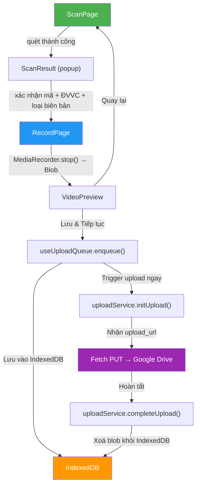

# 08 — FRONTEND ARCHITECTURE & PROJECT STRUCTURE

## React + Vite + PWA

**Framework:** React 18+ (với TypeScript)
**Build tool:** Vite 5+
**PWA:** `vite-plugin-pwa` (Workbox)
**State:** Zustand
**Routing:** React Router v6
**HTTP Client:** ky (nhẹ hơn axios, tối ưu cho modern browsers)
**Barcode:** zxing-wasm + BarcodeDetector API fallback
**IndexedDB:** idb
**CSS & UI Primitives:** Tailwind CSS v4 + shadcn/ui & Radix UI (Core UI Primitives), class-variance-authority, clsx, tailwind-merge

---

## 1. Project Structure

```
frontend/
├── public/
│   ├── icons/                    # PWA icons (192x192, 512x512, maskable)
│   ├── splash/                   # Splash screens (iOS)
│   └── sounds/
│       └── beep.mp3              # Âm thanh quét mã thành công
│
├── src/
│   ├── main.tsx                  # Entry point
│   ├── App.tsx                   # Router + Layout chính
│   ├── vite-env.d.ts             # Vite type declarations
│   │
│   ├── assets/                   # Static assets (logo, illustrations)
│   │   └── logo.svg
│   │
│   ├── styles/                   # Global styles & Tailwind v4
│   │   ├── index.css             # Tailwind v4 import (@import "tailwindcss"; @layer base theme variables)
│   │   └── pages.css             # Helper styles & legacy transition classes
│   │
│   ├── config/                   # App configuration
│   │   ├── constants.ts          # Hằng số (ĐVVC list, video defaults, retry config)
│   │   └── api.ts                # API base URL, endpoints map
│   │
│   ├── types/                    # TypeScript type definitions
│   │   ├── index.ts              # Barrel export
│   │   ├── bien-ban.ts           # BienBan, UploadStatus, LoaiBienBan
│   │   ├── nhan-vien.ts          # NhanVien, VaiTro
│   │   └── api.ts                # ApiResponse<T>, PaginatedResponse<T>
│   │
│   ├── stores/                   # Zustand stores
│   │   ├── auth-store.ts         # Token, user info, login/logout
│   │   ├── camera-store.ts       # Selected device, facing mode
│   │   ├── upload-store.ts       # Upload queue state, progress
│   │   └── config-store.ts       # App config from server
│   │
│   ├── hooks/                    # Custom React hooks
│   │   ├── use-camera.ts         # Camera access, device enumeration, stream management
│   │   ├── use-barcode.ts        # Barcode scanning (BarcodeDetector + zxing-wasm)
│   │   ├── use-media-recorder.ts # Video recording, canvas overlay, blob output
│   │   ├── use-upload-queue.ts   # IndexedDB queue management, upload trigger
│   │   ├── use-online-status.ts  # Online/offline detection
│   │   └── use-device-type.ts    # Detect mobile/pc/laptop (nhóm A/B/C)
│   │
│   ├── services/                 # API calls & external services
│   │   ├── api-client.ts         # HTTP client wrapper (ky), auth interceptor, error handling
│   │   ├── auth-service.ts       # login(), verify(), logout()
│   │   ├── upload-service.ts     # initUpload(), completeUpload(), reportError()
│   │   ├── bien-ban-service.ts   # getBienBanList(), checkMaVanDon(), getViewUrl()
│   │   ├── admin-service.ts      # CRUD nhân viên, cấu hình
│   │   └── idb-service.ts        # IndexedDB operations (lưu/đọc/xoá video blob)
│   │
│   ├── components/               # Reusable UI components
│   │   ├── ui/                   # Core UI Primitives (shadcn/ui + Radix UI)
│   │   │   ├── button.tsx        # CVA Button (default, destructive, outline, ghost...)
│   │   │   ├── input.tsx         # Input field (hỗ trợ font-mono cho barcode)
│   │   │   ├── card.tsx          # Card, CardHeader, CardTitle, CardContent, CardFooter
│   │   │   ├── badge.tsx         # Status & carrier badge
│   │   │   ├── dialog.tsx        # Radix Dialog (bắt buộc DialogTitle cho a11y)
│   │   │   ├── alert-dialog.tsx  # Modal xác nhận xóa, dừng khẩn cấp
│   │   │   ├── alert.tsx         # Alert box thông báo lỗi camera, quét trùng
│   │   │   ├── sonner.tsx        # Toast provider (Sonner)
│   │   │   ├── progress.tsx      # Thanh tiến trình tải video, storage quota
│   │   │   ├── skeleton.tsx      # Skeleton loader cho bảng và danh sách
│   │   │   ├── separator.tsx     # Đường kẻ phân cách ngữ cảnh
│   │   │   ├── select.tsx        # Dropdown lựa chọn ĐVVC, camera
│   │   │   ├── tabs.tsx          # Tab phân nhóm chế độ làm việc
│   │   │   ├── collapsible.tsx   # Đóng/mở chi tiết đơn hàng
│   │   │   ├── scroll-area.tsx   # Khung cuộn mượt mà có custom scrollbar
│   │   │   └── EmptyState.tsx    # Empty state minh họa SVG
│   │   │
│   │   ├── layout/               # Layout components
│   │   │   ├── AppShell.tsx      # Header + main content + bottom nav
│   │   │   ├── Header.tsx        # Logo + camera info + user badge
│   │   │   └── BottomNav.tsx     # Mobile bottom navigation (Home, Queue, History, Settings)
│   │   │
│   │   ├── camera/               # Camera-related components
│   │   │   ├── CameraPreview.tsx # Video element + camera stream
│   │   │   ├── CameraSelector.tsx # Dropdown chọn camera
│   │   │   └── CameraGuide.tsx   # Hướng dẫn đặt webcam (lần đầu)
│   │   │
│   │   ├── scanner/              # Barcode scanner
│   │   │   ├── ScannerOverlay.tsx # Khung quét + viewfinder animation
│   │   │   └── ScanResult.tsx    # Popup xác nhận mã + chọn ĐVVC
│   │   │
│   │   ├── recorder/             # Video recorder
│   │   │   ├── RecordingView.tsx # Full-screen recording với overlay
│   │   │   ├── RecordTimer.tsx   # Đồng hồ đếm giờ
│   │   │   └── VideoPreview.tsx  # Xem lại 3 giây cuối + nút Lưu/Quay lại
│   │   │
│   │   └── upload/               # Upload queue items
│   │       ├── QueueItem.tsx     # 1 item trong hàng đợi (status + progress)
│   │       └── QueueSummary.tsx  # Bộ đếm tổng "12 video — 10 đã lưu, 2 chờ"
│   │
│   ├── pages/                    # Route-level page components
│   │   ├── LoginPage.tsx         # Mã NV + PIN
│   │   ├── HomePage.tsx          # Nút "Quét mã đơn" lớn + dashboard nhanh
│   │   ├── ScanPage.tsx          # Camera full-screen + quét mã
│   │   ├── RecordPage.tsx        # Quay video + xác nhận
│   │   ├── QueuePage.tsx         # Hàng đợi upload
│   │   ├── HistoryPage.tsx       # Lịch sử / tra cứu
│   │   └── SettingsPage.tsx      # Cài đặt (admin only)
│   │
│   └── utils/                    # Utility functions
│       ├── format.ts             # Format datetime, filesize, duration
│       ├── detect-carrier.ts     # Đoán ĐVVC từ prefix mã vận đơn
│       ├── video-naming.ts       # Sinh tên file video theo quy tắc
│       └── cn.ts                 # className helper (join, conditional)
│
├── index.html
├── vite.config.ts                # Vite + PWA plugin config
├── tsconfig.json
├── package.json
└── .env.example
```

---

## 2. Routing

```tsx
// App.tsx
<Routes>
  {/* Public */}
  <Route path="/login" element={<LoginPage />} />

  {/* Protected — yêu cầu đăng nhập */}
  <Route element={<ProtectedRoute />}>
    <Route element={<AppShell />}>
      <Route path="/" element={<HomePage />} />
      <Route path="/scan" element={<ScanPage />} />
      <Route path="/record" element={<RecordPage />} />
      <Route path="/queue" element={<QueuePage />} />
      <Route path="/history" element={<HistoryPage />} />

      {/* Admin only */}
      <Route element={<AdminRoute />}>
        <Route path="/settings" element={<SettingsPage />} />
      </Route>
    </Route>
  </Route>
</Routes>
```

---

## 3. State Management (Zustand)

### auth-store.ts

```ts
interface AuthState {
  token: string | null;
  nhanVien: NhanVien | null;
  isLoggedIn: boolean;

  login: (ma: string, pin: string) => Promise<void>;
  logout: () => void;
  verifyToken: () => Promise<boolean>;
}
```

### camera-store.ts

```ts
interface CameraState {
  selectedDeviceId: string | null;
  facingMode: 'environment' | 'user';
  devices: MediaDeviceInfo[];

  setDevice: (deviceId: string) => void;
  toggleFacing: () => void;
  loadDevices: () => Promise<void>;
}
```

### upload-store.ts

```ts
interface UploadState {
  queue: QueueItem[];              // Từ IndexedDB
  currentUpload: string | null;     // ID đang upload
  progress: number;                // 0-100%
  isSyncing: boolean;              // Trạng thái đang đồng bộ
  totalToSync: number;             // Tổng số video trong phiên sync
  syncedInSession: number;         // Đã sync thành công trong phiên
  storageEstimate: StorageEstimateResult | null;
  storageWarning: string | null;

  addToQueue: (item: QueueItem) => Promise<void>;
  processQueue: (customHandler?: UploadHandler, targetIds?: string[]) => Promise<void>;
  retryItem: (id: string) => Promise<void>;
  removeItem: (id: string) => Promise<void>;
  removeItems: (ids: string[]) => Promise<void>; // Xoá hàng loạt
  removeCompleted: () => Promise<void>;
  abortSync: () => void;           // Tạm dừng/huỷ sync
}
```

### config-store.ts

```ts
export type RecordTriggerMode = 'auto' | 'confirm';

interface ConfigState {
  isOnline: boolean;
  deviceType: ThietBiType;
  theme: 'light' | 'dark';
  recordTriggerMode: RecordTriggerMode; // Chế độ quay: 'auto' (Hands-free) hoặc 'confirm' (Thủ công)

  setIsOnline: (online: boolean) => void;
  setDeviceType: (deviceType: ThietBiType) => void;
  setTheme: (theme: 'light' | 'dark') => void;
  toggleTheme: () => void;
  setRecordTriggerMode: (mode: RecordTriggerMode) => void;
}
```

---

## 4. Key Custom Hooks

### `useCamera`

```ts
function useCamera() {
  // Trả về:
  return {
    stream: MediaStream | null,       // Camera stream
    devices: MediaDeviceInfo[],       // Danh sách camera
    selectedDevice: string | null,    // Device ID đang dùng
    isLoading: boolean,
    error: CameraError | null,        // 'permission_denied' | 'not_found' | 'not_supported'

    // Actions:
    startCamera: (deviceId?: string) => Promise<void>,
    stopCamera: () => void,
    switchDevice: (deviceId: string) => Promise<void>,
    toggleFacing: () => Promise<void>,   // Mobile: front ↔ back
  };
}
```

### `useBarcode`

```ts
function useBarcode(videoRef: RefObject<HTMLVideoElement>) {
  // Internal: chọn BarcodeDetector native hoặc zxing-wasm tự động
  return {
    isScanning: boolean,
    result: BarcodeResult | null,     // { rawValue, format }
    error: string | null,

    startScanning: () => void,
    stopScanning: () => void,
    reset: () => void,               // Xoá result, sẵn sàng quét mã tiếp
  };
}
```

### `useMediaRecorder`

```ts
function useMediaRecorder(stream: MediaStream, overlayInfo: OverlayInfo) {
  // Internal: tạo canvas overlay (mã đơn + timestamp), capture stream → MediaRecorder
  return {
    isRecording: boolean,
    duration: number,                 // Giây đang quay
    blob: Blob | null,               // Video sau khi dừng

    startRecording: () => void,
    stopRecording: () => Promise<Blob>,
    discardRecording: () => void,
  };
}
```

### `useUploadQueue`

```ts
function useUploadQueue(options?: UseUploadQueueOptions) {
  // Internal: đọc/ghi IndexedDB, trigger upload, listen online/visibility events
  return {
    queue: QueueItem[],
    pendingCount: number,
    errorCount: number,
    completedCount: number,
    isUploading: boolean,
    isSyncing: boolean,
    currentProgress: number,          // 0-100 cho item đang upload
    currentUpload: string | null,
    totalToSync: number,
    syncedInSession: number,
    storageEstimate: StorageEstimateResult | null,
    storageWarning: string | null,

    enqueue: (video: Blob, metadata: BienBanMetadata) => Promise<QueueItem>,
    processAll: () => Promise<void>,
    uploadSelected: (ids: string[]) => Promise<void>, // Upload bulk đã chọn
    uploadSingle: (id: string) => Promise<void>,      // Upload ngay 1 video
    retryFailed: () => Promise<void>,
    retryOne: (id: string) => Promise<void>,
    removeItem: (id: string) => Promise<void>,
    removeSelected: (ids: string[]) => Promise<void>, // Xoá bulk đã chọn
    removeCompleted: () => Promise<void>,
    abortSync: () => void,
  };
}
```

---

## 5. Data Flow (Luồng quét → quay → upload)



---

## 6. PWA Configuration

### vite.config.ts

```ts
import { defineConfig } from 'vite';
import react from '@vitejs/plugin-react';
import { VitePWA } from 'vite-plugin-pwa';

export default defineConfig({
  plugins: [
    react(),
    VitePWA({
      registerType: 'autoUpdate',
      includeAssets: ['icons/*.png', 'sounds/*.mp3'],
      manifest: {
        name: 'Quay Video Đóng Hàng',
        short_name: 'QuayVideo',
        description: 'Quay video đóng gói/khui hàng, quét mã vận đơn, lưu Google Drive',
        theme_color: '#1a1a2e',
        background_color: '#1a1a2e',
        display: 'standalone',
        orientation: 'any',
        start_url: '/',
        icons: [
          { src: 'icons/icon-192.png', sizes: '192x192', type: 'image/png' },
          { src: 'icons/icon-512.png', sizes: '512x512', type: 'image/png' },
          { src: 'icons/icon-512-maskable.png', sizes: '512x512', type: 'image/png', purpose: 'maskable' },
        ],
      },
      workbox: {
        globPatterns: ['**/*.{js,css,html,ico,png,svg,woff2}'],
        runtimeCaching: [
          {
            urlPattern: /^https:\/\/api\..*/i,
            handler: 'NetworkFirst',
            options: {
              cacheName: 'api-cache',
              expiration: { maxEntries: 50, maxAgeSeconds: 300 },
            },
          },
        ],
      },
    }),
  ],
});
```

---

## 7. Responsive Breakpoints

```css
/* styles/index.css */
:root {
  /* Mobile first */
  --layout: 'portrait';
}

/* Tablet / Landscape mobile */
@media (min-width: 768px) {
  :root { --layout: 'landscape'; }
}

/* Desktop / PC */
@media (min-width: 1024px) {
  :root { --layout: 'desktop'; }
}
```

| Breakpoint | Thiết bị | Layout |
|---|---|---|
| < 768px | Nhóm A: iPhone, Android | Portrait, bottom nav, nút bấm to |
| 768px–1023px | Nhóm C: Laptop nhỏ | Landscape, side nav |
| ≥ 1024px | Nhóm B/C: PC bàn, laptop lớn | Desktop, video preview to giữa |

---

## 8. Coding Conventions

| Quy tắc | Chi tiết |
|---|---|
| **File naming** | `kebab-case.ts` cho files, `PascalCase.tsx` cho components (riêng UI primitives theo chuẩn shadcn: `button.tsx`, `card.tsx`, `dialog.tsx`) |
| **Component** | Functional components + hooks, không class component |
| **UI Primitives** | 100% sử dụng `@/components/ui/*` (shadcn/Radix). Cấm dùng raw HTML `<button>`, `<input>` với style tự chế |
| **Composition** | Tuân thủ compound components: `CardHeader` + `CardContent`, `Dialog` + `DialogContent` + `DialogTitle` |
| **Radix A11y** | Mọi Dialog/AlertDialog bắt buộc có `DialogTitle` (dùng `sr-only` nếu ẩn). Dùng `asChild` tránh lồng nút |
| **Types** | Dùng `interface` cho objects, `type` cho unions/intersections |
| **Imports** | Absolute imports: `@/components/...`, `@/hooks/...`, `@/services/...`, `@/utils/...` |
| **CSS & Spacing** | Tailwind CSS v4 utility classes + semantic design tokens. Dùng `gap-*` (cấm `space-y-*` hoặc margin hack) |
| **Class Merge** | Nối class động bắt buộc dùng `cn(...)` (`clsx` + `tailwind-merge`) |
| **Constants** | UPPER_SNAKE_CASE cho constants |
| **Async** | async/await, không .then() chains |
| **Error** | try/catch với typed errors, hiển thị thông báo bằng Sonner `toast` |

---

*Xem tiếp: **09-environment-deployment.md** (env vars, Google Cloud setup, Cloudflare deploy).*
