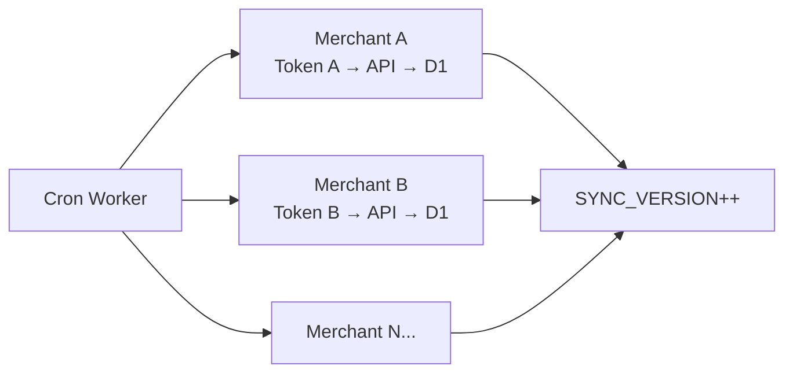
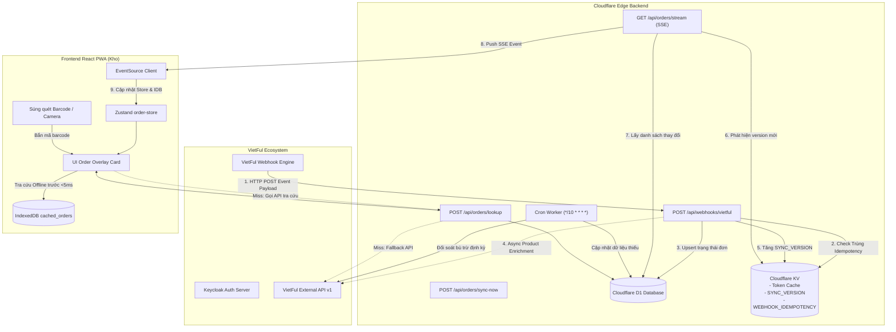
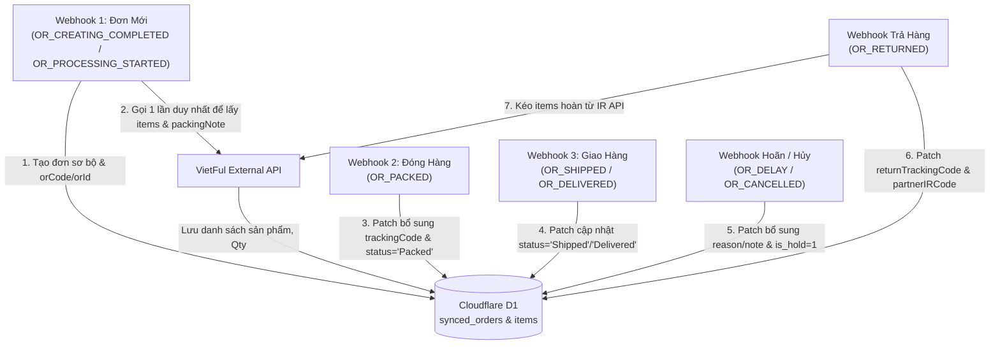

# 16 — ĐẶC TẢ TÍCH HỢP & ĐỒNG BỘ ĐƠN HÀNG QUA VIETFUL API

## 1. TỔNG QUAN & MỤC TIÊU NGHIỆP VỤ

### 1.1. Bối Cảnh Nghiệp Vụ
Trong quy trình kho vận đóng gói (Fulfillment) và xử lý hàng trả về (Reverse Logistics), nhân viên kho cần đối soát trực tiếp đơn hàng trước và trong khi quay video để đảm bảo tính minh bạch, chống gian lận và hỗ trợ khiếu nại sàn TMĐT (Shopee, TikTok Shop, Lazada...):
1. **Luồng Đóng hàng (Packing Mode)**:
   - Nhân viên quét mã vận đơn (in trên tem vận chuyển AWB) hoặc quét mã đơn hàng (Mã OR / Mã đơn sàn).
   - Ứng dụng tự động truy vấn thông tin đơn hàng, hiển thị danh sách sản phẩm, số lượng, SKU biến thể (màu, size) và **ghi chú đóng hàng (`packingNote`)**.
   - Bắt đầu quay video quá trình đóng gói và dán tem.
2. **Luồng Khui hàng / Trả hàng (Unboxing & Return Receiving Mode)**:
   - Nhân viên quét mã vận đơn ban đầu hoặc **mã vận đơn thu hồi (`returnTrackingCode`)** dán trên kiện hàng trả về.
   - Hệ thống tự động nhận diện đơn hoàn, hiển thị danh sách sản phẩm cần kiểm tra, tình trạng trả hàng (`returnDetails`), lý do hoàn.
   - Quay video khui mở gói hàng, kiểm tra ngoại quan và chất lượng sản phẩm.

### 1.2. Thách Thức Kỹ Thuật & Yêu Cầu Tốc Độ
- **Tốc độ phản hồi < 50ms**: Nhân viên dùng súng quét mã vạch USB bắn mã liên tục. Ứng dụng không thể chờ gọi HTTP trực tiếp sang bên thứ ba (độ trễ 500ms - 2000ms).
- **Đa dạng mã quét**: Chuỗi barcode quét được có thể là: Mã OR (`orCode` / `partnerORCode`), Mã vận đơn (`trackingCode`), Mã vận đơn thu hồi (`returnTrackingCode`), hoặc Mã kiện (`packageNo`). Tuy nhiên API VietFul tra cứu chi tiết (`GET /api/v1/ors/get-by-code/{code}`) chỉ chấp nhận `PartnerORCode`.
- **Offline-First Resilience**: Kho hàng thường có góc khuất sóng Wi-Fi/4G. Hệ thống phải lưu cache trên Cloudflare D1 và IndexedDB client để vẫn hiển thị thông tin ngay cả khi rớt mạng tạm thời.

---

## 2. THÔNG TIN KẾT NỐI & XÁC THỰC VIETFUL API

### 2.1. Cấu Hình Cần Lấy Từ VietFul
Để tích hợp, quản trị viên cần liên hệ VietFul (hoặc truy cập **Momena Portal $\rightarrow$ Developer Settings**) để lấy các thông số sau:

| Thông số | Môi trường Staging | Môi trường Production | Mô tả |
| :--- | :--- | :--- | :--- |
| **API Base URL** | `https://ext.stg.vnfai.com` | `https://ext-api.vnfai.com` | Địa chỉ gọi các API nghiệp vụ |
| **Auth Base URL** | `https://tes-auth.fai.aipacific.tech` | `https://auth.vnfai.com` | Máy chủ Keycloak cấp OAuth2 Token |
| **Client Code (Realm)** | Ví dụ: `aad`, `nvs`, `thg`... | Ví dụ: `asp` | Mã định danh tenant (Realm). Nhiều nhà (merchant) có thể dùng chung Realm |
| **Client ID** | Lấy trên portal | Lấy trên portal | Định danh ứng dụng API — **mỗi nhà (merchant) sẽ có Client ID riêng biệt** |
| **Client Secret** | Lấy trên portal | Lấy trên portal | Khóa bí mật sinh token (Bảo mật tuyệt đối) — **mỗi nhà có secret riêng** |
| **Warehouse Code** | Ví dụ: `WH_HCM_01` | Mã kho thực tế | Giới hạn đơn hàng theo kho. Mỗi nhà có thể có 1 hoặc nhiều kho |

> [!CAUTION]
> Tuyệt đối **KHÔNG** lưu `Client Secret` trên Frontend React PWA. Toàn bộ quá trình xác thực và ủy quyền phải thực hiện tại Cloudflare Workers backend.

### 2.2. Kiến Trúc Multi-Merchant (Nhiều Nhà Dùng Chung Realm)

Trong thực tế vận hành, một kho Fulfillment có thể xử lý hàng cho **nhiều nhà (merchant/seller)** khác nhau. Trên VietFul, các nhà này có thể cùng chung **Realm** (ví dụ: `asp`), cùng Auth URL và API URL, nhưng mỗi nhà có **Client ID & Client Secret riêng biệt**.

**Ví dụ thực tế:**

| Merchant | Realm | Auth URL | API URL | Client ID | Warehouse |
| :--- | :--- | :--- | :--- | :--- | :--- |
| **Nhà A** (Shop Giày) | `asp` | `https://auth.vnfai.com` | `https://ext-api.vnfai.com` | `8901911f-ea55-...` | `ZPTDN` |
| **Nhà B** (Shop Áo) | `asp` | `https://auth.vnfai.com` | `https://ext-api.vnfai.com` | `51c4c858-adfd-...` | `ZPTDN` |

**Giải pháp thiết kế:**

#### 2.2.1. Bảng Cấu Hình Merchant (`vietful_merchants`) Trên D1
```sql
CREATE TABLE vietful_merchants (
    id TEXT PRIMARY KEY,                       -- UUID hệ thống (dùng làm merchant_id)
    name TEXT NOT NULL,                        -- Tên hiển thị nhà (VD: "Shop Giày ABC")
    realm TEXT NOT NULL,                       -- Realm chung (VD: "asp")
    auth_url TEXT NOT NULL,                    -- Auth base URL
    api_url TEXT NOT NULL,                     -- API base URL
    client_id TEXT NOT NULL,                   -- Client ID riêng
    client_secret_encrypted TEXT NOT NULL,     -- Client Secret đã mã hóa (AES-256-GCM)
    warehouse_codes TEXT NOT NULL,             -- JSON array: ["ZPTDN", "ZPTHCM"]
    webhook_secret TEXT NOT NULL,              -- Secret riêng xác thực webhook cho merchant này
    is_active INTEGER DEFAULT 1,               -- Bật/tắt merchant
    created_at INTEGER NOT NULL,
    updated_at INTEGER NOT NULL
);

CREATE UNIQUE INDEX idx_merchants_client_id ON vietful_merchants(client_id);
```

#### 2.2.2. Token Cache Phân Biệt Theo Merchant (KV Prefix)
Mỗi merchant có token riêng, lưu trong Cloudflare KV với key có prefix `merchant_id`:
```
KV Keys (ví dụ cho 2 merchant):
├── VIETFUL_TOKEN:{merchant_id_A}    → access_token của Nhà A (TTL riêng)
├── VIETFUL_TOKEN:{merchant_id_B}    → access_token của Nhà B (TTL riêng)
├── LAST_SYNC:{merchant_id_A}        → Thời điểm sync gần nhất Nhà A
├── LAST_SYNC:{merchant_id_B}        → Thời điểm sync gần nhất Nhà B
├── SYNC_VERSION                     → Integer chung (tăng khi bất kỳ merchant nào có thay đổi)
├── SYNC_LOCK:{merchant_id}          → Mutex lock sync theo từng merchant
└── WEBHOOK_IDEMPOTENCY:{event_id}   → Chống trùng lặp webhook (chung)
```

#### 2.2.3. Webhook Phân Luồng Theo Merchant
Mỗi merchant cấu hình Webhook URL riêng trên VietFul Portal, gắn `merchant_id` vào path:
```
Nhà A: POST https://api.example.com/api/webhooks/vietful/{merchant_id_A}
Nhà B: POST https://api.example.com/api/webhooks/vietful/{merchant_id_B}
```

Worker nhận webhook → trích xuất `merchant_id` từ URL path → xác thực `webhook_secret` riêng → gắn `merchant_id` vào bản ghi `synced_orders` khi upsert.

#### 2.2.4. Cron Sync Xoay Vòng Qua Từng Merchant
Khi Cron đối soát chạy, Worker lặp qua danh sách `vietful_merchants` (active), lấy token riêng từng nhà, gọi API riêng và upsert kết quả vào D1 kèm `merchant_id`.



> [!IMPORTANT]
> **Nguyên tắc then chốt:** Frontend PWA và nhân viên kho **không cần biết** đơn hàng thuộc merchant nào. Tất cả đơn đổ chung vào `synced_orders` với `merchant_id` chỉ dùng cho backend phân luồng API call. Khi quét barcode, hệ thống tra cứu theo `tracking_code` / `or_code` bất kể merchant.

### 2.3. Cơ Chế Xác Thực OAuth2 Client Credentials
VietFul sử dụng chuẩn Keycloak OpenID Connect:
- **Endpoint lấy Access Token**:
  ```http
  POST /auth/realms/{realm}/protocol/openid-connect/token
  Host: {auth_base_url}
  Content-Type: application/x-www-form-urlencoded

  grant_type=client_credentials&client_id={CLIENT_ID}&client_secret={CLIENT_SECRET}
  ```
- **Phản hồi thành công (200 OK)**:
  ```json
  {
    "access_token": "eyJhbGciOiJSUzI1NiIs...",
    "expires_in": 86400,
    "refresh_expires_in": 604800,
    "refresh_token": "eyJhbGciOiJIUzI1NiIs...",
    "token_type": "bearer"
  }
  ```
- **Caching Token tại Edge (Multi-Merchant)**:
  Cloudflare Worker lưu `access_token` vào Cloudflare KV với key `VIETFUL_TOKEN:{merchant_id}` và TTL = `expires_in - 300` (giảm 5 phút dự phòng). Mỗi merchant có token cache riêng, không ảnh hưởng lẫn nhau.

---

## 3. KIẾN TRÚC TỔNG THỂ & LUỒNG DỮ LIỆU (EVENT-DRIVEN WEBHOOK + SSE SYNC)

### 3.1. Tổng Quan Kiến Trúc

Hệ thống sử dụng kiến trúc **Event-Driven kết hợp 5 tầng (5-Tier Real-Time Sync)** tận dụng cơ chế Webhook thời gian thực từ VietFul:

| Tầng | Cơ Chế | Latency | Khi Nào Kích Hoạt |
| :--- | :--- | :--- | :--- |
| **Tier 1: VietFul Webhook (Chính)** | VietFul push HTTP POST tới `/api/webhooks/vietful` | < 1 giây | Ngay khi trạng thái đơn/kho biến động trên VietFul |
| **Tier 2: SSE Real-time Push** | Server-Sent Events push diff từ Cloudflare Worker → Client | < 1 giây | Ngay sau khi Worker nhận & ghi nhận Webhook |
| **Tier 3: Cron Reconciliation** | Worker poll VietFul API định kỳ (mỗi 10 phút) | ~10 phút | Đối soát bù đắp sự kiện nếu Webhook rớt gói |
| **Tier 4: On-demand Lookup** | IDB → D1 → VietFul API fallback | <5ms ~ 2s | Khi súng quét mã vạch bắn barcode (Cache miss) |
| **Tier 5: Manual Force Sync** | Admin kích hoạt đồng bộ toàn bộ qua giao diện | ~5-30s | Quản trị viên chủ động bấm nút "Đồng bộ ngay" |

### 3.2. Sơ Đồ Luồng Dữ Liệu



---

## 3A. ĐẶC TẢ CHI TIẾT VIETFUL WEBHOOK & LÀM GIÀU DỮ LIỆU SẢN PHẨM

### 3A.1. Danh Sách 13 Sự Kiện Webhook VietFul Hỗ Trợ

Trên hệ thống cấu hình Webhook của VietFul Portal, hỗ trợ 13 mã sự kiện chuẩn:

| STT | Mã Sự Kiện (`event`) | Ý Nghĩa Nghiệp Vụ | Dữ Liệu Đi Kèm |
| :--- | :--- | :--- | :--- |
| 1 | `IR_PROCESSING_STARTED` | Khi yêu cầu nhập kho (Inbound Request - IR) bắt đầu xử lý | `irId`, `irCode` |
| 2 | `IR_FINISHED` | Khi yêu cầu nhập kho (IR) được hoàn thành | `irId`, `irCode` |
| 3 | `OR_CREATING_COMPLETED` | Khi đơn hàng xuất (Outbound Request - OR) đã được xử lý (thành công/thất bại) | `orId`, `orCode`, `partnerORCode` |
| 4 | `OR_PROCESSING_STARTED` | Khi đơn hàng xuất bắt đầu được xử lý | `orId`, `orCode`, `partnerORCode` |
| 5 | `OR_PICKED` | Khi đơn hàng đã được lấy hàng khỏi kệ kho | `orId`, `orCode`, `partnerORCode` |
| 6 | `OR_PACKED` | Khi đơn hàng đã được đóng gói xong | `orId`, `orCode`, `partnerORCode`, `trackingCode` |
| 7 | `OR_SHIPPED` | Khi đơn hàng đã được bàn giao cho đối tác vận chuyển | `orId`, `orCode`, `partnerORCode` |
| 8 | `OR_DELIVERED` | Khi Đối tác vận chuyển giao hàng thành công | `orId`, `orCode`, `partnerORCode` |
| 9 | `OR_DELAY` | Khi ĐVVC báo đơn hàng bị hoãn / giao thất bại | `orId`, `orCode`, `partnerORCode`, `trackingCode`, `reason` |
| 10 | `OR_PARTIALRETURNED` | Khi đơn hàng đã hoàn trả một phần | `orId`, `orCode`, `irId`, `partnerIRCode` |
| 11 | `OR_RETURNED` | Khi đơn hàng đã hoàn tất trả hàng (Khởi tạo phiếu nhập hàng hoàn) | `orId`, `orCode`, `irId`, `partnerIRCode` |
| 12 | `OR_CANCELLED` | Khi đơn hàng bị hủy bỏ | `orId`, `orCode`, `partnerORCode`, `note` |
| 13 | `INV_CHANGED` | Khi số lượng tồn kho sản phẩm bị thay đổi (Xuất, nhập, hủy, kiểm kê) | `warehouseCode`, `changedReason`, mảng `items[]` |

### 3A.2. Các Mẫu Payload Webhook Thực Tế Từ VietFul

#### 1. Lấy hàng (`OR_PICKED`)
```json
{
  "orId": 59879052,
  "orCode": "ORZPTKV7ME6Y667",
  "partnerORCode": "ORZPTKV7ME6Y667",
  "event": "OR_PICKED",
  "id": "01a0c85d-6cfd-7191-b4b6-169ca48cbb00",
  "timestamp": 1790067961
}
```

#### 2. Đóng gói (`OR_PACKED` — Có Mã Vận Đơn `trackingCode`)
```json
{
  "orId": 59879052,
  "orCode": "ORZPTKV7ME6Y667",
  "partnerORCode": "ORZPTKV7ME6Y667",
  "trackingCode": "SPXVN067031770179",
  "event": "OR_PACKED",
  "id": "01a0c85d-a28f-79de-9cc6-62794a423c9f",
  "timestamp": 1790067974
}
```

#### 3. Hoãn / Thất bại giao (`OR_DELAY` — Kèm lý do và mã vận đơn)
```json
{
  "orId": 59868640,
  "orCode": "ORZPTG6E2S2E266",
  "partnerORCode": "260922P12SWMU0",
  "trackingCode": "VN260474971079F",
  "reason": "From marketplace",
  "event": "OR_DELAY",
  "id": "01a0c85d-e75e-71d3-b2ba-6f7cd7c1fa46",
  "timestamp": 1790067992
}
```

#### 4. Hoàn trả (`OR_RETURNED` — Sinh Phiếu Nhập Kho Hàng Hoàn `partnerIRCode`)
```json
{
  "orId": 59879052,
  "orCode": "ORZPTKV7ME6Y667",
  "partnerORCode": "ORZPTKV7ME6Y667",
  "irId": 2671214,
  "partnerIRCode": "IRZPTPF0C048",
  "event": "OR_RETURNED",
  "id": "01a0c85f-59bf-7092-bbf4-bb6fd75f617e",
  "timestamp": 1790068087
}
```

#### 5. Hủy đơn (`OR_CANCELLED` — Kèm lý do hủy `note`)
```json
{
  "orId": 59879950,
  "orCode": "ORZPTAO8EMLD853",
  "partnerORCode": "ORZPTAO8EMLD853",
  "note": "sai dc",
  "event": "OR_CANCELLED",
  "id": "01a0c86b-dadb-7c3c-a293-4f64aad16e7d",
  "timestamp": 1790068906
}
```

#### 6. Giao thành công (`OR_DELIVERED`)
```json
{
  "orId": 59808683,
  "orCode": "ORZPTGY92QDA259",
  "partnerORCode": "586181172918912155",
  "event": "OR_DELIVERED",
  "id": "01a0c867-7eec-72f8-8f16-3cd9d625d995",
  "timestamp": 1790068621
}
```

#### 7. Biến động tồn kho (`INV_CHANGED` — Mang sẵn dữ liệu sản phẩm `items[]`)
```json
{
  "warehouseCode": "ZPTDN",
  "changedReason": "OR_CREATING_COMPLETED",
  "items": [
    {
      "unitCode": "DOI",
      "sku": "D005BK42",
      "partnerSKU": "D005BK42",
      "conditionTypeCode": "NEW",
      "changeQty": -1
    }
  ],
  "event": "INV_CHANGED",
  "id": "01a0c86b-2cfe-733d-a717-8767ea756ae7",
  "timestamp": 1790068862
}
```

### 3A.3. Cơ Chế Khởi Tạo Đơn & Tích Lũy Thông Tin Lũy Tiến (Event-Driven State Accumulator)

Hệ thống áp dụng mô hình **Progressive Enrichment (Làm giàu dữ liệu lũy tiến)** bám sát vòng đời đơn hàng thông qua chuỗi Webhook:



#### 1. Khởi tạo đơn tự động khi có sự kiện đơn mới (Initial Ingestion)
- **Sự kiện kích hoạt**: Khi nhận Webhook `OR_CREATING_COMPLETED` hoặc `OR_PROCESSING_STARTED` (hoặc `INV_CHANGED` có lý do `OR_CREATING_COMPLETED`).
- **Thực thi**:
  1. Tự động khởi tạo bản ghi trong bảng `synced_orders` với các trường định danh ban đầu: `or_id`, `or_code`, `partner_or_code`, `status = event`.
  2. Kích hoạt Worker Background Job (`context.waitUntil()`): Gọi VietFul API **duy nhất 1 lần** (`GET /api/v1/ors/get-by-code/{partnerORCode}`) để kéo toàn bộ danh sách sản phẩm (`orderLines`), số lượng (`orderQty`), đơn giá, biến thể, hình ảnh và `packingNote`.
  3. Batch insert danh sách sản phẩm vào `synced_order_items`. Lúc này dữ liệu cốt lõi đã hoàn thiện sẵn trong D1 trước khi nhân viên quét hàng.

#### 2. Tự động tích lũy thông tin còn thiếu theo các Webhook tiếp theo (Patch Accumulator)
Mỗi khi nhận các Webhook sau có chứa `orId` hoặc `orCode`, hệ thống **chỉ thực hiện cập nhật trường còn thiếu (Patch)** trực tiếp vào D1 qua câu lệnh SQL siêu nhẹ (< 5ms):

| Webhook Sự Kiện | Dữ Liệu Bổ Sung Cần Patch | Hành Động Tại Hệ Thống |
| :--- | :--- | :--- |
| **`OR_PICKED`** | `status = 'Picked'` | Cập nhật đơn đã gom hàng khỏi kệ, sẵn sàng đóng gói. |
| **`OR_PACKED`** | `tracking_code = webhook.trackingCode`, `status = 'Packed'` | **Bổ sung Mã vận đơn (AWB)** vào đơn hàng. Khi nhân viên kho dùng súng bắn mã vận đơn trên tem, hệ thống lập tức hit cache và mở video đóng hàng ngay lập tức! |
| **`OR_SHIPPED`** | `status = 'Shipped'` | Cập nhật đơn đã giao cho ĐVVC. |
| **`OR_DELAY`** | `tracking_code = COALESCE(webhook.trackingCode, tracking_code)`, `order_note = 'Delay: ' + webhook.reason`, `status = 'Delay'` | Bổ sung mã vận đơn (nếu chưa có) và ghi nhận lý do hoãn giao từ sàn. |
| **`OR_CANCELLED`** | `order_note = 'Hủy: ' + webhook.note`, `is_hold = 1`, `status = 'Cancelled'` | Đánh dấu cờ chặn `is_hold = 1`. Nếu nhân viên quét đơn này, PWA cảnh báo đỏ toàn màn hình và vô hiệu hóa nút quay để tránh đóng nhầm đơn hủy. |
| **`OR_DELIVERED`** | `status = 'Delivered'` | Đánh dấu hoàn tất luồng xuất hàng. |
| **`OR_RETURNED`** | `return_tracking_code = COALESCE(webhook.trackingCode, return_tracking_code)`, `status = 'Returned'` | Gắn mã phiếu nhập hàng hoàn `partnerIRCode` / `irId`. Kích hoạt `waitUntil()` gọi API IR để lấy danh sách sản phẩm hoàn nạp vào `synced_order_returns`, sẵn sàng cho chế độ Khui Hàng (Unboxing Mode). |

#### 3. Ưu Điểm Tuyệt Đối Của Cơ Chế Này:
1. **Tối Ưu Hóa Tải API**: Chỉ gọi API chi tiết đơn hàng đúng **1 lần** lúc tạo đơn. Các sự kiện sau chỉ là câu lệnh SQL UPDATE trường lẻ dựa trên `or_id` hoặc `or_code`.
2. **Zero-Latency Cho Nhân Viên Kho**: Toàn bộ sản phẩm và mã vận đơn đã được nạp sẵn vào D1 và IndexedDB trước khi kiện hàng đến bàn đóng gói. Tốc độ tra cứu khi quét barcode đạt **< 5ms**.
3. **Phản Ứng Tức Thì Với Sự Cố (Real-time Hold)**: Nếu đơn bị hủy (`OR_CANCELLED`) ngay trước lúc đóng gói, webhook lập tức bật `is_hold = 1`, SSE bắn thẳng xuống PWA và đổi màu cảnh báo ngay trên màn hình camera.

---

### 3.3. Cơ Chế Sync Version (Đồng Bộ Phiên Bản)

Hệ thống sử dụng **Sync Version Counter** lưu trong Cloudflare KV để theo dõi thay đổi:

1. **Mỗi lần nhận Webhook hoặc Cron sync hoàn tất**: Tăng giá trị `SYNC_VERSION` (integer, monotonic increasing) trong KV.
2. **SSE Hub kiểm tra**: Mỗi 5 giây, SSE endpoint so sánh `SYNC_VERSION` hiện tại với version mà client đã nhận cuối cùng (`lastEventId`).
3. **Nếu version mới > version cũ**: Query D1 lấy danh sách đơn hàng có `updated_at >= last_sync_timestamp` và push qua SSE.
4. **Client ghi nhận**: `lastEventId` được EventSource API tự động gửi khi reconnect, đảm bảo không mất event.

```
KV Keys (Multi-Merchant):
├── VIETFUL_TOKEN:{merchant_id}      → OAuth2 access token riêng từng nhà (TTL = expires_in - 300)
├── LAST_SYNC:{merchant_id}          → ISO8601 thời điểm sync gần nhất từng nhà
├── SYNC_VERSION                     → Integer chung, tăng khi bất kỳ nhà nào có thay đổi
├── SYNC_LOCK:{merchant_id}          → Mutex lock sync riêng từng nhà (chống chạy song song)
└── WEBHOOK_IDEMPOTENCY:{event_id}   → Chống trùng webhook (chung, TTL 24h)
```

---

## 4. LƯỢC ĐỒ DATABASE (CLOUDFLARE D1) CHO ĐỒNG BỘ ĐƠN HÀNG

Nhằm tối ưu hóa tốc độ tra cứu bất kỳ loại mã nào thành thời gian truy vấn dưới **10ms**, thiết kế cấu trúc bảng tại Cloudflare D1 như sau:

### 4.1. Bảng `synced_orders` (Thông Tin Đơn Hàng Đồng Bộ & Quản Lý Trạng Thái Kho)
```sql
CREATE TABLE synced_orders (
    id TEXT PRIMARY KEY,                       -- UUID hệ thống
    merchant_id TEXT NOT NULL,                 -- FK tới vietful_merchants(id) — phân biệt đơn thuộc nhà nào
    or_id INTEGER,                             -- ID nội bộ VietFul (VD: 59879052)
    or_code TEXT NOT NULL,                     -- Mã OR VietFul (VD: OR2026090001)
    partner_or_code TEXT NOT NULL,             -- Mã đơn hàng của đối tác/sàn (VD: ORD-SHOPEE-991)
    ref_code TEXT,                             -- Mã tham chiếu
    warehouse_code TEXT NOT NULL,              -- Mã kho
    status TEXT NOT NULL,                      -- Trạng thái VietFul (OR_PICKED, OR_PACKED, OR_DELIVERED, OR_RETURNED, OR_CANCELLED, OR_DELAY...)
    tracking_code TEXT,                        -- Mã vận đơn giao hàng
    return_tracking_code TEXT,                 -- Mã vận đơn thu hồi / hoàn trả
    packing_note TEXT,                         -- Ghi chú đóng gói quan trọng cho nhân viên kho
    order_note TEXT,                           -- Ghi chú chung của đơn
    customer_name TEXT,                        -- Tên người nhận
    customer_phone TEXT,                       -- Số điện thoại
    shipping_address TEXT,                     -- Địa chỉ giao
    carrier_name TEXT,                         -- Đơn vị vận chuyển (SPX, GHN, J&T...)
    cod_amount REAL DEFAULT 0,                 -- Tiền thu hộ COD
    is_hold INTEGER DEFAULT 0,                 -- Cảnh báo giữ đơn (1 = Hold, 0 = Bình thường)

    -- Trạng thái Đóng Hàng Kho (Read-only từ góc độ quản lý đơn)
    packing_status TEXT NOT NULL DEFAULT 'pending', -- 'pending' (chưa đóng), 'in_progress' (đang quay), 'completed' (đã đóng & có video)
    packing_video_id TEXT,                     -- FK tới bảng videos(id) - Video đóng gói lưu Google Drive
    packed_by TEXT,                            -- Tên/mã nhân viên quay đóng gói
    packed_at INTEGER,                         -- Timestamp hoàn tất đóng gói (Unix seconds)

    -- Trạng thái Kiểm Hàng Hoàn (Reverse Logistics Inspection - Read-only)
    return_inspection_status TEXT NOT NULL DEFAULT 'not_applicable', -- 'not_applicable' (đơn thường), 'pending_inspection' (hoàn về chưa kiểm), 'in_progress' (đang quay khui hàng), 'inspected' (đã kiểm hoàn có video)
    return_video_id TEXT,                      -- FK tới bảng videos(id) - Video khui kiểm hàng hoàn
    inspected_by TEXT,                         -- Nhân viên kiểm tra khui hàng
    inspected_at INTEGER,                      -- Timestamp hoàn tất kiểm hoàn (Unix seconds)
    inspection_result TEXT,                    -- 'good' (nguyên vẹn), 'damaged' (hỏng/vỡ), 'wrong_item' (sai hàng), 'missing_item' (thiếu hàng), 'swapped' (bị tráo hàng)
    inspection_note TEXT,                      -- Ghi chú của nhân viên kiểm hàng hoàn

    -- Hệ Thống Cảnh Báo Tự Động (Warning Matrix Flags)
    warning_type TEXT,                         -- NULL, 'CANCELLED_HOLD', 'ALREADY_PACKED', 'ALREADY_INSPECTED', 'DELAY_ISSUE', 'SUSPICIOUS_RETURN', 'PACKING_NOTE'
    warning_message TEXT,                      -- Nội dung thông báo cảnh báo hiển thị tức thì trên UI khi quét mã

    synced_at INTEGER NOT NULL,                -- Timestamp đồng bộ (Unix seconds)
    updated_at INTEGER NOT NULL,
    FOREIGN KEY (merchant_id) REFERENCES vietful_merchants(id),
    FOREIGN KEY (packing_video_id) REFERENCES videos(id),
    FOREIGN KEY (return_video_id) REFERENCES videos(id)
);

-- Indexes tối quan trọng cho súng quét mã vạch và bộ lọc quản lý đơn
CREATE INDEX idx_synced_orders_merchant ON synced_orders(merchant_id);
CREATE INDEX idx_synced_orders_or_id ON synced_orders(or_id, merchant_id);
CREATE INDEX idx_synced_orders_tracking ON synced_orders(tracking_code);
CREATE INDEX idx_synced_orders_return_tracking ON synced_orders(return_tracking_code);
CREATE INDEX idx_synced_orders_partner_or ON synced_orders(partner_or_code);
CREATE INDEX idx_synced_orders_or_code ON synced_orders(or_code);
CREATE INDEX idx_synced_orders_warehouse ON synced_orders(warehouse_code);
CREATE INDEX idx_synced_orders_status ON synced_orders(status);
CREATE INDEX idx_synced_orders_packing_status ON synced_orders(packing_status);
CREATE INDEX idx_synced_orders_return_status ON synced_orders(return_inspection_status);
CREATE INDEX idx_synced_orders_warning ON synced_orders(warning_type);
```

### 4.2. Bảng `synced_order_items` (Chi Tiết Sản Phẩm Trong Đơn)
```sql
CREATE TABLE synced_order_items (
    id TEXT PRIMARY KEY,                       -- UUID
    order_id TEXT NOT NULL,                    -- Foreign key tới synced_orders(id)
    sku TEXT NOT NULL,                         -- SKU nội bộ VietFul
    partner_sku TEXT NOT NULL,                 -- SKU của đối tác / sàn
    product_name TEXT NOT NULL,                -- Tên sản phẩm
    variant_info TEXT,                         -- JSON: { color: "Đỏ", size: "XL" }
    order_qty INTEGER NOT NULL DEFAULT 1,      -- Số lượng đặt
    packed_qty INTEGER NOT NULL DEFAULT 0,     -- Số lượng đã đóng
    price REAL DEFAULT 0,                      -- Đơn giá
    avatar_url TEXT,                           -- URL ảnh đại diện sản phẩm
    note TEXT,                                 -- Ghi chú sản phẩm
    FOREIGN KEY (order_id) REFERENCES synced_orders(id) ON DELETE CASCADE
);

CREATE INDEX idx_synced_items_order_id ON synced_order_items(order_id);
CREATE INDEX idx_synced_items_sku ON synced_order_items(partner_sku);
```

### 4.3. Bảng `synced_order_packages` (Kiện Hàng)
```sql
CREATE TABLE synced_order_packages (
    id TEXT PRIMARY KEY,
    order_id TEXT NOT NULL,
    package_no TEXT NOT NULL,                  -- Mã kiện (VD: PKG-001)
    bill_of_lading TEXT NOT NULL,              -- Mã vận đơn gắn theo kiện
    status TEXT NOT NULL,                      -- Packed, InTransit, Returned...
    FOREIGN KEY (order_id) REFERENCES synced_orders(id) ON DELETE CASCADE
);

CREATE INDEX idx_synced_packages_bill ON synced_order_packages(bill_of_lading);
CREATE INDEX idx_synced_packages_no ON synced_order_packages(package_no);
```

### 4.4. Bảng `synced_order_returns` (Chi Tiết Trả Về Khi Khui Hàng)
```sql
CREATE TABLE synced_order_returns (
    id TEXT PRIMARY KEY,
    order_id TEXT NOT NULL,
    ir_code TEXT,                              -- Mã IR nhập hàng trả về
    sku TEXT NOT NULL,
    partner_sku TEXT NOT NULL,
    qty INTEGER NOT NULL DEFAULT 1,            -- Số lượng hoàn
    condition_type_code TEXT,                  -- Loại điều kiện (Hàng tốt, Hàng lỗi, vỡ hỏng)
    storage_code TEXT,                         -- Vị trí lưu kho
    lot_number TEXT,                           -- Số lô
    expired_date TEXT,                         -- Hạn dùng
    FOREIGN KEY (order_id) REFERENCES synced_orders(id) ON DELETE CASCADE
);

CREATE INDEX idx_synced_returns_order ON synced_order_returns(order_id);
```

---

## 5. ĐẶC TẢ BACKEND API ENDPOINTS (CLOUDFLARE WORKERS)

### 5.1. `POST /api/webhooks/vietful` (Tiếp Nhận Webhook Từ VietFul — Tier 1)
Endpoint công khai tiếp nhận HTTP POST event từ VietFul Webhook Engine.

- **Yêu Cầu Xác Thực**: Header bí mật cấu hình trên VietFul Portal hoặc query token bí mật (VD: `X-Webhook-Secret: {VIETFUL_WEBHOOK_SECRET}`).
- **Xử Lý Idempotency**: Kiểm tra trường `id` (UUIDv7) trong payload với Cloudflare KV `WEBHOOK_IDEMPOTENCY:{id}` (TTL 24h). Nếu trùng lặp, trả về `200 OK` ngay lập tức mà không xử lý lại.

- **Logic Xử Lý Tại Backend**:
  1. Xác thực webhook secret từ header.
  2. Parse JSON body: Lấy `event`, `orCode`, `partnerORCode`, `trackingCode`, `partnerIRCode`, `items` (nếu có).
  3. **Với Sự Kiện Tạo Đơn Mới (`OR_CREATING_COMPLETED`, `OR_PROCESSING_STARTED`)**:
     - Khởi tạo bản ghi `synced_orders` với `or_id`, `or_code`, `partner_or_code`, `status`.
     - Kích hoạt `context.waitUntil()`: Gọi API `GET /api/v1/ors/get-by-code/{partnerORCode}` để lấy danh mục sản phẩm `items[]` (SKU, Qty, giá, biến thể, ảnh) và lưu vào `synced_order_items`.
  4. **Với Sự Kiện Trạng Thái Tiếp Theo (`OR_PICKED`, `OR_PACKED`, `OR_SHIPPED`, `OR_DELAY`, `OR_CANCELLED`, `OR_DELIVERED`)**:
     - Bỏ qua việc gọi API sản phẩm (tiết kiệm tài nguyên).
     - Thực hiện câu lệnh SQL PATCH nhanh theo `or_id` hoặc `or_code`:
       - Cập nhật `status = event`.
       - Nếu có `trackingCode` (`OR_PACKED`, `OR_DELAY`) $\rightarrow$ cập nhật `tracking_code`.
       - Nếu có `reason` (`OR_DELAY`) hoặc `note` (`OR_CANCELLED`) $\rightarrow$ cập nhật `order_note`.
       - Nếu hủy (`OR_CANCELLED`) $\rightarrow$ bật `is_hold = 1`.
  5. **Với Sự Kiện Hàng Hoàn (`OR_RETURNED`)**:
     - Cập nhật `status = 'Returned'`, gán `return_tracking_code` và liên kết `partnerIRCode` / `irId`.
     - Kích hoạt `context.waitUntil()`: Gọi API Inbound Request (`GET /api/v1/irs/{irId}`) để lấy danh sách sản phẩm cần kiểm tra ngoại quan khi khui hàng hoàn và lưu vào `synced_order_returns`.
  6. **Với Sự Kiện `INV_CHANGED` (Biến Động Kho)**:
     - Duyệt qua mảng `items[]`, cập nhật số lượng biến động tồn kho hoặc log đối soát.
  7. Tăng `SYNC_VERSION` trong KV để kích hoạt SSE push tới toàn bộ PWA client đang kết nối.
  8. Trả về `200 OK` trong vòng < 50ms.

- **Response Chuẩn (200 OK)**:
  ```json
  {
    "success": true,
    "message": "Webhook processed successfully",
    "eventId": "01a0c85d-a28f-79de-9cc6-62794a423c9f"
  }
  ```

### 5.2. `POST /api/orders/lookup` (Tra Cứu Nhanh Khi Quét Mã — Tier 4)
Phục vụ trực tiếp cho PWA khi súng quét bắn mã vào.

- **Request Body**:
  ```json
  {
    "code": "SPX09812345678",
    "mode": "auto" 
  }
  ```
  *(mode: `auto` | `packing` | `unboxing`)*

- **Logic Xử Lý Tại Backend**:
  1. Kiểm tra mã `code` trong bảng `synced_orders` lần lượt theo thứ tự ưu tiên:
     - `tracking_code = code` (Mã vận đơn)
     - `return_tracking_code = code` (Mã vận đơn thu hồi)
     - `partner_or_code = code` (Mã OR đối tác)
     - `or_code = code` (Mã OR VietFul)
     - Tìm trong bảng `synced_order_packages` theo `bill_of_lading` hoặc `package_no`.
  2. **Nếu tìm thấy trong D1**: Trả về dữ liệu ngay lập tức (<10ms).
  3. **Nếu không tìm thấy trong D1 (Cache Miss)**:
     - Gọi fallback trực tiếp sang VietFul API: `GET /api/v1/ors/get-by-code/{code}`.
     - Nếu có, tiến hành parse, enrich sản phẩm qua `GET /api/v1/Products/{partnerSKU}` và upsert tức thì vào D1 để lần quét sau hit cache.
  4. Xác định luồng: Nếu mã trùng `return_tracking_code` hoặc trạng thái đơn là `OnReturn`, `ReturnReceived`, `Returned` $\rightarrow$ Đánh dấu cờ `isReturnOrder: true` để giao diện tự bật chế độ Khui Hàng.

- **Response Chuẩn (200 OK)**:
  ```json
  {
    "success": true,
    "data": {
      "orderId": "uuid-123",
      "orCode": "OR20260922001",
      "partnerOrCode": "ORD-SHOPEE-99881",
      "refCode": "REF-001",
      "trackingCode": "SPX09812345678",
      "returnTrackingCode": "RET-SPX-098123",
      "status": "Packing",
      "isReturnOrder": false,
      "isHold": false,
      "packingNote": "Bọc thêm 2 lớp xốp bong bóng khí, dán tem hàng dễ vỡ!",
      "orderNote": "Giao giờ hành chính",
      "carrier": {
        "name": "Shopee Xpress",
        "service": "Chuẩn"
      },
      "customer": {
        "name": "Nguyễn Văn A",
        "phone": "0987***321",
        "address": "Phường 12, Quận Tân Bình, TP.HCM"
      },
      "codAmount": 150000,
      "items": [
        {
          "sku": "VF-SKU-001",
          "partnerSku": "AO-THUN-DEN-L",
          "productName": "Áo Thun Cotton Oversize - Đen (Size L)",
          "variant": { "color": "Đen", "size": "L" },
          "orderQty": 2,
          "packedQty": 0,
          "price": 75000,
          "avatarUrl": "https://minio.vnfai.com/public/products/ao-den.jpg"
        }
      ],
      "packages": [
        {
          "packageNo": "PKG01",
          "billOfLading": "SPX09812345678",
          "status": "Packed"
        }
      ],
      "returnDetails": []
    }
  }
  ```

### 5.3. `POST /api/orders/sync-job` (Cron Worker Đối Soát Bù Trừ — Tier 3)
Chạy tự động theo lịch (Cron trigger: `*/10 * * * *` - mỗi 10 phút một lần) để đối soát bù trừ trường hợp rớt gói webhook.

- **Cơ Chế Đồng Bộ Gia Tăng (Incremental Sync)**:
  1. Kiểm tra `SYNC_LOCK` trong KV — nếu đang lock (chống chạy song song), skip cycle này.
  2. Đặt `SYNC_LOCK = true` với TTL 120 giây.
  3. Lấy `LAST_SYNC_TIMESTAMP` từ Cloudflare KV.
  4. Gọi VietFul API (phân trang tự động):
     ```http
     GET /api/v1/ors?FromDate={last_sync}&ToDate={now}&WithProduct=true&SearchDateOption=2&PageSize=50
     ```
     *(SearchDateOption = 2: Tìm theo `UpdatedDate` để bắt kịp các thay đổi trạng thái).*
  5. Với mỗi trang kết quả: Upsert vào bảng `synced_orders`, `synced_order_items`, `synced_order_packages` (batch INSERT OR REPLACE).
  6. Cập nhật `LAST_SYNC_TIMESTAMP` = `now` trong KV.
  7. **Tăng `SYNC_VERSION`** (integer) trong KV — trigger SSE push tới connected clients.
  8. Xóa `SYNC_LOCK`.

- **Response (cho Admin manual trigger)**:
  ```json
  {
    "success": true,
    "data": {
      "syncedCount": 42,
      "newOrders": 5,
      "updatedOrders": 37,
      "syncVersion": 128,
      "duration_ms": 3200
    }
  }
  ```

### 5.4. `POST /api/orders/sync-now` (Admin Force Sync — Tier 5)
Dành cho Admin kích hoạt đồng bộ thủ công, bypass Cron schedule.

- **Request Body**:
  ```json
  {
    "mode": "incremental",
    "fromDate": "2026-09-22T00:00:00Z"
  }
  ```
  *(mode: `incremental` | `full`. `full` sẽ sync lại toàn bộ 7 ngày gần nhất)*

- **Logic**: Giống `sync-job` nhưng:
  - Cho phép override `fromDate` (sync lại khoảng thời gian cụ thể).
  - Mode `full` reset `LAST_SYNC_TIMESTAMP` về 7 ngày trước.
  - Yêu cầu JWT với `vai_tro = 'admin'`.

### 5.5. `GET /api/orders/stream` (SSE Real-time Push — Tier 2)
Server-Sent Events endpoint để push thay đổi trạng thái đơn hàng realtime từ server xuống client.

- **Headers Response**:
  ```http
  Content-Type: text/event-stream
  Cache-Control: no-cache
  Connection: keep-alive
  Content-Encoding: Identity
  ```

- **Yêu Cầu Xác Thực**: JWT token qua query param `?token={jwt}` (vì EventSource API không hỗ trợ custom headers).

- **Cơ Chế Hoạt Động**:
  1. Client mở connection: `new EventSource('/api/orders/stream?token=xxx&lastVersion=125')`.
  2. Server giữ connection alive, mỗi **5 giây** kiểm tra `SYNC_VERSION` trong KV.
  3. Nếu `SYNC_VERSION` hiện tại > `lastVersion` của client:
     - Query D1: `SELECT * FROM synced_orders WHERE updated_at >= {last_sync_timestamp} AND warehouse_code = {warehouse}`.
     - Push SSE event chứa danh sách đơn thay đổi.
  4. Nếu không có thay đổi: Gửi SSE comment (`:keepalive`) mỗi 30 giây để giữ connection.
  5. Khi client disconnect (`stream.aborted`): Dừng loop, giải phóng tài nguyên.

- **SSE Event Format**:
  ```
  event: order-update
  id: 128
  data: {"syncVersion":128,"timestamp":"2026-09-22T15:45:00Z","changes":[{"orderId":"uuid-1","partnerOrCode":"ORD-SHOPEE-99881","status":"Packed","isHold":false,"action":"updated"},{"orderId":"uuid-2","partnerOrCode":"ORD-TIKTOK-55123","status":"Cancelled","isHold":true,"action":"updated"}]}

  event: heartbeat
  data: {"syncVersion":128,"connectedClients":3,"timestamp":"2026-09-22T15:45:30Z"}
  ```

- **Implementation Tham Khảo (Hono `streamSSE`)**:
  ```typescript
  import { streamSSE } from 'hono/streaming';

  ordersRouter.get('/stream', authMiddleware, async (c) => {
    const env = c.env;
    const lastVersion = parseInt(c.req.query('lastVersion') || '0', 10);
    
    c.header('Content-Encoding', 'Identity');
    return streamSSE(c, async (stream) => {
      let clientVersion = lastVersion;
      let heartbeatCounter = 0;
      
      while (!stream.aborted) {
        const currentVersion = parseInt(
          await env.ORDER_SYNC_KV.get('SYNC_VERSION') || '0', 10
        );

        if (currentVersion > clientVersion) {
          const lastTimestamp = await env.ORDER_SYNC_KV.get('LAST_SYNC_TIMESTAMP');
          const changes = await getChangedOrders(env, lastTimestamp, c.get('warehouse_code'));
          
          await stream.writeSSE({
            data: JSON.stringify({
              syncVersion: currentVersion,
              timestamp: new Date().toISOString(),
              changes
            }),
            event: 'order-update',
            id: String(currentVersion)
          });
          clientVersion = currentVersion;
          heartbeatCounter = 0;
        } else {
          heartbeatCounter++;
          // Gửi heartbeat mỗi 30s (6 x 5s)
          if (heartbeatCounter >= 6) {
            await stream.writeSSE({
              data: JSON.stringify({
                syncVersion: currentVersion,
                timestamp: new Date().toISOString()
              }),
              event: 'heartbeat'
            });
            heartbeatCounter = 0;
          }
        }

        await stream.sleep(5000); // Check mỗi 5 giây
      }
    });
  });
  ```

### 5.6. `GET /api/orders/changes` (Polling Fallback — Tier 2 Degraded)
Fallback cho trường hợp trình duyệt/mạng không hỗ trợ SSE ổn định (proxy chặn, iOS background...).

- **Query Parameters**:
  ```
  GET /api/orders/changes?since_version=125&warehouse_code=WH_HCM_01
  ```

- **Response (200 OK)**:
  ```json
  {
    "success": true,
    "data": {
      "currentVersion": 128,
      "hasChanges": true,
      "changes": [
        {
          "orderId": "uuid-1",
          "partnerOrCode": "ORD-SHOPEE-99881",
          "status": "Packed",
          "isHold": false,
          "updatedAt": 1727012700
        }
      ]
    }
  }
  ```

- **Client sử dụng**: Nếu SSE connection fail 3 lần liên tiếp, frontend tự động chuyển sang polling endpoint này mỗi 30 giây.

### 5.7. `GET /api/orders` (Danh Sách Đơn Hàng — Quản Lý Trạng Thái Chỉ Xem)
Endpoint phục vụ màn hình Quản Lý Đơn Hàng (Read-Only) cho phép Quản lý kho, Trưởng ca và Nhân viên theo dõi tiến độ đóng gói và kiểm hoàn toàn diện.

- **Query Parameters**:
  | Tham số | Kiểu dữ liệu | Mặc định | Mô tả |
  | :--- | :--- | :--- | :--- |
  | `page` | `integer` | `1` | Số trang |
  | `limit` | `integer` | `20` | Số lượng bản ghi/trang (tối đa 100) |
  | `search` | `string` | `null` | Tìm kiếm theo `tracking_code`, `partner_or_code`, `or_code`, `customer_name`, `customer_phone` |
  | `merchant_id` | `string` | `all` | Lọc theo nhà / merchant cụ thể (hỗ trợ Multi-Merchant) |
  | `warehouse_code`| `string` | `current` | Lọc theo mã kho |
  | `status` | `string` | `all` | Lọc theo trạng thái VietFul (`OR_PICKED`, `OR_PACKED`, `OR_DELIVERED`, `OR_RETURNED`, `OR_CANCELLED`, `OR_DELAY`) |
  | `packing_status`| `string` | `all` | Lọc theo tiến độ đóng gói: `pending` (chưa đóng), `in_progress` (đang quay), `completed` (đã đóng & có video) |
  | `return_inspection_status` | `string` | `all` | Lọc theo tiến độ kiểm hoàn: `not_applicable`, `pending_inspection` (hoàn về chưa kiểm), `in_progress`, `inspected` (đã kiểm hoàn) |
  | `has_warning` | `boolean` | `null` | Nếu `true`: Chỉ lấy các đơn có cảnh báo (`warning_type IS NOT NULL` hoặc `is_hold = 1`) |
  | `from_date` | `integer` | `null` | Unix timestamp bắt đầu |
  | `to_date` | `integer` | `null` | Unix timestamp kết thúc |

- **Response Chuẩn (200 OK)**:
  ```json
  {
    "success": true,
    "data": {
      "items": [
        {
          "id": "ord-uuid-001",
          "merchantId": "merch-asp-01",
          "merchantName": "Kho Giày Dép ZPT",
          "orCode": "ORZPTKV7ME6Y667",
          "partnerOrCode": "ORD-SHOPEE-99881",
          "trackingCode": "SPXVN067031770179",
          "returnTrackingCode": null,
          "status": "OR_PACKED",
          "carrierName": "Shopee Xpress",
          "customerName": "Nguyễn Văn A",
          "customerPhone": "0987***321",
          "totalItems": 2,
          "totalQuantity": 3,
          "codAmount": 150000,
          "packingStatus": "completed",
          "packingVideo": {
            "id": "vid-uuid-101",
            "driveFileId": "1gA...xyz",
            "driveViewUrl": "https://drive.google.com/file/d/1gA...xyz/view",
            "duration": 42,
            "recordedBy": "Nguyễn Văn Kho (NV01)",
            "recordedAt": 1727012800
          },
          "returnInspectionStatus": "not_applicable",
          "returnVideo": null,
          "warning": null,
          "updatedAt": 1727012805
        },
        {
          "id": "ord-uuid-002",
          "merchantId": "merch-asp-02",
          "merchantName": "Kho Thời Trang Nữ",
          "orCode": "ORZPTG6E2S2E266",
          "partnerOrCode": "260922P12SWMU0",
          "trackingCode": "VN260474971079F",
          "returnTrackingCode": "RET-VN26047497",
          "status": "OR_RETURNED",
          "carrierName": "VNPost",
          "customerName": "Trần Thị B",
          "customerPhone": "0912***456",
          "totalItems": 1,
          "totalQuantity": 1,
          "codAmount": 0,
          "packingStatus": "completed",
          "packingVideo": {
            "id": "vid-uuid-089",
            "driveViewUrl": "https://drive.google.com/file/d/1bB...abc/view"
          },
          "returnInspectionStatus": "pending_inspection",
          "returnVideo": null,
          "warning": {
            "type": "SUSPICIOUS_RETURN",
            "level": "warning",
            "message": "Đơn hàng hoàn về kho chưa quay video khui kiểm tra!"
          },
          "updatedAt": 1727015400
        }
      ],
      "pagination": {
        "page": 1,
        "limit": 20,
        "total": 142,
        "totalPages": 8
      },
      "summary": {
        "totalOrders": 142,
        "pendingPacking": 28,
        "packedCompleted": 105,
        "pendingInspection": 6,
        "inspectedCompleted": 3,
        "activeWarnings": 8
      }
    }
  }
  ```

### 5.8. `GET /api/orders/:id` (Xem Chi Tiết Đơn Hàng Đầy Đủ — Chỉ Xem)
Xem toàn bộ thông tin đối soát của 1 đơn hàng bao gồm danh mục sản phẩm, video đóng gói, video khui hoàn và timeline sự kiện.

- **Response Chuẩn (200 OK)**:
  ```json
  {
    "success": true,
    "data": {
      "id": "ord-uuid-001",
      "merchant": {
        "id": "merch-asp-01",
        "name": "Kho Giày Dép ZPT",
        "warehouseCode": "ZPTDN"
      },
      "orderInfo": {
        "orId": 59879052,
        "orCode": "ORZPTKV7ME6Y667",
        "partnerOrCode": "ORD-SHOPEE-99881",
        "refCode": "REF-SHOPEE-01",
        "trackingCode": "SPXVN067031770179",
        "returnTrackingCode": null,
        "status": "OR_PACKED",
        "isHold": 0,
        "packingNote": "Bọc thêm 2 lớp xốp bong bóng khí, dán tem hàng dễ vỡ!",
        "orderNote": "Giao giờ hành chính",
        "carrierName": "Shopee Xpress",
        "codAmount": 150000,
        "customer": {
          "name": "Nguyễn Văn A",
          "phone": "0987***321",
          "address": "Số 123 Đường Lê Duẩn, Phường Hải Châu 1, Đà Nẵng"
        }
      },
      "items": [
        {
          "id": "item-01",
          "sku": "D005BK42",
          "partnerSku": "D005BK42",
          "productName": "Giày Sneaker Nam Cổ Thấp - Đen 42",
          "variantInfo": { "color": "Đen", "size": "42" },
          "orderQty": 1,
          "packedQty": 1,
          "price": 320000,
          "avatarUrl": "https://minio.vnfai.com/public/products/d005bk.jpg"
        }
      ],
      "packages": [
        {
          "packageNo": "PKG01",
          "billOfLading": "SPXVN067031770179",
          "status": "Packed"
        }
      ],
      "packingVideo": {
        "id": "vid-uuid-101",
        "driveFileId": "1gA...xyz",
        "driveViewUrl": "https://drive.google.com/file/d/1gA...xyz/view",
        "duration": 42,
        "fileSizeBytes": 14857600,
        "recordedBy": "Nguyễn Văn Kho (NV01)",
        "recordedAt": 1727012800,
        "checksum": "sha256:abcd..."
      },
      "returnInspection": {
        "status": "not_applicable",
        "video": null,
        "items": []
      },
      "warning": null,
      "timeline": [
        {
          "event": "OR_PICKED",
          "description": "Nhặt hàng khỏi kệ kho VietFul",
          "source": "VietFul Webhook",
          "timestamp": 1727011200
        },
        {
          "event": "PACKING_VIDEO_RECORDED",
          "description": "Nhân viên NV01 hoàn thành quay video đóng gói (42s)",
          "source": "App Internal",
          "timestamp": 1727012800
        },
        {
          "event": "OR_PACKED",
          "description": "VietFul xác nhận đơn đã đóng gói, sinh mã MVĐ SPXVN067031770179",
          "source": "VietFul Webhook",
          "timestamp": 1727012810
        }
      ]
    }
  }
  ```

### 5.9. `GET /api/orders/warnings/summary` (Tổng Hợp Cảnh Báo Realtime)
Cung cấp số liệu thống kê cảnh báo để hiển thị badge số đỏ trên thanh menu điều hướng PWA.

- **Response Chuẩn (200 OK)**:
  ```json
  {
    "success": true,
    "data": {
      "totalWarnings": 9,
      "breakdown": {
        "cancelledHoldOrders": 2,      // Đơn đã bị hủy/giữ nhưng nhân viên có thể chưa biết
        "uninspectedReturns": 5,       // Hàng hoàn về kho nhưng chưa quay video kiểm tra
        "duplicatePackedScans": 1,     // Đơn bị quét trùng đóng gói trong ca
        "missingItemsReported": 1      // Đơn hoàn phát hiện thiếu hàng / sai hàng
      }
    }
  }
  ```

### 5.10. Hook Nội Bộ: Tự Động Gắn Kết Video Vào Đơn Hàng (`POST /api/videos/complete`)
Khi nhân viên bấm kết thúc quay và video được upload thành công lên Google Drive qua Cloudflare Worker:

1. **Trích Xuất Mã Barcode**: Lấy `barcode` (Mã vận đơn / Mã OR) từ metadata video.
2. **Tìm Kiếm Đơn Hàng Tương Ứng Trong D1**:
   - `SELECT * FROM synced_orders WHERE tracking_code = ? OR return_tracking_code = ? OR partner_or_code = ? OR or_code = ?`.
3. **Nếu là Luồng Đóng Hàng (Packing)**:
   - Kiểm tra: Nếu `packing_status == 'completed'`: Đánh dấu `warning_type = 'ALREADY_PACKED'` và ghi log cảnh báo quét trùng đóng gói.
   - Cập nhật D1:
     ```sql
     UPDATE synced_orders 
     SET packing_status = 'completed',
         packing_video_id = ?,
         packed_by = ?,
         packed_at = unixepoch(),
         updated_at = unixepoch()
     WHERE id = ?;
     ```
4. **Nếu là Luồng Khui Hàng Hoàn (Unboxing / Return)**:
   - Cập nhật D1:
     ```sql
     UPDATE synced_orders 
     SET return_inspection_status = 'inspected',
         return_video_id = ?,
         inspected_by = ?,
         inspected_at = unixepoch(),
         inspection_result = ?,
         inspection_note = ?,
         warning_type = NULL,
         updated_at = unixepoch()
     WHERE id = ?;
     ```
5. **Kích Hoạt Real-time Sync**: Tăng `SYNC_VERSION` trong KV $\rightarrow$ SSE push cập nhật tức thì trạng thái sang toàn bộ thiết bị đang mở màn hình Quản Lý Đơn Hàng.

---

## 6. THIẾT KẾ UI/UX TRÊN FRONTEND REACT PWA

Tuân thủ nghiêm ngặt Quy tắc UI/UX dự án (`.agents/rules/01-ui-ux.md`):
- Sử dụng **Core UI Primitives** (`@/components/ui/card`, `badge`, `scroll-area`, `separator`, `alert`).
- Tuyệt đối **không dùng Emoji ký tự** (`📦`, `🎥`, `✅`, `❌`...). Bắt buộc dùng `lucide-react` icons.
- Kích thước phần tử tương tác tối thiểu **$48px \times 48px$** cho môi trường công nhân kho đeo găng tay.

### 6.1. Order Info Card (Giao Diện Overlay Trên Màn Hình Quay Video)

```
┌────────────────────────────────────────────────────────────┐
│ [Lucide: Package] ĐƠN HÀNG: ORD-SHOPEE-99881  [Badge: Packing] │
│ MVĐ: SPX09812345678 • ĐVVC: Shopee Xpress                 │
├────────────────────────────────────────────────────────────┤
│ ⚠ GHI CHÚ ĐÓNG GÓI:                                       │
│ Bọc thêm 2 lớp xốp bong bóng khí, dán tem hàng dễ vỡ!     │
├────────────────────────────────────────────────────────────┤
│ DANH SÁCH SẢN PHẨM (Tổng: 2 món):                         │
│ [Ảnh 40x40] Áo Thun Cotton Oversize                       │
│             Phân loại: Đen / L  •  SKU: AO-THUN-DEN-L     │
│             Số lượng cần đóng: [ 2 cái ]                   │
├────────────────────────────────────────────────────────────┤
│ Người nhận: Nguyễn Văn A (0987***321) • COD: 150.000 đ    │
└────────────────────────────────────────────────────────────┘
```

### 6.2. Các Trạng Thái Giao Diện (State Management)
1. **Trạng thái Chờ Quét (Idle State)**:
   - Hiển thị ô nhập mã vận đơn kích thước lớn, autofocus sẵn sàng nhận tín hiệu từ súng quét mã vạch USB.
2. **Trạng thái Tìm Thấy Đơn (Order Loaded)**:
   - Tự động hiển thị Order Info Card nổi trên khung hình camera.
   - Nếu đơn hàng có cảnh báo `isHold = true`: Hiển thị cảnh báo màu đỏ (`Alert variant="destructive"`), kèm icon `AlertTriangle`, nút quay video bị vô hiệu hóa để chặn đóng gói đơn bị hủy/giữ.
   - Nếu có `packingNote`: Hiển thị khung màu vàng tương phản cao (`bg-amber-500/10 border-amber-500/30 text-amber-300`).
3. **Trạng thái Chế Độ Khui Hàng (Unboxing Mode)**:
   - Khi quét trúng `returnTrackingCode` hoặc đơn hàng có trạng thái `OnReturn`:
   - Giao diện tự động chuyển sang theme Khui hàng (Badge tím: `Hàng Hoàn / Khui Hàng`).
   - Hiển thị danh sách `returnDetails` để nhân viên tích chọn đối soát từng sản phẩm khi mở hộp.

### 6.3. Màn Hình Quản Lý Đơn Hàng (Chỉ Xem — Read-Only Order Management Dashboard)

Màn hình chuyên biệt phục vụ Quản lý kho, Trưởng ca và Nhân viên đối soát. **Tuân thủ nguyên tắc: CHỈ XEM, KHÔNG SỬA** để bảo toàn tính xác thực chuỗi cung ứng. Mọi biến động trạng thái đều tự động kích hoạt bởi VietFul Webhook và quy trình quay video tại trạm kho.

```
┌────────────────────────────────────────────────────────────────────────────────────────┐
│  QUẢN LÝ ĐƠN HÀNG (CHỈ XEM)                           [Icon Refresh] [Icon Export CSV] │
│  Mã kho: [ Kho ZPT Đà Nẵng ▼ ]   Nhà bán: [ Tất cả nhà (Multi-Merchant) ▼ ]            │
├────────────────────────────────────────────────────────────────────────────────────────┤
│  [ Ô tìm kiếm MVĐ / Mã OR / Tên khách hàng (Hỗ trợ súng quét barcode)               ]  │
├────────────────────────────────────────────────────────────────────────────────────────┤
│  [Tất cả (142)] [Chờ đóng (28)] [Đã đóng (105)] [Chờ kiểm hoàn (6)] [Đã kiểm (3)] [⚠ Cảnh báo (8)]
├────────────────────────────────────────────────────────────────────────────────────────┤
│ MÃ ĐƠN / MVĐ       │ NHÀ BÁN   │ TRẠNG THÁI VF │ ĐÓNG HÀNG      │ KIỂM HOÀN    │ CẢNH BÁO │ THAO TÁC   │
├────────────────────┼───────────┼───────────────┼────────────────┼──────────────┼──────────┼────────────┤
│ ORD-SHOPEE-99881   │ ZPT Shoes │ OR_PACKED     │ [✓ Đã đóng]    │ Không        │ Bình     │ [Xem CT]   │
│ SPXVN067031770179  │ (ZPTDN)   │               │ 42s • NV01     │              │ thường   │ [Play Vid] │
├────────────────────┼───────────┼───────────────┼────────────────┼──────────────┼──────────┼────────────┤
│ 260922P12SWMU0     │ Thời trang│ OR_RETURNED   │ [✓ Đã đóng]    │ [⏳ Chờ kiểm] │ [⚠ HOÀN] │ [Xem CT]   │
│ RET-VN26047497     │ Nữ        │               │ 35s • NV02     │ Chưa quay vid│ Chưa khui│ [Khui Ngay]│
├────────────────────┼───────────┼───────────────┼────────────────┼──────────────┼──────────┼────────────┤
│ ORZPTAO8EMLD853    │ ZPT Shoes │ OR_CANCELLED  │ [✕ Chưa đóng]  │ Không        │ [🛑 HỦY]  │ [Xem CT]   │
│ (Chưa có MVĐ)      │ (ZPTDN)   │               │ Khóa quay      │              │ Trả kệ   │            │
└────────────────────────────────────────────────────────────────────────────────────────┘
```

#### Các Chức Năng Cốt Lõi Trên Giao Diện Quản Lý:
1. **Thanh Thống Kê Tổng Quan (Summary KPI Cards)**:
   - **Tổng đơn trong ca**: Số lượng đơn hàng đồng bộ từ VietFul.
   - **Tiến độ đóng gói**: Tỷ lệ phần trăm đơn đã quay video đóng gói (`completed` / `total`).
   - **Tồn đọng hàng hoàn**: Số kiện hoàn về kho chưa thực hiện khui kiểm tra (`pending_inspection`).
   - **Số đơn cảnh báo đỏ**: Số lượng đơn bị Hủy, Giữ hoặc Sai lệch cần giải quyết ngay.
2. **Hệ Thống 6 Tab Phân Loại Trực Quan**:
   - `Tất cả`: Toàn bộ đơn hàng đồng bộ trong ngày/ca làm việc.
   - `Chờ đóng hàng` (`packing_status = 'pending'`): Danh sách các đơn đã nhặt hàng (`OR_PICKED`), công nhân kho chỉ việc nhìn vào danh sách này để lấy hàng và đóng gói.
   - `Đã đóng gói` (`packing_status = 'completed'`): Các đơn đã quay video và tải lên Google Drive. Cung cấp nút xem nhanh video đối soát kèm tên nhân viên và thời lượng.
   - `Chờ kiểm hoàn` (`return_inspection_status = 'pending_inspection'`): Danh sách kiện hàng hoàn trả từ khách/bưu cục về kho nhưng chưa khui hàng quay video kiểm tra ngoại quan.
   - `Đã kiểm hoàn` (`return_inspection_status = 'inspected'`): Đơn hoàn đã có video khui hàng và biên bản kiểm tra.
   - `Cảnh báo` (`has_warning = true`): Gom nhanh toàn bộ các đơn có nguy cơ lỗi (Hủy sau khi nhặt, Hold, quét trùng, rách hỏng) để Trưởng ca xử lý.
3. **Modal / Drawer Xem Chi Tiết Đơn Hàng (Read-Only Detail Drawer)**:
   - **Thông tin đơn hàng**: Khách hàng, địa chỉ, đơn vị vận chuyển, tiền thu hộ COD, ghi chú đóng gói đặc biệt.
   - **Chi tiết sản phẩm**: Danh sách SKU, tên sản phẩm, biến thể (màu/size), hình ảnh đại diện và số lượng cần đóng.
   - **Khung Video Player Nhúng Trực Tiếp**:
     + Xem lại video đóng gói hoặc video kiểm hoàn được stream trực tiếp từ Google Drive.
     + Hiển thị thông tin kiểm chứng: Người quay, thời gian quay, dung lượng, mã băm SHA-256 chống gian lận.
   - **Dòng Thời Gian Vòng Đời (Lifecycle Audit Trail)**: Ghi lại từng mốc thời gian từ lúc tạo đơn VietFul $\rightarrow$ Nhặt hàng $\rightarrow$ Quay video đóng $\rightarrow$ Giao vận $\rightarrow$ Phát sinh hoàn $\rightarrow$ Quay video kiểm hoàn.

---

### 6.4. Ma Trận Cảnh Báo Thông Minh Cho Nhân Viên Đóng Hàng & Kiểm Hàng (Warning & Alert Matrix)

Nhằm triệt tiêu 100% sai sót đóng nhầm hàng hủy, thất thoát hàng hóa, hoặc bỏ sót kiểm tra hàng hoàn, hệ thống áp dụng cơ chế cảnh báo thời gian thực đa cấp độ:

| Mã Cảnh Báo | Tình Huống Kích Hoạt | Cấp Độ & Màu Sắc | Phản Ứng Giao Diện (UI/UX) | Hành Vi Hệ Thống |
| :--- | :--- | :--- | :--- | :--- |
| **`OR_CANCELLED`** | Quét mã đơn hàng mà VietFul đã phát sự kiện hủy (`OR_CANCELLED`) | 🔴 **NGUY HIỂM (Critical Red)** | Modal đỏ toàn màn hình (`Alert variant="destructive"`), chữ lớn: **"ĐƠN ĐÃ BỊ HỦY - KHÔNG ĐƯỢC ĐÓNG GÓI"** | **Khóa hoàn toàn nút Bắt đầu quay**. Phát âm thanh còi báo động lỗi (3 hồi beep dài). Hướng dẫn trả hàng về kệ. |
| **`HOLD_OR_DELAY`** | Đơn có cờ `is_hold = 1` hoặc sự kiện `OR_DELAY` từ sàn/bưu cục | 🔴 **CHẶN (Blocking Red)** | Banner đỏ nổi bật: **"ĐƠN HÀNG ĐANG BỊ GIỮ / HOÃN GIAO"**, kèm lý do cụ thể từ VietFul (`delayReason`) | Khóa nút quay đóng gói. Yêu cầu Trưởng ca kho xác minh mở khóa trên hệ thống VietFul. |
| **`ALREADY_PACKED`** | Quét mã đơn/MVĐ mà hệ thống đã có video đóng gói (`packing_status = 'completed'`) | 🟡 **CẢNH BÁO TRÙNG (Amber Warning)** | Bật popup xác nhận (`AlertDialog`): **"ĐƠN NÀY ĐÃ ĐƯỢC ĐÓNG GÓI TRƯỚC ĐÓ"** bởi NV [Tên] lúc [HH:mm:ss]. Kèm nút [Xem video cũ] | Không tự động quay ngay. Yêu cầu nhân viên xác nhận nếu là đóng bổ sung kiện thứ 2 hoặc đóng lại do rách hộp. |
| **`ALREADY_INSPECTED`**| Quét mã kiện hoàn mà đã có video khui hàng kiểm tra trước đó | 🟡 **CẢNH BÁO TRÙNG (Amber Warning)** | Popup thông báo: **"KIỆN HOÀN NÀY ĐÃ ĐƯỢC KIỂM TRA"** bởi NV [Tên] kèm biên bản kiểm tra ngoại quan cũ | Tránh nhân viên khui trùng 2 lần gây sai lệch dữ liệu tồn kho. |
| **`PACKING_NOTE`** | Đơn hàng có `packing_note` từ sàn hoặc VietFul (hàng dễ vỡ, bọc xốp 3 lớp, quà tặng) | 🟠 **CHÚ Ý ĐÓNG GÓI (Orange Attention)** | Khung vàng hổ phách viền sáng nhấp nháy, hiển thị chữ in hoa rõ ràng nội dung ghi chú | Bắt buộc nhân viên nhấn nút **"ĐÃ HIỂU GHI CHÚ"** ($48px \times 48px$) thì nút Bắt đầu quay mới được mở. |
| **`RETURN_PENDING`** | Quét trúng mã vận đơn hoàn trả (`return_tracking_code`) hoặc đơn có `OR_RETURNED` | 🟣 **CHUYỂN CHẾ ĐỘ (Purple Unboxing)** | Giao diện tự động chuyển từ nền Xanh đóng hàng sang nền Tím Khui Hàng Kiểm Hoàn | Mở bảng đối soát danh mục sản phẩm từ phiếu Inbound Request (`IR`), chuẩn bị quay video kiểm hàng. |
| **`SUSPICIOUS_RETURN`**| Khi khui hàng hoàn, nhân viên phát hiện thiếu hàng, sai SKU hoặc hàng vỡ/bị tráo | 🔴 **BIÊN BẢN SỰ CỐ (Fraud Alert)** | Hiển thị nút đỏ chụp ảnh bằng chứng tức thì (`Snapshot`) đính kèm video và chọn phân loại sự cố | Tự động cập nhật `inspection_result = 'damaged' | 'swapped'` và gửi thông báo cho đội Khiếu nại sàn. |

#### Mô Phỏng Dialog Cảnh Báo Quét Trùng Đơn Đã Đóng Gói (`ALREADY_PACKED`):
```
┌────────────────────────────────────────────────────────────┐
│  ⚠ CẢNH BÁO: ĐƠN HÀNG ĐÃ ĐƯỢC ĐÓNG GÓI!                    │
├────────────────────────────────────────────────────────────┤
│  Mã đơn: ORD-SHOPEE-99881  •  MVĐ: SPXVN067031770179       │
│  - Đã đóng gói thành công lúc: 14:32:15 22/09/2026         │
│  - Nhân viên thực hiện: Nguyễn Văn Kho (NV01)              │
│  - Thời lượng video: 42 giây (Đã lưu Google Drive)         │
├────────────────────────────────────────────────────────────┤
│  [ Nút: Xem Lại Video Cũ ]   [ Nút: Đóng Kiện Bổ Sung / Quay Lại ]  │
│                              [ Nút: Hủy Bỏ (Khuyên dùng) ]          │
└────────────────────────────────────────────────────────────┘
```

---

## 7. CHIẾN LƯỢC OFFLINE-FIRST & BẢO TOÀN DỮ LIỆU

### 7.1. Đồng Bộ Cục Bộ (IndexedDB - Store `cached_orders`)
- Khi nhân viên bắt đầu ca làm việc, PWA tự động tải trước danh sách các đơn hàng dự kiến đóng/trả trong ngày vào IndexedDB.
- Khi súng quét mã vạch bắn tín hiệu:
  1. Frontend tìm kiếm trực tiếp trong IndexedDB store `cached_orders` với index `trackingCode` và `returnTrackingCode`.
  2. Nếu có: Hiển thị ngay thông tin đơn hàng trong **$0 - 5ms$**, không cần kết nối mạng.
  3. Đánh dấu `isOfflineCached: true`.
- Khi có mạng: Background Sync tự động đồng bộ video quay được và thông tin đối soát lên server.

### 7.2. SSE Real-time Sync Trên Client

Frontend duy trì SSE connection để nhận cập nhật trạng thái đơn hàng near real-time:

```
Khởi động PWA → Login → Mở SSE Connection
    │
    ▼
┌─────────────────────────────────────────────────┐
│  EventSource('/api/orders/stream?token=&lastVer')│
│                                                 │
│  event: order-update                            │
│  ├─ Parse changes[]                             │
│  ├─ Cập nhật Zustand order-store                │
│  ├─ Upsert vào IndexedDB cached_orders          │
│  └─ Nếu currentOrder bị thay đổi → re-render UI │
│                                                 │
│  event: heartbeat (mỗi 30s)                     │
│  └─ Xác nhận connection còn sống                │
└─────────────────────────────────────────────────┘
    │
    ▼ (Mất kết nối)
┌─────────────────────────────────────────────────┐
│  Auto-reconnect (EventSource built-in)          │
│  ├─ Retry với lastEventId (resume từ version cũ)│
│  ├─ Nhận toàn bộ thay đổi bị miss              │
│  │                                              │
│  ▼ (Fail 3 lần liên tiếp)                       │
│  Degraded Mode: Polling /api/orders/changes     │
│  └─ Poll mỗi 30 giây cho đến khi SSE hồi phục  │
└─────────────────────────────────────────────────┘
```

**Cơ chế Graceful Degradation:**
1. **Ưu tiên SSE**: `EventSource` tự động reconnect khi mất mạng.
2. **Fallback Polling**: Nếu SSE fail 3 lần liên tiếp (ví dụ: proxy chặn, iOS background), frontend tự động chuyển sang `GET /api/orders/changes?since_version={v}` mỗi 30 giây.
3. **Phục hồi SSE**: Khi mạng ổn định trở lại, thử mở lại SSE connection. Nếu thành công, tắt polling.

**IndexedDB `cached_orders` Schema:**
```typescript
// IDB Store: cached_orders
// KeyPath: orderId
// Indexes:
//   - trackingCode (unique: false)
//   - returnTrackingCode (unique: false)
//   - partnerOrCode (unique: false)
//   - orCode (unique: false)
//   - status (unique: false)
//   - syncVersion (unique: false)

interface CachedOrder {
  orderId: string;        // Primary key
  orCode: string;
  partnerOrCode: string;
  trackingCode: string | null;
  returnTrackingCode: string | null;
  status: string;
  isHold: boolean;
  isReturnOrder: boolean;
  packingNote: string | null;
  orderNote: string | null;
  carrier: { name: string; service?: string };
  customer: { name: string; phone: string; address: string };
  codAmount: number;
  items: OrderItem[];
  packages: OrderPackage[];
  returnDetails: OrderReturn[];
  syncVersion: number;    // Track version for diff
  cachedAt: number;       // Unix timestamp
}
```

### 7.3. Xử Lý Các Trường Hợp Bất Thường (Edge Cases)
| Trường hợp | Hiện tượng | Giải pháp xử lý |
| :--- | :--- | :--- |
| **Quét không tìm thấy đơn** | Súng quét mã lạ hoặc đơn mới tạo chưa đồng bộ | Phát âm thanh bíp cảnh báo lỗi (`AudioBeep.error()`), hiển thị Modal cho phép nhân viên tiếp tục quay thủ công (nhập mã tay) hoặc bấm nút "Thử tìm lại trên server VietFul". |
| **Đơn hàng bị Giữ / Hủy** | `isHold = true` hoặc `status = Cancelled` | Hiển thị cảnh báo đỏ toàn màn hình, chặn bấm bắt đầu quay đóng hàng để tránh lãng phí vật tư đóng gói. |
| **Đơn có nhiều kiện (Multi-package)** | 1 đơn chia thành nhiều thùng | Hiển thị danh sách kiện (`packages`), highlight kiện ứng với mã vận đơn vừa quét, chỉ rõ kiện `1/2` hay `2/2`. |
| **Token VietFul hết hạn** | API trả về mã `401 Unauthorized` | Cloudflare Worker bắt mã 401, tự động xóa KV cache, kích hoạt luồng tái cấp token và retry request tự động (tối đa 2 lần). |
| **SSE connection bị chặn** | Proxy/firewall chặn long-lived HTTP | Tự động fallback sang polling `/api/orders/changes` mỗi 30s. UI hiển thị indicator nhỏ `⟳ Polling mode`. |
| **Đơn hàng thay đổi status giữa lúc quay** | Đơn bị Cancel/Hold sau khi nhân viên đã bắt đầu quay | SSE push thay đổi → hiển thị Alert overlay trên video: "Đơn hàng vừa bị HỦY/GIỮ", nhưng KHÔNG tự dừng recording. Nhân viên tự quyết định. |
| **Nhiều tab/device cùng kết nối SSE** | 5 nhân viên cùng ca, mỗi người mở 1 SSE | Mỗi SSE connection độc lập, filter theo `warehouse_code`. Cloudflare Workers xử lý tốt concurrent connections. |

---

## 8. KẾ HOẠCH TRIỂN KHAI PHÁT TRIỂN (ROADMAP)

### Giai Đoạn 1: Backend Core — D1 Database & VietFul Client
- [ ] Khởi tạo Migration thêm 4 bảng `synced_orders`, `synced_order_items`, `synced_order_packages`, `synced_order_returns` trên Cloudflare D1.
- [ ] Tạo KV Namespace `ORDER_SYNC_KV` và binding trong `wrangler.toml`.
- [ ] Thêm VietFul env vars vào `types/env.ts`: `VIETFUL_API_URL`, `VIETFUL_AUTH_URL`, `VIETFUL_CLIENT_CODE`, `VIETFUL_CLIENT_ID`, `VIETFUL_CLIENT_SECRET`, `VIETFUL_WAREHOUSE_CODE`.
- [ ] Xây dựng `services/vietful-client.ts`: OAuth2 Client Credentials flow, token caching KV, auto-refresh 401.
- [ ] Xây dựng `services/order-sync-service.ts`: Incremental sync logic, multi-index lookup, upsert D1.

### Giai Đoạn 2: Backend API — Webhook, Lookup, Sync, Read-only Orders & Video Hooks
- [ ] Cài đặt `POST /api/webhooks/vietful`: Xác thực webhook secret, chống trùng lặp (Idempotency Key trong KV 24h), phân luồng 13 mã sự kiện (`OR_*`, `IR_*`, `INV_CHANGED`).
- [ ] Xây dựng cơ chế Product & Return Enrichment (`context.waitUntil()`): Bất đồng bộ gọi VietFul API lấy `items` và `orderQty` khi có webhook `OR_*` hoặc `OR_RETURNED`.
- [ ] Cài đặt `routes/orders.ts` với các endpoints:
  - `POST /lookup`: Tra cứu siêu tốc khi quét mã (< 10ms).
  - `POST /sync-now`: Admin force sync.
  - `GET /stream`: SSE streaming với Hono `streamSSE`, heartbeat 30s, sync version check 5s.
  - `GET /changes`: Polling fallback.
  - `GET /`: Danh sách đơn hàng hỗ trợ phân trang, lọc Multi-Merchant, trạng thái đóng gói, trạng thái kiểm hoàn, cờ cảnh báo.
  - `GET /:id`: Chi tiết đơn hàng, danh mục SKU, kiện hàng, video đóng gói, video khui hoàn và timeline audit trail.
  - `GET /warnings/summary`: Thống kê số lượng đơn cảnh báo realtime cho badge menu.
- [ ] Cập nhật `POST /api/videos/complete`: Hook tự động gắn video vào đơn hàng, cập nhật `packing_status` / `return_inspection_status`, phát hiện quét trùng `ALREADY_PACKED`.
- [ ] Cài đặt Cron Trigger `*/10 * * * *` cho `sync-job` đối soát bù trừ trong `index.ts` và `wrangler.toml`.
- [ ] Unit test VietFul Webhook và VietFulClient với mocked Keycloak & webhook payloads.

### Giai Đoạn 3: Frontend — Order Store, Hooks & SSE Client
- [ ] Tạo `types/order.ts` — TypeScript interfaces cho SyncedOrder, OrderItem, OrderPackage, OrderReturn, OrderWarning.
- [ ] Tạo `stores/order-store.ts` (Zustand) — quản lý state đơn hàng hiện tại, danh sách đơn hàng ca làm việc, SSE sync version.
- [ ] Tạo `services/order-service.ts` — API client cho lookup, list, detail, warnings summary; IDB CRUD cho `cached_orders`.
- [ ] Tạo `hooks/use-order-sync.ts` — SSE EventSource connection, auto-reconnect, fallback polling.
- [ ] Tạo `hooks/use-order-lookup.ts` — tích hợp barcode scan → IDB → API lookup flow.
- [ ] Mở rộng `services/idb-service.ts` — thêm store `cached_orders` với indexes.

### Giai Đoạn 4: Frontend — UI Components, Quản Lý Đơn Hàng & Ma Trận Cảnh Báo
- [ ] Xây dựng `components/OrderPreviewCard.tsx` — Card overlay trên camera view (Shadcn UI, Lucide icons).
- [ ] Tích hợp vào `pages/HomePage.tsx` — quét mã → lookup → hiển thị card, chặn record nếu Hold / Cancelled.
- [ ] Xây dựng `pages/OrdersPage.tsx` — Màn hình Quản Lý Đơn Hàng (Chỉ Xem):
  - Summary KPI cards (tổng đơn, tiến độ đóng gói, chờ kiểm hoàn, cảnh báo).
  - Hệ thống 6 Tab lọc nhanh: Tất cả, Chờ đóng, Đã đóng, Chờ kiểm hoàn, Đã kiểm, Cảnh báo.
  - Ô tìm kiếm lớn hỗ trợ súng quét mã vạch USB.
  - Bộ lọc Nhà (Multi-Merchant), Trạng thái VietFul, Kho.
- [ ] Xây dựng `components/OrderDetailDrawer.tsx` — Drawer xem chi tiết đơn hàng (Chỉ xem): danh sách SKU, hình ảnh, player Google Drive xem lại video đóng gói / kiểm hoàn, timeline vòng đời đơn hàng.
- [ ] Xây dựng hệ thống cảnh báo thông minh:
  - `AlertDialog` cảnh báo quét trùng đơn đã đóng gói (`ALREADY_PACKED`) với nút xem video cũ.
  - Alert đỏ toàn màn hình chặn đơn đã hủy (`OR_CANCELLED`) hoặc đang giữ (`is_hold`).
  - Audio feedback: Beep success / Beep error (còi báo động) / Beep attention (ghi chú đóng gói).
- [ ] Bắt sự kiện quét súng barcode tốc độ cao (keydown input buffer < 50ms) để tự động kích hoạt lookup.

### Giai Đoạn 5: Offline-First & Khui Hàng Nâng Cao
- [ ] Prefetch đơn hàng ca làm việc vào IndexedDB khi mở app.
- [ ] SSE → IDB sync pipeline: SSE events tự động update `cached_orders` trong IndexedDB.
- [ ] Xây dựng giao diện đối soát sản phẩm trong luồng Khui Hàng Hoàn (`UnboxingInspectionModal`).
- [ ] Kiểm thử thực tế với máy quét mã vạch USB chuyên dụng và thiết bị di động kho vận.
- [ ] Load test SSE với 10+ concurrent connections trên Cloudflare Workers free tier.
