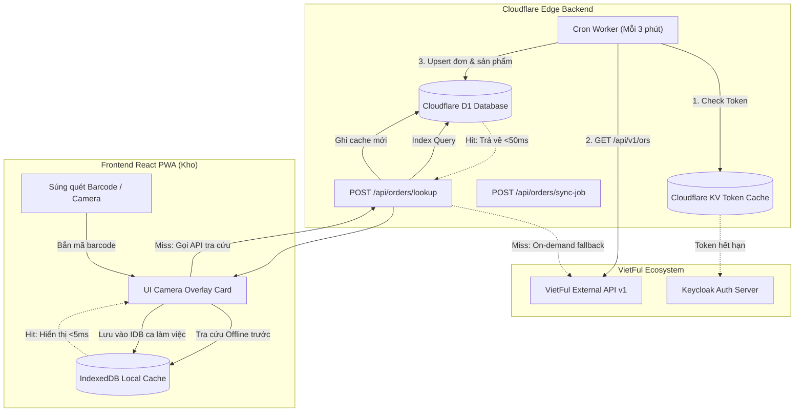

# 16 — ĐẶC TẢ TÍCH HỢP & ĐỒNG BỘ ĐƠN HÀNG QUA VIETFUL API

## 1. TỔNG QUAN & MỤC TIÊU NGHIỆP VỤ

### 1.1. Bối Cảnh Nghiệp Vụ
Trong quy trình kho vận đóng gói (Fulfillment) và xử lý hàng trả về (Reverse Logistics), nhân viên kho cần đối soát trực tiếp đơn hàng trước và trong khi quay video để đảm bảo tính minh bạch, chống gian lận và hỗ trợ khiếu nại sàn TMĐT (Shopee, TikTok Shop, Lazada...):
1. **Luồng Đóng hàng (Packing Mode)**:
   - Nhân viên quét mã vận đơn (in trên tem vận chuyển AWB) hoặc quét mã đơn hàng (Mã OR / Mã đơn sàn).
   - Ứng dụng tự động truy vấn thông tin đơn hàng, hiển thị danh sách sản phẩm, số lượng, SKU biến thể (màu, size) và **ghi chú đóng hàng (`packingNote`)**.
   - Bắt đầu quay video quá trình đóng gói và dán tem.
2. **Luồng Khui hàng / Trả hàng (Unboxing & Return Receiving Mode)**:
   - Nhân viên quét mã vận đơn ban đầu hoặc **mã vận đơn thu hồi (`returnTrackingCode`)** dán trên kiện hàng trả về.
   - Hệ thống tự động nhận diện đơn hoàn, hiển thị danh sách sản phẩm cần kiểm tra, tình trạng trả hàng (`returnDetails`), lý do hoàn.
   - Quay video khui mở gói hàng, kiểm tra ngoại quan và chất lượng sản phẩm.

### 1.2. Thách Thức Kỹ Thuật & Yêu Cầu Tốc Độ
- **Tốc độ phản hồi < 50ms**: Nhân viên dùng súng quét mã vạch USB bắn mã liên tục. Ứng dụng không thể chờ gọi HTTP trực tiếp sang bên thứ ba (độ trễ 500ms - 2000ms).
- **Đa dạng mã quét**: Chuỗi barcode quét được có thể là: Mã OR (`orCode` / `partnerORCode`), Mã vận đơn (`trackingCode`), Mã vận đơn thu hồi (`returnTrackingCode`), hoặc Mã kiện (`packageNo`). Tuy nhiên API VietFul tra cứu chi tiết (`GET /api/v1/ors/get-by-code/{code}`) chỉ chấp nhận `PartnerORCode`.
- **Offline-First Resilience**: Kho hàng thường có góc khuất sóng Wi-Fi/4G. Hệ thống phải lưu cache trên Cloudflare D1 và IndexedDB client để vẫn hiển thị thông tin ngay cả khi rớt mạng tạm thời.

---

## 2. THÔNG TIN KẾT NỐI & XÁC THỰC VIETFUL API

### 2.1. Cấu Hình Cần Lấy Từ VietFul
Để tích hợp, quản trị viên cần liên hệ VietFul (hoặc truy cập **Momena Portal $\rightarrow$ Developer Settings**) để lấy các thông số sau:

| Thông số | Môi trường Staging | Môi trường Production | Mô tả |
| :--- | :--- | :--- | :--- |
| **API Base URL** | `https://ext.stg.vnfai.com` | Cung cấp theo domain khách hàng | Địa chỉ gọi các API nghiệp vụ |
| **Auth Base URL** | `https://tes-auth.fai.aipacific.tech` | Cung cấp theo tenant realm | Máy chủ Keycloak cấp OAuth2 Token |
| **Client Code (Realm)** | Ví dụ: `aad`, `nvs`, `thg`... | Mã định danh 3 ký tự của tenant | Đường dẫn realm trong URL xác thực |
| **Client ID** | Lấy trên portal | Lấy trên portal | Định danh ứng dụng API |
| **Client Secret** | Lấy trên portal | Lấy trên portal | Khóa bí mật sinh token (Bảo mật tuyệt đối) |
| **Warehouse Code** | Ví dụ: `WH_HCM_01` | Mã kho thực tế | Giới hạn đơn hàng theo kho làm việc |

> [!CAUTION]
> Tuyệt đối **KHÔNG** lưu `Client Secret` trên Frontend React PWA. Toàn bộ quá trình xác thực và ủy quyền phải thực hiện tại Cloudflare Workers backend.

### 2.2. Cơ Chế Xác Thực OAuth2 Client Credentials
VietFul sử dụng chuẩn Keycloak OpenID Connect:
- **Endpoint lấy Access Token**:
  ```http
  POST /auth/realms/{client_code}/protocol/openid-connect/token
  Host: {auth_base_url}
  Content-Type: application/x-www-form-urlencoded

  grant_type=client_credentials&client_id={CLIENT_ID}&client_secret={CLIENT_SECRET}
  ```
- **Phản hồi thành công (200 OK)**:
  ```json
  {
    "access_token": "eyJhbGciOiJSUzI1NiIs...",
    "expires_in": 86400,
    "refresh_expires_in": 604800,
    "refresh_token": "eyJhbGciOiJIUzI1NiIs...",
    "token_type": "bearer"
  }
  ```
- **Caching Token tại Edge**:
  Cloudflare Worker lưu `access_token` vào Cloudflare KV với TTL = `expires_in - 300` (giảm 5 phút dự phòng rủi ro lệch đồng hồ). Chỉ gọi lại endpoint lấy token khi token trong KV hết hạn.

---

## 3. KIẾN TRÚC TỔNG THỂ & LUỒNG DỮ LIỆU



---

## 4. LƯỢC ĐỒ DATABASE (CLOUDFLARE D1) CHO ĐỒNG BỘ ĐƠN HÀNG

Nhằm tối ưu hóa tốc độ tra cứu bất kỳ loại mã nào thành thời gian truy vấn dưới **10ms**, thiết kế cấu trúc bảng tại Cloudflare D1 như sau:

### 4.1. Bảng `synced_orders` (Thông Tin Đơn Hàng Đồng Bộ)
```sql
CREATE TABLE synced_orders (
    id TEXT PRIMARY KEY,                       -- UUID hệ thống
    or_code TEXT NOT NULL,                     -- Mã OR VietFul (VD: OR2026090001)
    partner_or_code TEXT NOT NULL,             -- Mã đơn hàng của đối tác/sàn (VD: ORD-SHOPEE-991)
    ref_code TEXT,                             -- Mã tham chiếu
    warehouse_code TEXT NOT NULL,              -- Mã kho
    status TEXT NOT NULL,                      -- Trạng thái đơn (Packing, Packed, OnReturn, ...)
    tracking_code TEXT,                        -- Mã vận đơn giao hàng
    return_tracking_code TEXT,                 -- Mã vận đơn thu hồi / hoàn trả
    packing_note TEXT,                         -- Ghi chú đóng gói quan trọng cho nhân viên kho
    order_note TEXT,                           -- Ghi chú chung của đơn
    customer_name TEXT,                        -- Tên người nhận
    customer_phone TEXT,                       -- Số điện thoại
    shipping_address TEXT,                     -- Địa chỉ giao
    carrier_name TEXT,                         -- Đơn vị vận chuyển (SPX, GHN, J&T...)
    cod_amount REAL DEFAULT 0,                 -- Tiền thu hộ COD
    is_hold INTEGER DEFAULT 0,                 -- Cảnh báo giữ đơn (1 = Hold, 0 = Bình thường)
    synced_at INTEGER NOT NULL,                -- Timestamp đồng bộ (Unix seconds)
    updated_at INTEGER NOT NULL
);

-- Indexes tối quan trọng cho súng quét mã vạch
CREATE INDEX idx_synced_orders_tracking ON synced_orders(tracking_code);
CREATE INDEX idx_synced_orders_return_tracking ON synced_orders(return_tracking_code);
CREATE INDEX idx_synced_orders_partner_or ON synced_orders(partner_or_code);
CREATE INDEX idx_synced_orders_or_code ON synced_orders(or_code);
CREATE INDEX idx_synced_orders_warehouse ON synced_orders(warehouse_code);
```

### 4.2. Bảng `synced_order_items` (Chi Tiết Sản Phẩm Trong Đơn)
```sql
CREATE TABLE synced_order_items (
    id TEXT PRIMARY KEY,                       -- UUID
    order_id TEXT NOT NULL,                    -- Foreign key tới synced_orders(id)
    sku TEXT NOT NULL,                         -- SKU nội bộ VietFul
    partner_sku TEXT NOT NULL,                 -- SKU của đối tác / sàn
    product_name TEXT NOT NULL,                -- Tên sản phẩm
    variant_info TEXT,                         -- JSON: { color: "Đỏ", size: "XL" }
    order_qty INTEGER NOT NULL DEFAULT 1,      -- Số lượng đặt
    packed_qty INTEGER NOT NULL DEFAULT 0,     -- Số lượng đã đóng
    price REAL DEFAULT 0,                      -- Đơn giá
    avatar_url TEXT,                           -- URL ảnh đại diện sản phẩm
    note TEXT,                                 -- Ghi chú sản phẩm
    FOREIGN KEY (order_id) REFERENCES synced_orders(id) ON DELETE CASCADE
);

CREATE INDEX idx_synced_items_order_id ON synced_order_items(order_id);
CREATE INDEX idx_synced_items_sku ON synced_order_items(partner_sku);
```

### 4.3. Bảng `synced_order_packages` (Kiện Hàng)
```sql
CREATE TABLE synced_order_packages (
    id TEXT PRIMARY KEY,
    order_id TEXT NOT NULL,
    package_no TEXT NOT NULL,                  -- Mã kiện (VD: PKG-001)
    bill_of_lading TEXT NOT NULL,              -- Mã vận đơn gắn theo kiện
    status TEXT NOT NULL,                      -- Packed, InTransit, Returned...
    FOREIGN KEY (order_id) REFERENCES synced_orders(id) ON DELETE CASCADE
);

CREATE INDEX idx_synced_packages_bill ON synced_order_packages(bill_of_lading);
CREATE INDEX idx_synced_packages_no ON synced_order_packages(package_no);
```

### 4.4. Bảng `synced_order_returns` (Chi Tiết Trả Về Khi Khui Hàng)
```sql
CREATE TABLE synced_order_returns (
    id TEXT PRIMARY KEY,
    order_id TEXT NOT NULL,
    ir_code TEXT,                              -- Mã IR nhập hàng trả về
    sku TEXT NOT NULL,
    partner_sku TEXT NOT NULL,
    qty INTEGER NOT NULL DEFAULT 1,            -- Số lượng hoàn
    condition_type_code TEXT,                  -- Loại điều kiện (Hàng tốt, Hàng lỗi, vỡ hỏng)
    storage_code TEXT,                         -- Vị trí lưu kho
    lot_number TEXT,                           -- Số lô
    expired_date TEXT,                         -- Hạn dùng
    FOREIGN KEY (order_id) REFERENCES synced_orders(id) ON DELETE CASCADE
);

CREATE INDEX idx_synced_returns_order ON synced_order_returns(order_id);
```

---

## 5. ĐẶC TẢ BACKEND API ENDPOINTS (CLOUDFLARE WORKERS)

### 5.1. `POST /api/orders/lookup` (Tra Cứu Nhanh Khi Quét Mã)
Phục vụ trực tiếp cho PWA khi súng quét bắn mã vào.

- **Request Body**:
  ```json
  {
    "code": "SPX09812345678",
    "mode": "auto" 
  }
  ```
  *(mode: `auto` | `packing` | `unboxing`)*

- **Logic Xử Lý Tại Backend**:
  1. Kiểm tra mã `code` trong bảng `synced_orders` lần lượt theo thứ tự ưu tiên:
     - `tracking_code = code` (Mã vận đơn)
     - `return_tracking_code = code` (Mã vận đơn thu hồi)
     - `partner_or_code = code` (Mã OR đối tác)
     - `or_code = code` (Mã OR VietFul)
     - Tìm trong bảng `synced_order_packages` theo `bill_of_lading` hoặc `package_no`.
  2. **Nếu tìm thấy trong D1**: Trả về dữ liệu ngay lập tức (<10ms).
  3. **Nếu không tìm thấy trong D1 (Cache Miss)**:
     - Gọi fallback trực tiếp sang VietFul API: `GET /api/v1/ors/get-by-code/{code}`.
     - Nếu có, tiến hành parse, enrich sản phẩm qua `GET /api/v1/Products/{partnerSKU}` và upsert tức thì vào D1 để lần quét sau hit cache.
  4. Xác định luồng: Nếu mã trùng `return_tracking_code` hoặc trạng thái đơn là `OnReturn`, `ReturnReceived`, `Returned` $\rightarrow$ Đánh dấu cờ `isReturnOrder: true` để giao diện tự bật chế độ Khui Hàng.

- **Response Chuẩn (200 OK)**:
  ```json
  {
    "success": true,
    "data": {
      "orderId": "uuid-123",
      "orCode": "OR20260922001",
      "partnerOrCode": "ORD-SHOPEE-99881",
      "refCode": "REF-001",
      "trackingCode": "SPX09812345678",
      "returnTrackingCode": "RET-SPX-098123",
      "status": "Packing",
      "isReturnOrder": false,
      "isHold": false,
      "packingNote": "Bọc thêm 2 lớp xốp bong bóng khí, dán tem hàng dễ vỡ!",
      "orderNote": "Giao giờ hành chính",
      "carrier": {
        "name": "Shopee Xpress",
        "service": "Chuẩn"
      },
      "customer": {
        "name": "Nguyễn Văn A",
        "phone": "0987***321",
        "address": "Phường 12, Quận Tân Bình, TP.HCM"
      },
      "codAmount": 150000,
      "items": [
        {
          "sku": "VF-SKU-001",
          "partnerSku": "AO-THUN-DEN-L",
          "productName": "Áo Thun Cotton Oversize - Đen (Size L)",
          "variant": { "color": "Đen", "size": "L" },
          "orderQty": 2,
          "packedQty": 0,
          "price": 75000,
          "avatarUrl": "https://minio.vnfai.com/public/products/ao-den.jpg"
        }
      ],
      "packages": [
        {
          "packageNo": "PKG01",
          "billOfLading": "SPX09812345678",
          "status": "Packed"
        }
      ],
      "returnDetails": []
    }
  }
  ```

### 5.2. `POST /api/orders/sync-job` (Cron Worker Đồng Bộ Gia Tăng)
Chạy tự động theo lịch (Cron trigger: `*/3 * * * *` - mỗi 3 phút một lần) hoặc do Admin kích hoạt thủ công.

- **Cơ Chế Đồng Bộ Gia Tăng (Incremental Sync)**:
  - Lấy thời điểm đồng bộ gần nhất từ Cloudflare KV (`LAST_SYNC_TIMESTAMP`).
  - Gọi VietFul API:
    ```http
    GET /api/v1/ors?FromDate={last_sync}&ToDate={now}&WithProduct=true&SearchDateOption=2&PageSize=50
    ```
    *(SearchDateOption = 2: Tìm theo `UpdatedDate` để bắt kịp các thay đổi trạng thái).*
  - Duyệt danh sách đơn, upsert vào bảng `synced_orders` và `synced_order_items`.
  - Cập nhật lại `LAST_SYNC_TIMESTAMP` trong KV.

---

## 6. THIẾT KẾ UI/UX TRÊN FRONTEND REACT PWA

Tuân thủ nghiêm ngặt Quy tắc UI/UX dự án (`.agents/rules/01-ui-ux.md`):
- Sử dụng **Core UI Primitives** (`@/components/ui/card`, `badge`, `scroll-area`, `separator`, `alert`).
- Tuyệt đối **không dùng Emoji ký tự** (`📦`, `🎥`, `✅`, `❌`...). Bắt buộc dùng `lucide-react` icons.
- Kích thước phần tử tương tác tối thiểu **$48px \times 48px$** cho môi trường công nhân kho đeo găng tay.

### 6.1. Order Info Card (Giao Diện Overlay Trên Màn Hình Quay Video)

```
┌────────────────────────────────────────────────────────────┐
│ [Lucide: Package] ĐƠN HÀNG: ORD-SHOPEE-99881  [Badge: Packing] │
│ MVĐ: SPX09812345678 • ĐVVC: Shopee Xpress                 │
├────────────────────────────────────────────────────────────┤
│ ⚠ GHI CHÚ ĐÓNG GÓI:                                       │
│ Bọc thêm 2 lớp xốp bong bóng khí, dán tem hàng dễ vỡ!     │
├────────────────────────────────────────────────────────────┤
│ DANH SÁCH SẢN PHẨM (Tổng: 2 món):                         │
│ [Ảnh 40x40] Áo Thun Cotton Oversize                       │
│             Phân loại: Đen / L  •  SKU: AO-THUN-DEN-L     │
│             Số lượng cần đóng: [ 2 cái ]                   │
├────────────────────────────────────────────────────────────┤
│ Người nhận: Nguyễn Văn A (0987***321) • COD: 150.000 đ    │
└────────────────────────────────────────────────────────────┘
```

### 6.2. Các Trạng Thái Giao Diện (State Management)
1. **Trạng thái Chờ Quét (Idle State)**:
   - Hiển thị ô nhập mã vận đơn kích thước lớn, autofocus sẵn sàng nhận tín hiệu từ súng quét mã vạch USB.
2. **Trạng thái Tìm Thấy Đơn (Order Loaded)**:
   - Tự động hiển thị Order Info Card nổi trên khung hình camera.
   - Nếu đơn hàng có cảnh báo `isHold = true`: Hiển thị cảnh báo màu đỏ (`Alert variant="destructive"`), kèm icon `AlertTriangle`, nút quay video bị vô hiệu hóa để chặn đóng gói đơn bị hủy/giữ.
   - Nếu có `packingNote`: Hiển thị khung màu vàng tương phản cao (`bg-amber-500/10 border-amber-500/30 text-amber-300`).
3. **Trạng thái Chế Độ Khui Hàng (Unboxing Mode)**:
   - Khi quét trúng `returnTrackingCode` hoặc đơn hàng có trạng thái `OnReturn`:
   - Giao diện tự động chuyển sang theme Khui hàng (Badge tím: `Hàng Hoàn / Khui Hàng`).
   - Hiển thị danh sách `returnDetails` để nhân viên tích chọn đối soát từng sản phẩm khi mở hộp.

---

## 7. CHIẾN LƯỢC OFFLINE-FIRST & BẢO TOÀN DỮ LIỆU

### 7.1. Đồng Bộ Cục Bộ (IndexedDB - Store `cached_orders`)
- Khi nhân viên bắt đầu ca làm việc, PWA tự động tải trước danh sách các đơn hàng dự kiến đóng/trả trong ngày vào IndexedDB.
- Khi súng quét mã vạch bắn tín hiệu:
  1. Frontend tìm kiếm trực tiếp trong IndexedDB store `cached_orders` với index `trackingCode` và `returnTrackingCode`.
  2. Nếu có: Hiển thị ngay thông tin đơn hàng trong **$0 - 5ms$**, không cần kết nối mạng.
  3. Đánh dấu `isOfflineCached: true`.
- Khi có mạng: Background Sync tự động đồng bộ video quay được và thông tin đối soát lên server.

### 7.2. Xử Lý Các Trường Hợp Bất Thường (Edge Cases)
| Trường hợp | Hiện tượng | Giải pháp xử lý |
| :--- | :--- | :--- |
| **Quét không tìm thấy đơn** | Súng quét mã lạ hoặc đơn mới tạo chưa đồng bộ | Phát âm thanh bíp cảnh báo lỗi (`AudioBeep.error()`), hiển thị Modal cho phép nhân viên tiếp tục quay thủ công (nhập mã tay) hoặc bấm nút "Thử tìm lại trên server VietFul". |
| **Đơn hàng bị Giữ / Hủy** | `isHold = true` hoặc `status = Cancelled` | Hiển thị cảnh báo đỏ toàn màn hình, chặn bấm bắt đầu quay đóng hàng để tránh lãng phí vật tư đóng gói. |
| **Đơn có nhiều kiện (Multi-package)** | 1 đơn chia thành nhiều thùng | Hiển thị danh sách kiện (`packages`), highlight kiện ứng với mã vận đơn vừa quét, chỉ rõ kiện `1/2` hay `2/2`. |
| **Token VietFul hết hạn** | API trả về mã `401 Unauthorized` | Cloudflare Worker bắt mã 401, tự động xóa KV cache, kích hoạt luồng tái cấp token và retry request tự động (tối đa 2 lần). |

---

## 8. KẾ HOẠCH TRIỂN KHAI PHÁT TRIỂN (ROADMAP)

### Giai Đoạn 1: Backend & D1 Database Setup
- [ ] Khởi tạo Migration thêm 4 bảng `synced_orders`, `synced_order_items`, `synced_order_packages`, `synced_order_returns` trên Cloudflare D1.
- [ ] Xây dựng module `VietFulClient` trên Cloudflare Workers: Xác thực OAuth2 Keycloak, caching token bằng KV.
- [ ] Cài đặt endpoint `POST /api/orders/lookup` và Worker Cron Trigger `POST /api/orders/sync-job`.

### Giai Đoạn 2: Frontend PWA UI Integration
- [ ] Xây dựng Component `OrderPreviewCard` tích hợp trên `RecordingView.tsx` sử dụng Shadcn UI & Radix UI.
- [ ] Bổ sung trạng thái `syncedOrder` vào `useRecordingStore` (Zustand).
- [ ] Bắt sự kiện quét súng barcode tốc độ cao (keydown input buffer < 50ms) để tự động kích hoạt lookup.

### Giai Đoạn 3: Offline-First IndexedDB & Khui Hàng Nâng Cao
- [ ] Mở rộng `idb` database schema tại client, thêm store `cached_orders`.
- [ ] Xây dựng giao diện đối soát sản phẩm trong luồng Khui Hàng Hoàn (`UnboxingInspectionModal`).
- [ ] Kiểm thử thực tế với máy quét mã vạch USB chuyên dụng và thiết bị di động kho vận.
