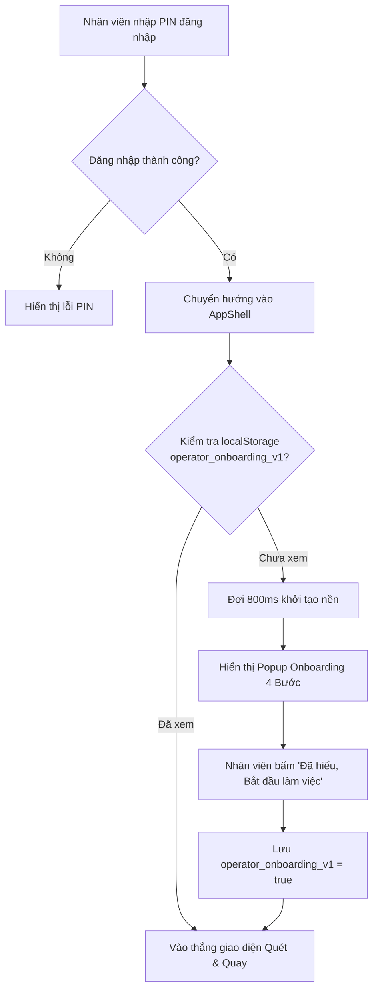
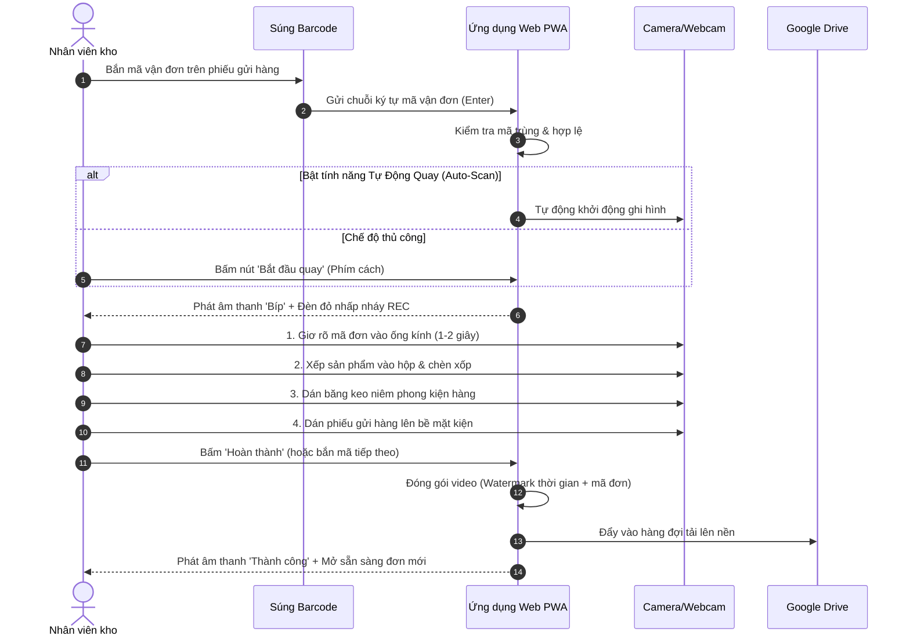

# ĐẶC TẢ HƯỚNG DẪN SỬ DỤNG, ONBOARDING & MENU TRỢ GIÚP CHO NHÂN VIÊN (DOCS 17)

## 1. TỔNG QUAN & ĐỐI TƯỢNG ÁP DỤNG

### 1.1 Mục tiêu tài liệu
Tài liệu này đặc tả toàn diện giải pháp hướng dẫn người dùng cho vai trò **Nhân viên kho vận (`nhan_vien`)**:
- Trải nghiệm đăng nhập lần đầu mượt mà, không bỡ ngỡ thông qua **Popup Onboarding tự động**.
- Cơ chế mở lại hướng dẫn thao tác tức thì mọi lúc mọi nơi thông qua **Menu Hướng dẫn trên PC và Mobile** (được gộp khoa học vào icon Menu trên thiết bị di động).
- Bộ quy trình thao tác chuẩn (SOP) tối giản, dễ hiểu cho công nhân kho, tập trung vào tốc độ và tính chính xác cao.

### 1.2 Đối tượng người dùng mục tiêu
- **Nhân viên đóng hàng**: Thao tác liên tục bằng súng quét barcode USB, máy tính bàn hoặc tablet cố định tại bàn đóng gói.
- **Nhân viên nhận hàng hoàn / Khui hàng**: Thường sử dụng điện thoại di động (PWA Mobile) hoặc webcam di động để kiểm tra kiện hàng trả về.
- **Đặc thù người dùng**: Cần giao diện trực quan, chữ to rõ, nút bấm tối thiểu 48px, không chữ kỹ thuật phức tạp, hướng dẫn step-by-step kèm icon trực quan.

---

## 2. CƠ CHẾ POPUP ONBOARDING LẦN ĐẦU ĐĂNG NHẬP

### 2.1 Điều kiện kích hoạt (Trigger Logic)
- **Đối tượng áp dụng**: Tất cả tài khoản có vai trò `nhan_vien` (hoặc `admin` truy cập trạm làm việc lần đầu).
- **Trigger event**: Đăng nhập thành công, chuyển hướng vào `AppShell` (`/`).
- **Điều kiện hiển thị**:
  1. `isAuthenticated === true`
  2. Chưa tồn tại khóa `operator_onboarding_dismissed` trong `localStorage` (hoặc cờ phiên bản `operator_onboarding_v1 !== 'true'`).
  3. Delay khởi động: **800ms** sau khi mount `AppShell` để tránh giật lag layout và ưu tiên khởi tạo camera preview.



### 2.2 Thiết kế Giao diện Popup Onboarding (`UserOnboardingModal`)
Giao diện Popup được xây dựng dựa trên Core Primitives `@/components/ui/dialog`:
- Độ rộng: `max-w-md w-[92vw]`, bo góc `rounded-3xl`, bóng đổ `shadow-2xl`.
- Bố cục: 4 bước trực quan dạng trình chiếu thẻ (Stepped Cards) hoặc Carousel trượt mượt mà.

#### Nội dung 4 bước hướng dẫn cốt lõi:
| Bước | Tiêu đề | Nội dung hướng dẫn ngắn gọn cho nhân viên | Icon Lucide |
| :---: | :--- | :--- | :---: |
| **1** | **Chọn Kho & Thiết bị** | Chọn đúng Kho làm việc trên thanh tiêu đề. Chọn Webcam (máy tính) hoặc Camera sau (điện thoại). | `Building2` |
| **2** | **Bắn Mã Vận Đơn** | Dùng súng quét barcode bắn vào mã vận đơn trên phiếu gửi. Hệ thống tự động kích hoạt quay (nếu bật Auto-Scan). | `Barcode` / `ScanLine` |
| **3** | **Quay Quy Trình Đóng/Khui** | Đưa kiện hàng và tem mã đơn rõ nét vào khung hình. Thực hiện đóng gói hoặc rạch thùng kiểm hàng. | `Video` |
| **4** | **Tự Động Upload An Toàn** | Bấm nút Kết thúc (hoặc bấm súng quét mã tiếp theo). Video tự động tải lên Google Drive, không lo mất mạng. | `CloudCheck` / `ShieldCheck` |

#### Hành động người dùng (Action Controls):
- **Nút "Đã hiểu, bắt đầu làm việc"**: Kích thước lớn (`h-11`), bo góc `rounded-xl`, màu xanh `bg-primary`, icon `CheckCircle2`.
- **Tùy chọn ghi nhớ**: Tự động lưu `operator_onboarding_v1 = true` vào `localStorage` khi đóng popup.
- **Nút "Xem chi tiết quy trình"**: Cho phép chuyển nhanh đến Drawer/Page hướng dẫn chi tiết nếu cần.

---

## 3. ĐẶC TẢ VỊ TRÍ MENU "HƯỚNG DẪN" TRÊN PC & MOBILE

Hệ thống cung cấp điểm truy cập menu Hướng dẫn thường trực để nhân viên có thể tra cứu lại bất cứ lúc nào trong ca làm việc.

```
┌─────────────────────────────────────────────────────────────────────────┐
│                            HỆ THỐNG TRUY CẬP                           │
├────────────────────────────────────┬────────────────────────────────────┤
│           MÁY TÍNH (PC)            │        ĐIỆN THOẠI (MOBILE)         │
│  - Sidebar: Nút "Hướng dẫn" riêng  │  - Menu Bottom: Icon Menu (Sheet)  │
│  - Header: Icon Trợ giúp (?)       │  - Tích hợp mục "Hướng dẫn thao tác"│
└────────────────────────────────────┴────────────────────────────────────┘
```

### 3.1 Trên Giao diện PC / Tablet (Desktop Sidebar & Header)
1. **Desktop Sidebar (`Sidebar.tsx`)**:
   - Nằm trong nhóm menu thao tác hàng ngày:
     - `Dashboard` (`/dashboard`)
     - `Quét & Quay` (`/`)
     - `Hàng đợi` (`/queue`)
     - `Lịch sử` (`/history`)
     - 🌟 **`Hướng dẫn thao tác`** (Nút kích hoạt Modal Hướng dẫn hoặc chuyển tới `/guide`)
     - `Cài đặt` (`/settings`)
   - Icon: `BookOpen` hoặc `HelpCircle` (màu hổ phách `amber-500` hoặc xanh lục `emerald-500`).
   - Hỗ trợ cả 2 trạng thái Sidebar: Expanded (có nhãn chữ) và Collapsed (chỉ hiển thị tooltip).

2. **Desktop Header (`Header.tsx`)**:
   - Nút icon `HelpCircle` tròn thanh mảnh nằm ở góc phải Header cạnh nút Chuyển đổi Theme (Dark/Light).
   - Tooltip: `"Hướng dẫn thao tác kho (F1)"`.

---

### 3.2 Trên Giao diện Điện Thoại (Mobile Bottom Navigation & Sheet Menu)
Theo đặc tả, trên thiết bị di động cần tránh tình trạng thanh điều hướng dưới đáy (BottomNav) bị quá tải nút bấm gây chật chội và bấm nhầm.

#### Cấu trúc Bottom Navigation chuẩn Mobile (5 vị trí):
1. **Quét & Quay** (`/`) - Icon `ScanLine` (Trọng tâm)
2. **Dashboard** (`/dashboard`) - Icon `LayoutDashboard`
3. **Hàng đợi** (`/queue`) - Icon `UploadCloud` (Có badge đếm video chờ tải)
4. **Lịch sử** (`/history`) - Icon `History`
5. **Menu** (Icon `Menu`) - **Sheet trượt từ cạnh phải/dưới**

#### Thiết kế Menu Sheet Mobile (Gộp tất cả chức năng phụ):
Khi nhân viên bấm vào icon **Menu** ở góc dưới cùng bên phải, một `Sheet` Radix UI sẽ trượt lên hiển thị danh mục hành động gọn gàng:

```
┌────────────────────────────────────────────────────────┐
│  📱 MENU TIỆN ÍCH & TRỢ GIÚP                       [X] │
├────────────────────────────────────────────────────────┤
│  ┌──────────────────────────────────────────────────┐  │
│  │ 📖 Hướng dẫn thao tác kho                        │  │
│  │    Xem lại quy trình quét, quay & xử lý sự cố     │  │
│  └──────────────────────────────────────────────────┘  │
│  ┌──────────────────────────────────────────────────┐  │
│  │ ⚙️ Cài đặt cá nhân & Thiết bị                    │  │
│  │    Đổi camera, độ phân giải, âm thanh thông báo  │  │
│  └──────────────────────────────────────────────────┘  │
│  ┌──────────────────────────────────────────────────┐  │
│  │ 🏢 Kho làm việc: Kho Tổng Tân Bình               │  │
│  │    Nhân viên: NV001 - Nguyễn Văn Kho              │  │
│  └──────────────────────────────────────────────────┘  │
│  ┌──────────────────────────────────────────────────┐  │
│  │ 🚪 Đăng xuất ca làm việc                         │  │
│  └──────────────────────────────────────────────────┘  │
└────────────────────────────────────────────────────────┘
```

- Bấm vào **"Hướng dẫn thao tác kho"**: Mở ngay Popup/Drawer Hướng dẫn chi tiết dạng thẻ tab thân thiện.

---

## 4. QUY TRÌNH THAO TÁC CHUẨN KHO VẬN (SOP) DÀNH CHO NHÂN VIÊN

### 4.1 Quy trình 1: Đóng Gói Hàng (Bán hàng đi)



#### Lưu ý vàng khi đóng hàng:
1. **Khoảng cách tem**: Giơ tem vận đơn cách camera 20 - 30cm trong 1 - 2 giây đầu tiên để watermark và hình ảnh rõ nét nhất.
2. **Kiểm tra ngoại quan**: Luôn quay rõ sản phẩm còn nguyên seal/hộp trước khi cho vào thùng carton.

---

### 4.2 Quy trình 2: Khui Hàng / Trả Hàng (Hàng hoàn về kho)

1. **Bước 1**: Chuyển chế độ sang **"Khui Hàng"** (Nút chuyển đổi nhanh góc trên màn hình).
2. **Bước 2**: Bắn súng quét vào mã vận đơn đơn hoàn.
3. **Bước 3**: Bấm bắt đầu quay:
   - Quay rõ 6 mặt kiện hàng để chứng minh hiện trạng tem niêm phong và ngoại quan (hộp móp méo, rách, ướt...).
   - Đưa kéo/dao cắt rạch băng keo trước ống kính.
   - Lấy sản phẩm bên trong ra kiểm đếm: số lượng, tình trạng tem mác, phụ kiện đi kèm.
4. **Bước 4**: Bấm **"Hoàn thành"** để lưu biên bản khui hàng. Video này là bằng chứng pháp lý đối soát với đơn vị vận chuyển hoặc sàn thương mại điện tử.

---

### 4.3 Chế độ Quay Liên Tục (Continuous Mode - Siêu tốc độ)
Dành cho trạm đóng hàng năng suất cao (>500 đơn/ngày):
- Nhân viên không cần chạm tay vào chuột hay bàn phím.
- Khi đang quay kiện hàng hiện tại, chỉ cần cầm súng **bắn mã của kiện hàng tiếp theo**:
  + Hệ thống tự động lưu và gửi video kiện cũ vào hàng đợi.
  + Hệ thống lập tức cắt video và bắt đầu ghi hình kiện mới với mã vừa bắn.
  + Tốc độ xử lý: Tiết kiệm 4 - 6 giây cho mỗi đơn hàng.

---

## 5. CƠ CHẾ CHỐNG MẤT DỮ LIỆU & XỬ LÝ SỰ CỐ KHO (OFFLINE-FIRST)

### 5.1 Xử lý khi mất kết nối mạng Internet
- **Hiện tượng**: Đèn báo góc trên chuyển sang màu đỏ `[Mất kết nối — Offline]`.
- **Hành động của nhân viên**: **TIẾP TỤC ĐÓNG HÀNG BÌNH THƯỜNG**.
- **Cơ chế an toàn**:
  + Video được ghi và lưu tạm an toàn vào bộ nhớ nội bộ máy tính (`IndexedDB`).
  + Hàng đợi hiển thị số lượng video chờ đẩy (Badge màu cam).
  + Khi kho có mạng trở lại, ứng dụng tự động đẩy video lên Google Drive lần lượt mà không làm gián đoạn công việc của nhân viên.

### 5.2 Bảng xử lý tình huống khẩn cấp cho nhân viên:

| Sự cố | Nguyên nhân phổ biến | Cách xử lý tức thì (Dưới 30 giây) |
| :--- | :--- | :--- |
| **Súng quét bấm kêu nhưng không vào mã** | Súng bị lỏng cáp USB hoặc đang bật gõ tiếng Việt (Telex/VNI). | 1. Tắt Unikey/bộ gõ tiếng Việt trên máy tính.<br/>2. Rút cắm lại đầu cáp USB của súng quét.<br/>3. Click chuột vào ô nhập mã vận đơn. |
| **Màn hình camera bị đen / Báo lỗi camera** | Trình duyệt chưa được cấp quyền hoặc camera bị ứng dụng khác chiếm giữ. | 1. Tắt các ứng dụng khác như Zalo, Zoom, Teams.<br/>2. Bấm vào biểu tượng ổ khóa cạnh URL trình duyệt -> Chọn "Cho phép Camera".<br/>3. Bấm `F5` tải lại trang. |
| **Cảnh báo "Mã vận đơn đã được quay trước đó"** | Đơn hàng bị quét trùng 2 lần. | 1. Kiểm tra màn hình cảnh báo xem ai đã đóng gói lúc mấy giờ.<br/>2. Nếu đóng lại do sự cố, chọn "Tiếp tục quay lại". Nếu quét nhầm thì bỏ kiện hàng ra đối soát. |
| **Video tải lên bị lỗi (Báo đỏ trong Hàng đợi)** | Google Drive đầy hoặc mạng bị ngắt giữa chừng. | Vào mục **"Hàng đợi"** -> Bấm nút **"Thử lại tất cả"** (Icon vòng xoay). Không tự ý xóa bộ nhớ cache trình duyệt. |

---

## 6. ĐẶC TẢ KỸ THUẬT TRIỂN KHAI FRONTEND (CODE ARCHITECTURE)

### 6.1 State Management: `useOnboardingStore` (`src/stores/onboarding-store.ts`)
```typescript
import { create } from 'zustand';
import { persist } from 'zustand/middleware';

interface OnboardingState {
  hasSeenGuide: boolean;
  isGuideModalOpen: boolean;
  setHasSeenGuide: (seen: boolean) => void;
  openGuideModal: () => void;
  closeGuideModal: () => void;
}

export const useOnboardingStore = create<OnboardingState>()(
  persist(
    (set) => ({
      hasSeenGuide: false,
      isGuideModalOpen: false,
      setHasSeenGuide: (seen) => set({ hasSeenGuide: seen }),
      openGuideModal: () => set({ isGuideModalOpen: true }),
      closeGuideModal: () => set({ isGuideModalOpen: false }),
    }),
    {
      name: 'operator_onboarding_v1',
    }
  )
);
```

### 6.2 Component: `UserGuideModal.tsx` (`src/components/guide/UserGuideModal.tsx`)
- Sử dụng Radix UI `Dialog`, chứa 3 tab nội dung chuẩn:
  1. `Tab 1: Bắt đầu nhanh (4 bước đóng hàng)`
  2. `Tab 2: Phím tắt & Súng quét barcode`
  3. `Tab 3: Xử lý lỗi thường gặp`
- Tái sử dụng được cho cả 2 mục đích:
  + Tự động bung ra khi đăng nhập lần đầu (`hasSeenGuide === false`).
  + Mở thủ công khi bấm menu "Hướng dẫn" trên Sidebar (PC) hoặc Sheet Menu (Mobile).

### 6.3 Tích hợp vào Layout Hệ Thống
1. **`AppShell.tsx`**:
   - Thêm hook kiểm tra lần đầu:
     ```tsx
     const { hasSeenGuide, openGuideModal } = useOnboardingStore();
     useEffect(() => {
       if (isAuthenticated && !hasSeenGuide) {
         const timer = setTimeout(() => openGuideModal(), 800);
         return () => clearTimeout(timer);
       }
     }, [isAuthenticated, hasSeenGuide, openGuideModal]);
     ```
   - Render component `<UserGuideModal />` ở cấp vỏ bọc toàn cục.
2. **`Sidebar.tsx`**:
   - Bổ sung `renderNavItem` với hành động `openGuideModal()` hoặc dẫn hướng.
3. **`BottomNav.tsx`**:
   - Đối với vai trò `nhan_vien`: Chuyển tab thứ 5 thành `Sheet` chứa nút `Hướng dẫn thao tác kho` kèm `Cài đặt` và `Đăng xuất`.

---

## 7. CHECKLIST NGHIỆM THU TÍNH NĂNG (VERIFICATION CHECKLIST)

- [ ] **Lần đầu đăng nhập**: Nhân viên mới đăng nhập PIN `1234` -> Popup hướng dẫn 4 bước xuất hiện sau 800ms.
- [ ] **Ghi nhớ trạng thái**: Tắt popup -> Tải lại trang (`F5`) hoặc đăng xuất đăng nhập lại -> Không tự động hiển thị lại popup.
- [ ] **Menu PC**: Sidebar xuất hiện mục "Hướng dẫn thao tác kho" -> Click mở modal hướng dẫn đầy đủ.
- [ ] **Menu Mobile**: Thanh đáy hiển thị icon `Menu` -> Bấm vào mở Sheet -> Chọn "Hướng dẫn thao tác kho" -> Modal hiển thị mượt mà, căn chỉnh chuẩn màn hình cảm ứng (`touch-friendly`).
- [ ] **Nội dung đơn giản**: Sử dụng ngôn từ kho vận thực tế, dễ hiểu, cấm thuật ngữ lập trình khó hiểu.
- [ ] **Chuẩn UI**: Tuân thủ triệt để Rule 01 (Dùng Lucide icon, cấm Emoji ký tự, nút bấm tối thiểu 48px).
