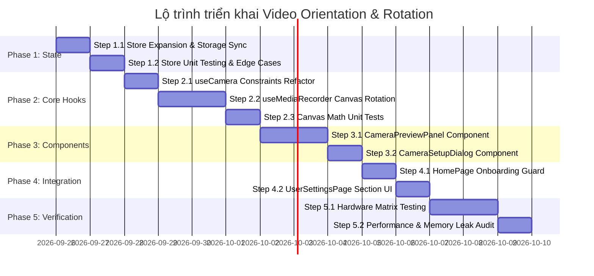

# 19 — ROADMAP TRIỂN KHAI CẤU HÌNH KHUNG HÌNH & GÓC XOAY VIDEO
*(IMPLEMENTATION ROADMAP: VIDEO ORIENTATION & ROTATION)*

> **Căn cứ tài liệu:** [`18-video-orientation-rotation.md`](file:///d:/TOOL%20AI/TOOL_QUAYVIDEO/docs/18-video-orientation-rotation.md)  
> **Tuân thủ tuyệt đối:** 6 bộ quy tắc tại [`.agents/rules/`](file:///d:/TOOL%20AI/TOOL_QUAYVIDEO/.agents/rules)  
> **Ứng dụng chuyên sâu:** Các skills tại [`.agents/skills/`](file:///d:/TOOL%20AI/TOOL_QUAYVIDEO/.agents/skills)  
> **Mục tiêu:** Cho phép nhân viên kho tùy chỉnh khung hình (Landscape/Portrait/Auto) và xoay góc camera (0°/90°/180°/270°) tương thích giá đỡ overhead stand; bắt buộc cấu hình lần đầu sau khi xóa cache hoặc đổi máy.

---

## 1. TỔNG QUAN PHÂN KỲ & MA TRẬN TIÊU CHUẨN



| Phase | Trọng tâm | Files tác động | DoD (Definition of Done) |
|---|---|---|---|
| **Phase 1** | State Management & Per-Device Storage | `stores/user-settings-store.ts`, `stores/__tests__/user-settings-store.test.ts` | State cập nhật chuẩn, isolated per `ma_nhan_vien`, fallback an toàn khi xóa cache |
| **Phase 2** | Media Pipeline & Canvas Transform Engine | `hooks/use-camera.ts`, `hooks/use-media-recorder.ts`, `hooks/__tests__/canvas-rotation.test.ts` | Video xuất chuẩn kích thước 16:9/9:16, camera xoay đúng góc, watermark overlay giữ thẳng |
| **Phase 3** | Reusable UI Primitives (Live Preview & Modal) | `components/settings/CameraPreviewPanel.tsx`, `components/recording/CameraSetupDialog.tsx` | UI đạt chuẩn WCAG AA, không dùng emoji, dùng Radix UI & shadcn, touch target ≥ 48px |
| **Phase 4** | Flow Guarding & Station Settings Page | `pages/HomePage.tsx`, `pages/UserSettingsPage.tsx` | Chặn quay khi chưa setup, điều hướng trực quan, cập nhật live preview mượt mà |
| **Phase 5** | Stress Testing, Memory Leaks & Hardware QA | Test specs, benchmark logs | Pass 16/16 test scenarios, không rò rỉ RAM, 30fps ổn định trên mobile overhead |

---

## 2. KẾ HOẠCH CHI TIẾT TỪNG BƯỚC (STEP-BY-STEP SPECIFICATION)

### PHASE 1: STATE MANAGEMENT & DATA PERSISTENCE

#### Step 1.1 — Mở rộng `user-settings-store.ts`
- **Mục tiêu:** Thêm các trường cấu hình hướng quay, góc xoay và cờ onboarding `isCameraConfigured` gắn liền với namespace từng nhân viên.
- **Tham chiếu docs:** [`18-video-orientation-rotation.md`](file:///d:/TOOL%20AI/TOOL_QUAYVIDEO/docs/18-video-orientation-rotation.md) Mục 2.1 & 3.2.
- **Quy tắc tuân thủ:**
  - [`.agents/rules/06-code-quality-and-standards.md`](file:///d:/TOOL%20AI/TOOL_QUAYVIDEO/.agents/rules/06-code-quality-and-standards.md): TypeScript `strict: true`, không dùng `any`, export đầy đủ type definitions.
  - [`.agents/rules/05-offline-and-reliability.md`](file:///d:/TOOL%20AI/TOOL_QUAYVIDEO/.agents/rules/05-offline-and-reliability.md): Local-first, bọc `try/catch` chống lỗi parse `localStorage`.
- **Skills áp dụng:**
  - `zustand-store-ts`: Khởi tạo store chuẩn subscription, middleware `subscribeWithSelector`, actions bất biến.
  - `typescript-pro`: Khai báo union types khắt khe: `'auto' | 'landscape' | 'portrait'`, `0 | 90 | 180 | 270`.
- **Nội dung công việc:**
  1. Thêm types:
     ```typescript
     export type VideoOrientation = 'auto' | 'landscape' | 'portrait';
     export type VideoRotation = 0 | 90 | 180 | 270;
     ```
  2. Bổ sung vào `UserSettingsState`:
     - `videoOrientation: VideoOrientation;`
     - `videoRotation: VideoRotation;`
     - `isCameraConfigured: boolean;`
  3. Bổ sung vào `UserSettingsActions`:
     - `setVideoOrientation: (orientation: VideoOrientation) => void;`
     - `setVideoRotation: (rotation: VideoRotation) => void;`
     - `setCameraConfigured: (configured: boolean) => void;`
     - `resetCameraConfiguration: () => void;`
  4. Cập nhật `saveToStorage` & `readFromStorage` để persist 3 fields này theo key `user_settings_{maNhanVien}`. Mặc định `isCameraConfigured = false`.
- **Tiêu chí hoàn thành:**
  - Khởi tạo app chưa có storage trả về `isCameraConfigured === false`.
  - Cập nhật store lập tức đồng bộ vào `localStorage` của đúng user active.

---

#### Step 1.2 — Unit Tests cho Store (`user-settings-store.test.ts`)
- **Mục tiêu:** Bảo đảm coverage 100% logic lưu trữ, chuyển đổi user và fallback khi cache bị xóa.
- **Tham chiếu docs:** [`18-video-orientation-rotation.md`](file:///d:/TOOL%20AI/TOOL_QUAYVIDEO/docs/18-video-orientation-rotation.md) Mục 3.1 & 4.4.
- **Quy tắc tuân thủ:**
  - [`.agents/rules/06-code-quality-and-standards.md`](file:///d:/TOOL%20AI/TOOL_QUAYVIDEO/.agents/rules/06-code-quality-and-standards.md): Unit test độc lập, mock browser APIs chuẩn xác.
- **Skills áp dụng:**
  - `test-driven-development`: Viết test cases kiểm thử các trường hợp biên của storage và session.
- **Nội dung công việc:**
  1. Test khởi tạo ban đầu: `videoOrientation: 'auto'`, `videoRotation: 0`, `isCameraConfigured: false`.
  2. Test `setVideoOrientation('landscape')` và `setVideoRotation(90)`.
  3. Test phân tách dữ liệu đa nhân viên (`NV001` cấu hình `landscape/90`, `NV002` đăng nhập nhận default `auto/0/false`).
  4. Test giả lập xóa cache: `localStorage.clear()` → store reset về `isCameraConfigured = false`.
- **Tiêu chí hoàn thành:** Toàn bộ test suites chạy pass trong Vitest.

---

### PHASE 2: CORE HARDWARE & MEDIA PIPELINE HOOKS

#### Step 2.1 — Cải tiến `hooks/use-camera.ts` (Camera Constraints)
- **Mục tiêu:** Cung cấp độ phân giải request chuẩn xác theo hướng mong muốn trước khi stream được vẽ lên canvas.
- **Tham chiếu docs:** [`18-video-orientation-rotation.md`](file:///d:/TOOL%20AI/TOOL_QUAYVIDEO/docs/18-video-orientation-rotation.md) Mục 7.3.
- **Quy tắc tuân thủ:**
  - [`.agents/rules/04-device-and-hardware.md`](file:///d:/TOOL%20AI/TOOL_QUAYVIDEO/.agents/rules/04-device-and-hardware.md): Hỗ trợ Safari iOS và Android camera constraints linh hoạt, fallback mượt mà.
  - [`.agents/rules/03-performance.md`](file:///d:/TOOL%20AI/TOOL_QUAYVIDEO/.agents/rules/03-performance.md): Đảm bảo thu hồi camera track cũ trước khi gán constraints mới.
- **Skills áp dụng:**
  - `frontend-dev-guidelines`: Kiểm soát chặt chẽ lifecycles của stream và clean-up hooks.
- **Nội dung công việc:**
  1. Cập nhật `getResolutionChain`:
     ```typescript
     export function getResolutionChain(
       resolution: '1080p' | '720p',
       fps: number = 30,
       forceOrientation?: VideoOrientation
     ): ResolutionConstraint[]
     ```
  2. Map `ideal.width` và `ideal.height` tương ứng:
     - `forceOrientation === 'landscape'`: `width = max`, `height = min`.
     - `forceOrientation === 'portrait'`: `width = min`, `height = max`.
     - `forceOrientation === 'auto'`: Dựa trên `window.innerHeight > window.innerWidth`.
- **Tiêu chí hoàn thành:** Camera khởi tạo nhận đúng tỉ lệ mong muốn từ thiết bị phần cứng.

---

#### Step 2.2 — Nâng cấp `hooks/use-media-recorder.ts` (Canvas Matrix & Rotation Engine)
- **Mục tiêu:** Biến đổi canvas frame chính xác theo góc xoay (0°, 90°, 180°, 270°) và tỷ lệ khung hình mà không làm quay lệch Watermark overlay.
- **Tham chiếu docs:** [`18-video-orientation-rotation.md`](file:///d:/TOOL%20AI/TOOL_QUAYVIDEO/docs/18-video-orientation-rotation.md) Mục 2.3 & 7.1, 7.2.
- **Quy tắc tuân thủ:**
  - [`.agents/rules/03-performance.md`](file:///d:/TOOL%20AI/TOOL_QUAYVIDEO/.agents/rules/03-performance.md): Giữ điều tiết render loop theo target FPS (30fps), giải phóng canvas context và memory blobs.
  - [`.agents/rules/04-device-and-hardware.md`](file:///d:/TOOL%20AI/TOOL_QUAYVIDEO/.agents/rules/04-device-and-hardware.md): Đảm bảo `playsInline`, `muted` cho source video ngầm.
- **Skills áp dụng:**
  - `react-component-performance`: Tránh allocate objects trong render loop `rAF`.
  - `typescript-pro`: Type checking nghiêm ngặt cho context transformation matrix.
- **Nội dung công việc:**
  1. Bổ sung tham số vào `UseMediaRecorderOptions`:
     ```typescript
     forceOrientation?: VideoOrientation;
     rotation?: VideoRotation;
     ```
  2. Viết hàm `resolveCanvasSize`:
     - Phân định rõ kích thước dựa trên `targetWidth`, `targetHeight` và `forceOrientation`.
     - 720p Landscape: `1280x720` | 720p Portrait: `720x1280`.
     - 1080p Landscape: `1920x1080` | 1080p Portrait: `1080x1920`.
  3. Tái cấu trúc hàm `drawCanvasOverlay`:
     - Tách pha 1: `drawRotatedCameraFrame(ctx, video, canvasWidth, canvasHeight, rotation)` sử dụng `ctx.save()`, `ctx.translate()`, `ctx.rotate()`, `ctx.restore()`.
     - Khi xoay `90°` hoặc `270°`: hoán đổi kích thước render (`canvasHeight`, `canvasWidth`) khi gọi crop `drawObjectFitCover`.
     - Tách pha 2: Render toàn bộ hệ thống Watermark (Badge REC, mã đơn, GPS, thời gian, kho) trực tiếp lên canvas gốc (tọa độ pixel cố định, text không bao giờ bị lộn ngược).
- **Tiêu chí hoàn thành:**
  - Khi đổi sang 90°/270°, hình ảnh camera xoay đúng chiều, phủ kín canvas không bị biến dạng kéo dẹt.
  - Chữ và barcode watermark hiển thị xuôi chiều 100% trường hợp.

---

#### Step 2.3 — Unit Tests Canvas Math (`canvas-rotation.test.ts`)
- **Mục tiêu:** Kiểm thử tính toán tọa độ, ma trận swap dimension và aspect-ratio cover crop.
- **Tham chiếu docs:** [`18-video-orientation-rotation.md`](file:///d:/TOOL%20AI/TOOL_QUAYVIDEO/docs/18-video-orientation-rotation.md) Mục 7.2.
- **Quy tắc tuân thủ:**
  - [`.agents/rules/06-code-quality-and-standards.md`](file:///d:/TOOL%20AI/TOOL_QUAYVIDEO/.agents/rules/06-code-quality-and-standards.md): Zero any, mock canvas context 2D chuẩn xác.
- **Skills áp dụng:**
  - `test-driven-development`: Viết unit test cho các thuật toán hình học máy học/toán đồ họa 2D.
- **Nội dung công việc:**
  1. Test tính toán kích thước canvas cho các tổ hợp (720p/1080p × Landscape/Portrait/Auto).
  2. Mock `CanvasRenderingContext2D` để verify các hàm: `translate`, `rotate`, `drawImage` được gọi đúng tham số ở từng góc 0°, 90°, 180°, 270°.
  3. Test thuật toán `drawObjectFitCover` không tạo tọa độ NaN khi `videoWidth` hoặc `videoHeight` bằng 0.
- **Tiêu chí hoàn thành:** Pass toàn bộ test math hình học.

---

### PHASE 3: REUSABLE UI PRIMITIVES (SHADCN & RADIX)

#### Step 3.1 — Component `CameraPreviewPanel.tsx`
- **Mục tiêu:** Panel hiển thị Live Camera Preview real-time kèm overlay mẫu, hỗ trợ chuyển đổi tức thì các tùy chọn để nhân viên quan sát trực quan trước khi lưu.
- **Tham chiếu docs:** [`18-video-orientation-rotation.md`](file:///d:/TOOL%20AI/TOOL_QUAYVIDEO/docs/18-video-orientation-rotation.md) Mục 5.3 & 8.
- **Quy tắc tuân thủ:**
  - [`.agents/rules/01-ui-ux.md`](file:///d:/TOOL%20AI/TOOL_QUAYVIDEO/.agents/rules/01-ui-ux.md):
    - CẤM TUYỆT ĐỐI emoji (`📹`, `🔄`, `📺`, `📱`, `✅`). Bắt buộc dùng `lucide-react` (`Camera`, `RotateCw`, `Monitor`, `Smartphone`, `Check`, `AlertCircle`, `X`).
    - Dùng Core UI Primitives: `Card`, `Badge`, `Button`, `Separator`.
    - Touch targets ≥ 48px cho các nút chọn góc xoay và hướng.
    - Màu trạng thái semantic: `bg-card`, `text-foreground`, `border-border`.
  - [`.agents/rules/03-performance.md`](file:///d:/TOOL%20AI/TOOL_QUAYVIDEO/.agents/rules/03-performance.md):
    - Bắt buộc thu hồi stream tracks `stream.getTracks().forEach(t => t.stop())` và `cancelAnimationFrame` khi unmount.
  - [`.agents/rules/04-device-and-hardware.md`](file:///d:/TOOL%20AI/TOOL_QUAYVIDEO/.agents/rules/04-device-and-hardware.md):
    - Xử lý khi camera không khả dụng hoặc bị từ chối quyền (placeholder UI).
- **Skills áp dụng:**
  - `shadcn` & `radix-ui-design-system`: Dựng layout tương phản cao, chuẩn a11y.
  - `ui-ux-pro-max`: Typography rõ nét, tỷ lệ tương phản WCAG 2.2 AA.
- **Nội dung công việc:**
  1. Xây dựng component nhận props:
     ```typescript
     interface CameraPreviewPanelProps {
       orientation: VideoOrientation;
       rotation: VideoRotation;
       resolution: VideoResolution;
       isOpen: boolean;
       onClose?: () => void;
     }
     ```
  2. Tạo canvas hiển thị real-time sử dụng chung engine `drawCanvasOverlay` với dữ liệu demo overlay: mã `DEMO123456789`, kho thực tế của nhân viên.
  3. Footer hiển thị debug info kỹ thuật:
     - `Canvas output: {w}x{h}`
     - `Camera stream: {vw}x{vh}`
     - `Góc xoay: {deg}°`
- **Tiêu chí hoàn thành:** Render live camera mượt mà, đổi góc xoay lập tức canvas phản hồi không delay, unmount camera tắt đèn ngay lập tức.

---

#### Step 3.2 — Component `CameraSetupDialog.tsx` (Bắt buộc thiết lập lần đầu)
- **Mục tiêu:** Dialog chặn thao tác quay khi nhân viên chưa cấu hình camera, hiển thị preview và yêu cầu lưu thiết lập.
- **Tham chiếu docs:** [`18-video-orientation-rotation.md`](file:///d:/TOOL%20AI/TOOL_QUAYVIDEO/docs/18-video-orientation-rotation.md) Mục 4 & 9.
- **Quy tắc tuân thủ:**
  - [`.agents/rules/01-ui-ux.md`](file:///d:/TOOL%20AI/TOOL_QUAYVIDEO/.agents/rules/01-ui-ux.md):
    - Dùng `Dialog`, `DialogContent`, `DialogHeader`, `DialogTitle`, `DialogDescription` từ `@/components/ui/dialog`.
    - BẮT BUỘC có `DialogTitle` cho trợ năng WCAG.
    - Cấm đóng dialog qua backdrop click hoặc phím Esc khi chưa hoàn thành cấu hình (`onPointerDownOutside={(e) => e.preventDefault()}`).
    - Nút CTA chính: `Button` size `lg`, touch target full-width trên mobile, chiều cao tối thiểu 52px.
- **Skills áp dụng:**
  - `radix-ui-design-system`: Điều khiển focus trap và accessible modal interactions.
  - `ui-component`: Xây dựng component module hóa, zero ad-hoc styling.
- **Nội dung công việc:**
  1. Định nghĩa component:
     ```typescript
     interface CameraSetupDialogProps {
       isOpen: boolean;
       onComplete: () => void;
     }
     ```
  2. Tích hợp `CameraPreviewPanel` bên trong modal content.
  3. Cung cấp bộ nút chọn nhanh:
     - Khung hình: [Tự động], [Ngang (16:9)], [Dọc (9:16)] kèm icons `RotateCw`, `Monitor`, `Smartphone`.
     - Góc xoay (khi khác Tự động): [0°], [90°], [180°], [270°].
  4. Nút hành động: `Lưu và bắt đầu quay` (`Button` variant `default`, icon `Check`).
  5. Khi nhấn lưu:
     - Lưu settings vào `user-settings-store`.
     - Cập nhật `isCameraConfigured = true`.
     - Đóng modal và kích hoạt callback `onComplete()`.
- **Tiêu chí hoàn thành:** Dialog hiển thị chuẩn, không cho tắt ngang nếu chưa bấm lưu, lưu xong unlock flow quay ngay lập tức.

---

### PHASE 4: PAGE INTEGRATION & WORKFLOW GUARDING

#### Step 4.1 — Tích hợp Guard vào `pages/HomePage.tsx`
- **Mục tiêu:** Chặn quy trình quay video (cả bấm nút thủ công lẫn quét barcode tự động quay) nếu chưa qua bước setup camera.
- **Tham chiếu docs:** [`18-video-orientation-rotation.md`](file:///d:/TOOL%20AI/TOOL_QUAYVIDEO/docs/18-video-orientation-rotation.md) Mục 4.1, 4.3 & 6.1.
- **Quy tắc tuân thủ:**
  - [`.agents/rules/04-device-and-hardware.md`](file:///d:/TOOL%20AI/TOOL_QUAYVIDEO/.agents/rules/04-device-and-hardware.md): Giữ nguyên tương thích súng quét barcode HID wedge và camera scanner.
  - [`.agents/rules/05-offline-and-reliability.md`](file:///d:/TOOL%20AI/TOOL_QUAYVIDEO/.agents/rules/05-offline-and-reliability.md): Không làm mất mã vận đơn đã quét khi dialog setup bật lên.
- **Skills áp dụng:**
  - `react-patterns`: Quản lý state transitions sạch sẽ, tránh race conditions giữa barcode event và dialog.
- **Nội dung công việc:**
  1. Đọc state từ store:
     ```typescript
     const { videoOrientation, videoRotation, isCameraConfigured } = useUserSettingsStore();
     ```
  2. Bổ sung state `isCameraSetupOpen` và `pendingStartAction`.
  3. Bổ sung Interceptor Guard trước khi gọi `startRecording()` hoặc `handleValidScan()`:
     ```typescript
     if (!isCameraConfigured) {
       setPendingStartAction(() => () => proceedRecording());
       setIsCameraSetupOpen(true);
       return;
     }
     ```
  4. Truyền `forceOrientation={videoOrientation}` và `rotation={videoRotation}` vào `useMediaRecorder`.
  5. Đóng gói `CameraSetupDialog` với handler `onComplete`: kích hoạt `pendingStartAction` nếu có.
- **Tiêu chí hoàn thành:**
  - Lần đầu vào app hoặc sau khi xóa cache: bấm quay hoặc bắn súng barcode sẽ dừng lại và bung Dialog Setup.
  - Bấm lưu xong tự động thực thi ngay phiên quay của mã vận đơn vừa quét.

---

#### Step 4.2 — Tích hợp Section cấu hình vào `pages/UserSettingsPage.tsx`
- **Mục tiêu:** Cung cấp khu vực quản lý cố định trong Tab "Ghi hình & Âm thanh" để nhân viên có thể điều chỉnh lại giá trị bất kỳ lúc nào hoặc bấm test góc máy.
- **Tham chiếu docs:** [`18-video-orientation-rotation.md`](file:///d:/TOOL%20AI/TOOL_QUAYVIDEO/docs/18-video-orientation-rotation.md) Mục 5.1 & 5.2.
- **Quy tắc tuân thủ:**
  - [`.agents/rules/01-ui-ux.md`](file:///d:/TOOL%20AI/TOOL_QUAYVIDEO/.agents/rules/01-ui-ux.md):
    - Đặt trong `SettingsCard` chuẩn thiết kế hiện tại.
    - Dùng icon `SlidersHorizontal`, `RotateCw`, `Check`, `RotateCcw` từ `lucide-react`.
    - Bố cục responsive grid (`grid-cols-3` cho khung hình, `grid-cols-4` cho góc xoay).
    - Cung cấp nút `Đặt lại cấu hình camera` với dialog xác nhận.
- **Skills áp dụng:**
  - `ui-ux-pro-max`: Trải nghiệm người dùng mượt mà, visual feedback rõ ràng khi active button.
- **Nội dung công việc:**
  1. Chèn section **Khung hình & Góc xoay camera** vào vị trí quy định trong tab Ghi hình & Âm thanh.
  2. Thêm button bật/tắt Live Preview inline ngay trong trang cài đặt.
  3. Gắn các nút chọn Khung hình (Tự động / Ngang 16:9 / Dọc 9:16) và Góc xoay (0° / 90° / 180° / 270°).
  4. Nút bấm:
     - `Lưu cài đặt camera`: Cập nhật store, hiện toast `toast.success('Đã lưu cấu hình camera trạm thành công')`.
     - `Đặt lại về mặc định`: Reset về `auto`, `0°`, `isCameraConfigured = false`.
- **Tiêu chí hoàn thành:** Nhân viên tùy chỉnh và quan sát kết quả ngay trong màn hình Cài đặt, thay đổi có hiệu lực ngay ở phiên quay tiếp theo.

---

### PHASE 5: KIỂM THỬ THIẾT BỊ, PERFORMANCE & HOÀN THIỆN

#### Step 5.1 — Kiểm thử ma trận thiết bị thực tế & Trường hợp biên
- **Mục tiêu:** Xác minh 16 kịch bản kiểm thử trong tài liệu đặc tả trên các điều kiện thực tế của kho vận.
- **Tham chiếu docs:** [`18-video-orientation-rotation.md`](file:///d:/TOOL%20AI/TOOL_QUAYVIDEO/docs/18-video-orientation-rotation.md) Mục 10 & 12.
- **Quy tắc tuân thủ:**
  - [`.agents/rules/04-device-and-hardware.md`](file:///d:/TOOL%20AI/TOOL_QUAYVIDEO/.agents/rules/04-device-and-hardware.md): Đảm bảo hoạt động hoàn hảo trên Android Chrome, iOS Safari, PC Webcam USB.
- **Skills áp dụng:**
  - `e2e-testing`: Tự động hóa kiểm thử UI flow với Playwright.
  - `systematic-debugging`: Cô lập lỗi stream video, xử lý trường hợp thiết bị trả về orientation bất thường.
- **Nội dung kiểm thử (16 scenarios):**
  1. *Chưa cấu hình lần đầu:* Chặn quay, hiện dialog setup.
  2. *Cấu hình xong:* Quay bình thường với setting đã lưu.
  3. *Overhead stand (Phone dọc, Setting Ngang, Góc 0°):* Xuất video 16:9 crop trên/dưới.
  4. *Overhead stand (Phone dọc, Setting Ngang, Góc 90°):* Xuất video 16:9 full frame đúng chiều mắt nhìn.
  5. *Phone ngang, Setting Dọc, Góc 0°:* Xuất video 9:16 crop 2 bên.
  6. *Auto setting trên thiết bị cầm tay:* Tự nhận diện chiều điện thoại theo OS.
  7. *Xóa cache trình duyệt:* Bật lại dialog bắt buộc setup ngay lần quay kế tiếp.
  8. *Đổi tài khoản đăng nhập:* Thiết lập tách biệt per `ma_nhan_vien`.
  9. *Chuyển đổi 720p và 1080p:* Canvas đúng độ phân giải (`1280x720` vs `1920x1080`).
  10. *Thay đổi setting trong SettingsPage:* Áp dụng ngay lập tức cho phiên quay sau.
- **Tiêu chí hoàn thành:** 16/16 kịch bản đạt kết quả mong muốn.

---

#### Step 5.2 — Đánh giá hiệu năng & Rò rỉ bộ nhớ (Performance & Memory Audit)
- **Mục tiêu:** Bảo đảm việc xoay canvas và live preview không gây sụt giảm khung hình hoặc tràn bộ nhớ RAM thiết bị kho.
- **Tham chiếu docs:** [`02-dac-ta-ky-thuat.md`](file:///d:/TOOL%20AI/TOOL_QUAYVIDEO/docs/02-dac-ta-ky-thuat.md) & [`18-video-orientation-rotation.md`](file:///d:/TOOL%20AI/TOOL_QUAYVIDEO/docs/18-video-orientation-rotation.md) Mục 10.
- **Quy tắc tuân thủ:**
  - [`.agents/rules/03-performance.md`](file:///d:/TOOL%20AI/TOOL_QUAYVIDEO/.agents/rules/03-performance.md):
    - Đảm bảo `URL.revokeObjectURL()`.
    - Dừng toàn bộ camera tracks khi thoát preview hoặc dừng quay.
    - Main thread render đạt ổn định 30fps, không drop frames.
- **Skills áp dụng:**
  - `performance-testing-review-multi-agent-review`: Benchmark CPU/Memory consumption.
  - `react-component-performance`: Đảm bảo không render thừa khi quay video liên tục.
- **Nội dung công việc:**
  1. Chạy profiling 50 phiên quay liên tiếp với setting xoay 90° trên điện thoại Android/iOS.
  2. Kiểm tra bộ nhớ JS Heap: không có hiện tượng memory creep (giữ video frames trong RAM).
  3. Đo CPU usage khi mở Live Camera Preview: duy trì dưới 35% trên chip di động tầm trung.
- **Tiêu chí hoàn thành:** Không crash trình duyệt, RAM ổn định sau 50 chu kỳ quay - lưu - upload.

---

## 3. CHECKLIST KIỂM SOÁT TUÂN THỦ RULES & SKILLS

| Danh mục kiểm tra | Rule / Skill | Yêu cầu bắt buộc | Trạng thái đạt |
|---|---|---|---|
| **Zero Emoji** | Rule `01-ui-ux.md` | Tuyệt đối cấm ký tự emoji trong toàn bộ UI/code/dialogs, chỉ dùng `lucide-react` | [ ] Bắt buộc |
| **Core UI Primitives** | Rule `01-ui-ux.md` | Dùng 100% `Dialog`, `Button`, `Card`, `Badge` từ `@/components/ui/*` | [ ] Bắt buộc |
| **Touch Target** | Rule `01-ui-ux.md` | Toàn bộ nút chọn orientation, rotation, CTA lưu đạt kích thước ≥ 48px | [ ] Bắt buộc |
| **Hardware Release** | Rule `03-performance.md` | Camera track phải tắt ngay khi đóng Preview hoặc chuyển trang | [ ] Bắt buộc |
| **Watermark Integrity** | Rule `04-device-and-hardware.md` | Text watermark luôn xuôi chiều, không bị lật ngược khi xoay camera | [ ] Bắt buộc |
| **Storage Isolation** | Rule `05-offline-and-reliability.md` | Key lưu theo user: `user_settings_{maNhanVien}`, fallback an toàn khi xóa cache | [ ] Bắt buộc |
| **Type Strictness** | Rule `06-code-quality-and-standards.md` | Zero `any`, khai báo kiểu khắt khe cho góc xoay và hướng khung hình | [ ] Bắt buộc |
| **State Middleware** | Skill `zustand-store-ts` | Sử dụng `subscribeWithSelector`, atomic actions | [ ] Bắt buộc |
| **Accessible Modals** | Skill `radix-ui-design-system` | Dialog có đầy đủ `DialogTitle`, focus trap, chặn backdrop escape khi bắt buộc setup | [ ] Bắt buộc |

---

## 4. KẾT LUẬN & BƯỚC TIẾP THEO

Roadmap này đóng vai trò là kim chỉ nam kỹ thuật chuẩn xác để đội ngũ kỹ sư tiến hành hiện thực hóa tính năng **Cấu hình Khung hình & Góc xoay Video**. Sau khi tài liệu này được phê duyệt:
1. Tiến hành ngay **Phase 1** (Step 1.1 & 1.2) trên nhánh tính năng.
2. Kiểm thử độc lập từng module theo đúng DoD trước khi ghép nối vào `HomePage.tsx`.
