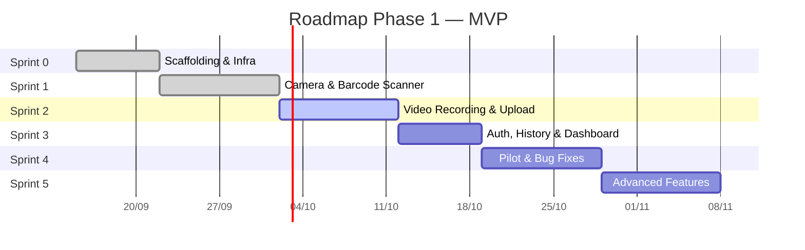

# ROADMAP CHI TIẾT — PWA QUAY VIDEO KHO VẬN

> Dựa trên 11 tài liệu kỹ thuật trong [`docs/`](file:///d:/TOOL%20AI/TOOL_QUAYVIDEO/docs), 6 rules và 20 skills đã thiết lập.

---

## Tổng quan Phase



| Sprint | Mục tiêu | Thời lượng | Trạng thái |
| :--- | :--- | :--- | :--- |
| **Sprint 0** | Scaffolding, Infra, Google Drive connection | 1 tuần | **ĐÃ HOÀN THÀNH (181/181 tests pass)** |
| **Sprint 1** | Camera + Barcode Scanner (3 nhóm thiết bị) | 1–2 tuần | **ĐÃ HOÀN THÀNH (126/126 tests pass)** |
| **Sprint 2** | Video Recording + IndexedDB Queue + Upload | 1–2 tuần | Chưa bắt đầu |
| **Sprint 3** | Auth (PIN), History/Search, Dashboard | 1 tuần | Chưa bắt đầu |
| **Sprint 4** | Pilot thực tế, bug fixes, UX polish | 1–2 tuần | Chưa bắt đầu |
| **Sprint 5** | Auto-scan, Quay liên tục, Watermark, Nén | 1–2 tuần | Chưa bắt đầu |

---

# SPRINT 0 — SCAFFOLDING & INFRASTRUCTURE [HOÀN THÀNH]

**Mục tiêu**: Dựng khung dự án hoàn chỉnh, kết nối thử Google Drive, chạy được dev server cả frontend lẫn backend.

## Step 0.1 — Khởi tạo Frontend (Vite + React + PWA)

**Tham chiếu docs:**
- [`08-frontend-architecture.md`](file:///d:/TOOL%20AI/TOOL_QUAYVIDEO/docs/08-frontend-architecture.md): Project structure, routing, PWA config
- [`11-ui-design-system.md`](file:///d:/TOOL%20AI/TOOL_QUAYVIDEO/docs/11-ui-design-system.md): Design tokens, color palette, typography

**Skills áp dụng:**
- `react-best-practices` — Cấu trúc project, naming conventions
- `typescript-pro` — tsconfig strict mode, path aliases
- `progressive-web-app` — vite-plugin-pwa, manifest, SW strategy

**Công việc:**
1. Khởi tạo Vite project: `npx create-vite@latest frontend --template react-ts`
2. Cài dependencies: `react-router-dom`, `zustand`, `lucide-react`, `idb`, `ky`
3. Cài dev dependencies: `vite-plugin-pwa`, `@vitejs/plugin-basic-ssl`
4. Cấu hình `tsconfig.json` (`strict: true`, path aliases `@/`)
5. Cấu hình `vite.config.ts` (PWA plugin, HTTPS dev, proxy)
6. Tạo cấu trúc thư mục chuẩn theo doc 08:
   ```
   src/
   ├── config/        (constants.ts, api.ts)
   ├── types/         (index.ts, bien-ban.ts, nhan-vien.ts, api.ts)
   ├── stores/        (auth-store.ts, camera-store.ts, upload-store.ts, config-store.ts)
   ├── hooks/         (placeholder files)
   ├── services/      (api-client.ts, idb-service.ts)
   ├── components/ui/ (Button, Input, Modal, Toast, Badge, Spinner, ProgressBar, EmptyState)
   ├── components/layout/ (AppShell, Header, BottomNav)
   ├── pages/         (placeholder pages)
   ├── styles/        (index.css, components.css, animations.css)
   └── utils/         (format.ts, cn.ts)
   ```
7. Thiết lập Design Tokens CSS (colors, spacing, typography, shadows) theo doc 11
8. Tạo PWA icons (192x192, 512x512, maskable)

**Verification:**
- [x] `npm run dev` → App chạy trên `https://localhost:5173` (HTTPS)
- [x] PWA manifest load thành công (DevTools → Application → Manifest)
- [x] Service Worker registered (DevTools → Application → Service Workers)
- [x] TypeScript `strict: true` không có lỗi biên dịch
- [x] Path alias `@/` resolve chính xác
- [x] Responsive breakpoints hoạt động (< 768, 768–1023, ≥ 1024)

---

## Step 0.2 — Khởi tạo Backend (Cloudflare Workers + Hono)

**Tham chiếu docs:**
- [`06-api-backend-specification.md`](file:///d:/TOOL%20AI/TOOL_QUAYVIDEO/docs/06-api-backend-specification.md): Base URL, response format, middleware pipeline
- [`09-environment-deployment.md`](file:///d:/TOOL%20AI/TOOL_QUAYVIDEO/docs/09-environment-deployment.md): wrangler.toml, repo structure

**Skills áp dụng:**
- `cloudflare-workers-expert` — Wrangler config, D1 bindings, Workers runtime limits
- `hono` — Hono app setup, middleware chain, route groups
- `typescript-pro` — Strict types cho Hono Env bindings

**Công việc:**
1. Khởi tạo Workers project: `npm create cloudflare@latest backend -- --type=hello-world`
2. Cài dependencies: `hono`, `@hono/zod-validator`, `jose` (JWT), `bcryptjs`
3. Cấu hình `wrangler.toml` (D1 binding, vars, cron trigger)
4. Tạo cấu trúc backend:
   ```
   backend/src/
   ├── index.ts           (Hono app entry, middleware mount)
   ├── types/             (Env bindings, DTOs)
   ├── middleware/         (cors.ts, auth.ts, rate-limit.ts)
   ├── routes/            (auth.ts, upload.ts, bien-ban.ts, admin.ts, dashboard.ts)
   ├── services/          (drive-service.ts, sheet-service.ts, jwt-service.ts)
   └── utils/             (hash.ts, validation.ts)
   ```
5. Implement CORS middleware (whitelist origins từ doc 06 mục 6)
6. Implement response envelope helper:
   ```ts
   function success<T>(data: T, meta?: unknown) { ... }
   function error(code: string, message: string, status: number) { ... }
   ```
7. Tạo health check endpoint: `GET /api/health`

**Verification:**
- [x] `npx wrangler dev` → Backend chạy trên `http://localhost:8787`
- [x] `curl http://localhost:8787/api/health` → `{ success: true, data: { status: "ok" } }`
- [x] CORS headers trả về đúng cho origin `http://localhost:5173`
- [x] Frontend gọi được `/api/health` từ dev server (no CORS error)

---

## Step 0.3 — Database D1 Setup & Migrations

**Tham chiếu docs:**
- [`07-database-schema.md`](file:///d:/TOOL%20AI/TOOL_QUAYVIDEO/docs/07-database-schema.md): 5 bảng, indexes, seed data, migration strategy

**Skills áp dụng:**
- `cloudflare-workers-expert` — D1 commands, migration apply
- `zod-validation-expert` — Schema definitions cho DTOs

**Công việc:**
1. Tạo D1 database: `npx wrangler d1 create quayvideo-db`
2. Cập nhật `database_id` vào `wrangler.toml`
3. Tạo migration files:
   - `migrations/0001_init_schema.sql` — CREATE 5 bảng (nhan_vien, bien_ban, phien_dang_nhap, upload_log, cau_hinh)
   - `migrations/0002_create_indexes.sql` — CREATE 7 indexes
   - `migrations/0003_seed_default_data.sql` — INSERT admin mặc định + cấu hình mặc định
4. Tạo Zod schemas cho tất cả DTOs (match database columns):
   - `LoginRequestSchema`, `UploadInitSchema`, `UploadCompleteSchema`
   - `BienBanQuerySchema`, `NhanVienCreateSchema`, `CauHinhUpdateSchema`
5. Apply local migration: `npx wrangler d1 migrations apply quayvideo-db --local`

**Verification:**
- [x] Migration chạy thành công (không lỗi SQL)
- [x] `SELECT * FROM nhan_vien` → Admin mặc định tồn tại
- [x] `SELECT * FROM cau_hinh` → 9 config keys seeded
- [x] Zod schemas validate đúng input hợp lệ, reject input sai
- [x] Tất cả CHECK constraints hoạt động (insert invalid vai_tro → lỗi)

---

## Step 0.4 — Google Drive Connection (Service Account)

**Tham chiếu docs:**
- [`04-tich-hop-luu-tru-du-lieu.md`](file:///d:/TOOL%20AI/TOOL_QUAYVIDEO/docs/04-tich-hop-luu-tru-du-lieu.md): Cơ chế Drive API, phân quyền, cấu trúc thư mục
- [`09-environment-deployment.md`](file:///d:/TOOL%20AI/TOOL_QUAYVIDEO/docs/09-environment-deployment.md): Google Cloud setup steps

**Skills áp dụng:**
- `google-drive-automation` — Drive API v3, Service Account auth, Resumable Upload
- `file-uploads` — Chunked upload patterns, presigned URLs
- `cloudflare-workers-expert` — Secrets management

**Công việc:**
1. Tạo Google Cloud Project, enable Drive API + Sheets API
2. Tạo Service Account, download JSON key
3. Tạo Shared Drive, cấp quyền Content Manager cho Service Account
4. Tạo Google Sheet template (headers theo doc 07 mục 7)
5. Implement `drive-service.ts`:
   - `getAccessToken()` — JWT assertion → Google OAuth2 token
   - `createFolder(name, parentId)` — Tạo thư mục YYYY/MM/DD
   - `initResumableUpload(fileName, mimeType, folderId)` — Trả upload_url
   - `testConnection()` — Tạo file test, xóa ngay, trả dung lượng
6. Implement `sheet-service.ts`:
   - `appendRow(metadata)` — Ghi 1 dòng metadata vào Sheet
7. Đưa Service Account JSON vào Workers secret
8. Implement endpoint `POST /api/admin/cau-hinh/test-drive`

**Verification:**
- [x] `POST /api/admin/cau-hinh/test-drive` → `{ ket_noi_ok: true, dung_luong_con_lai_gb: ... }`
- [x] Thư mục test được tạo và xóa thành công trên Shared Drive
- [x] Sheet append hoạt động (ghi 1 dòng test, kiểm tra trên Google Sheet)
- [x] Service Account key KHÔNG xuất hiện trong frontend bundle
- [x] `wrangler secret list` → `GOOGLE_SERVICE_ACCOUNT_JSON` hiện trong danh sách

---

## Step 0.5 — UI Primitives & Design System

**Tham chiếu docs:**
- [`11-ui-design-system.md`](file:///d:/TOOL%20AI/TOOL_QUAYVIDEO/docs/11-ui-design-system.md): Bảng màu, typography, component tokens
- [`03-uiux-flow.md`](file:///d:/TOOL%20AI/TOOL_QUAYVIDEO/docs/03-uiux-flow.md): Nguyên tắc thiết kế chung

**Skills áp dụng:**
- `ui-ux-pro-max` — Color palettes, accessibility, chart types
- `ui-component` — Component structure, variants, tokens
- `ui-skills` — Interface constraints, anti-patterns

**Rules bắt buộc:**
- `01-ui-ux.md` — Cấm emoji, touch targets 48px+, WCAG AA contrast

**Công việc:**
1. Build primitive components (tất cả dùng `lucide-react` icons, KHÔNG emoji):
   - `Button` — variants: primary, secondary, danger, ghost, outline; sizes: sm, md, lg; states: loading, disabled
   - `Input` — with label, error state, monospace variant (cho mã vận đơn)
   - `Modal` — backdrop blur, close on Escape, trap focus
   - `Toast` — success (emerald), error (rose), warning (amber), info (sky); auto-dismiss 5s
   - `Badge` — status badges: success, recording (pulse), warning, info
   - `Spinner` — inline, fullscreen overlay
   - `ProgressBar` — determinate (upload %), indeterminate
   - `EmptyState` — SVG illustration + title + action button
2. Build layout components:
   - `AppShell` — Header + content + BottomNav (mobile) / SideNav (desktop)
   - `Header` — Logo, camera info badge, user avatar/name, online status indicator
   - `BottomNav` — 4 tabs: Home, Queue, History, Settings
3. Tạo CSS animations: pulse recording, slide-in toast, skeleton loading

**Verification:**
- [x] Tất cả buttons có minimum touch target 48x48px
- [x] Không có emoji/unicode icon nào trong codebase (`grep -r "📦\|🎥\|✅\|❌" src/`)
- [x] Contrast ratio >= 4.5:1 cho text (kiểm tra bằng DevTools Accessibility)
- [x] Components responsive: mobile (bottom nav) ↔ desktop (side nav)
- [x] Focus ring hiển thị rõ ràng trên tất cả interactive elements
- [x] Recording pulse animation smooth (60fps)

---

# SPRINT 1 — CAMERA & BARCODE SCANNER [HOÀN THÀNH]

**Mục tiêu**: Camera hoạt động ổn định trên 3 nhóm thiết bị, quét mã vạch thành công QR/Code128/Code39.

## Step 1.1 — Camera Access & Device Management (`useCamera` hook)

**Tham chiếu docs:**
- [`02-dac-ta-ky-thuat.md`](file:///d:/TOOL%20AI/TOOL_QUAYVIDEO/docs/02-dac-ta-ky-thuat.md): Camera constraints, codec support
- [`08-frontend-architecture.md`](file:///d:/TOOL%20AI/TOOL_QUAYVIDEO/docs/08-frontend-architecture.md): useCamera hook spec
- [`10-error-handling.md`](file:///d:/TOOL%20AI/TOOL_QUAYVIDEO/docs/10-error-handling.md): Camera error states (2.1)

**Skills áp dụng:**
- `react-patterns` — Custom hook composition, cleanup patterns
- `error-handling-patterns` — Graceful degradation, user-friendly errors

**Rules bắt buộc:**
- `03-performance.md` — `stream.getTracks().forEach(track.stop())` on unmount
- `04-device-and-hardware.md` — `playsInline`, `autoPlay`, `muted` cho iOS; lưu `deviceId`

**Công việc:**
1. Implement `useCamera` hook:
   - `startCamera(deviceId?)` — `getUserMedia` with constraints (720p, 30fps, facingMode)
   - `stopCamera()` — stop all tracks, release hardware
   - `switchDevice(deviceId)` — stop current → start new
   - `toggleFacing()` — mobile only: front ↔ back
   - Error handling: `NotAllowedError`, `NotFoundError`, `NotReadableError`, `OverconstrainedError`
   - Auto-fallback resolution: 720p → 480p → any
2. Implement `CameraPreview` component:
   - `<video ref>` with `autoPlay`, `playsInline`, `muted`
   - Mirror mode cho front camera
   - Loading skeleton while stream initializes
3. Implement `CameraSelector` dropdown:
   - List devices via `enumerateDevices()`
   - Filter `videoinput` only, show device label
   - Save selection to `localStorage` (per-machine persistence)
   - Listen `navigator.mediaDevices.ondevicechange` for USB plug/unplug
4. Implement `CameraGuide` modal:
   - First-time setup guide cho PC webcam (doc 03, mục 3.2)
   - Permission denied recovery guide (doc 10, mục 2.1)
5. Implement `camera-store.ts` (Zustand):
   - `selectedDeviceId`, `facingMode`, `devices[]`
   - Persist device selection
6. Implement `use-device-type.ts`:
   - Detect mobile / pc_webcam / laptop (User-Agent + screen size + touch support)

**Verification:**
- [x] **iOS Safari**: Camera mở tự động (không fullscreen player), camera sau mặc định
- [x] **Android Chrome**: Camera sau mặc định, chuyển front/back thành công
- [x] **PC + USB webcam**: Dropdown hiện đúng tên thiết bị, lưu lại sau refresh
- [x] **Laptop**: Camera tích hợp hoạt động, phát hiện USB webcam mới cắm
- [x] Rút USB webcam giữa chừng → Toast cảnh báo, không crash
- [x] Permission denied → Modal hướng dẫn chi tiết từng trình duyệt
- [x] Component unmount → `stream.getTracks()` stopped (DevTools → `chrome://media-internals/`)

---

## Step 1.2 — Barcode Scanner (`useBarcode` hook)

**Tham chiếu docs:**
- [`02-dac-ta-ky-thuat.md`](file:///d:/TOOL%20AI/TOOL_QUAYVIDEO/docs/02-dac-ta-ky-thuat.md): BarcodeDetector API + zxing-wasm fallback
- [`08-frontend-architecture.md`](file:///d:/TOOL%20AI/TOOL_QUAYVIDEO/docs/08-frontend-architecture.md): useBarcode hook spec
- [`01-tong-quan-san-pham.md`](file:///d:/TOOL%20AI/TOOL_QUAYVIDEO/docs/01-tong-quan-san-pham.md): QR, Code128, Code39 formats

**Skills áp dụng:**
- `react-patterns` — Ref forwarding, effect cleanup
- `frontend-dev-guidelines` — Lazy loading heavy modules

**Rules bắt buộc:**
- `03-performance.md` — Lazy import `@zxing/library`, throttle scan frame 10-15fps
- `04-device-and-hardware.md` — USB barcode gun keydown listener (<50ms)
- `01-ui-ux.md` — Haptic feedback + audio beep on scan

**Công việc:**
1. Implement `useBarcode` hook:
   - Feature detection: `BarcodeDetector` available? → use native
   - Fallback: lazy import `zxing-wasm`, initialize decoder
   - Scan loop: `requestAnimationFrame` throttled 10fps, capture frame → detect
   - `startScanning()`, `stopScanning()`, `reset()`
   - Emit result: `{ rawValue, format }`
2. Implement USB barcode gun listener:
   - Global `keydown` event on `window`
   - Buffer characters with timestamp, detect rapid input (<50ms between chars)
   - On `Enter` key with buffered string → emit as scan result
   - Auto-focus: không cần click input field
3. Implement `ScannerOverlay` component:
   - Viewfinder animation (corner brackets, scan line)
   - Torch/flashlight toggle button (mobile)
   - Header HUD hiển thị rõ chế độ đang làm việc: `[ĐÓNG GÓI]` hoặc `[KHUI HÀNG]`
4. Implement `WorkModeSelector` & `ScanResult` popup (Luồng Mode-First):
   - **`WorkModeSelector` (Home Page)**: Bộ chọn chế độ làm việc lớn (Segmented Control: "Đóng gói" vs "Khui hàng") bắt buộc chọn trước khi quét, lưu phiên (Session persistence qua LocalStorage). Chốt chặn (guard rail) yêu cầu chọn chế độ trước khi bật camera hoặc nhận diện mã.
   - **`ScanResult` popup**:
     - Hiển thị mã đã quét (monospace, font lớn)
     - Tự động điền loại biên bản đã chọn từ trước (`dong_goi` / `khui_hang`), có nút chuyển đổi nhanh nếu đơn ngoại lệ
     - Auto-detect ĐVVC từ prefix mã (`detect-carrier.ts` util)
     - Dropdown ĐVVC (cho phép chỉnh sửa)
     - Nút CTA "Bắt đầu quay" (Enter/bấm tiếp tục ngay, giảm 50% thao tác thừa)
5. Implement haptic + audio feedback:
   - Success: `success_sound_scan.mp3` (hoặc tone 2400Hz) + `navigator.vibrate(100)`
   - Error/Duplicate: `warning_sound_scan.mp3` (hoặc tone 400Hz x2) + `navigator.vibrate([100,50,100])`

**Verification:**
- [x] **Mode-First Selector**: Buộc chọn "Đóng gói" hoặc "Khui hàng" trước khi quét; lưu trạng thái qua reload
- [x] **Camera scan**: QR code → detected trong < 2 giây ở điều kiện sáng bình thường
- [x] **Camera scan**: Code128 / Code39 barcode → detected thành công
- [x] **iOS Safari**: Fallback sang zxing-wasm (BarcodeDetector không có), vẫn quét được
- [x] **USB barcode gun**: Quét mã → tự động gán loại biên bản đang chọn, không cần click input
- [x] **ScanResult**: Kế thừa đúng loại biên bản đã chọn trước đó, không bắt người dùng chọn lại sau mỗi đơn
- [x] Carrier auto-detect: mã bắt đầu "GHN" → pre-select "GHN"
- [x] Beep sound (`success_sound_scan.mp3` / `warning_sound_scan.mp3`) phát đúng ngữ cảnh
- [x] Haptic vibration trên Android Chrome (iOS không hỗ trợ vibrate)
- [x] `@zxing/library` KHÔNG nằm trong initial JS bundle (verify với `vite-bundle-visualizer`)

---

## Step 1.3 — Kiểm tra mã vận đơn trùng (Check API)

**Tham chiếu docs:**
- [`06-api-backend-specification.md`](file:///d:/TOOL%20AI/TOOL_QUAYVIDEO/docs/06-api-backend-specification.md): `GET /api/bien-ban/check/:ma_van_don`
- [`07-database-schema.md`](file:///d:/TOOL%20AI/TOOL_QUAYVIDEO/docs/07-database-schema.md): Index `idx_bien_ban_ma_van_don`

**Skills áp dụng:**
- `cloudflare-workers-expert` — D1 prepared statements
- `zod-validation-expert` — Path param validation
- `frontend-api-integration-patterns` — Race condition handling

**Rules bắt buộc:**
- `02-security.md` — Zod validate ma_van_don format (regex: chữ, số, gạch nối, 4-64 ký tự)
- `06-code-quality-and-standards.md` — Envelope response format

**Công việc:**
1. Backend: Implement `GET /api/bien-ban/check/:ma_van_don`
   - Validate path param via Zod
   - Query D1 with prepared statement
   - Return `{ da_co_video, so_luong_video, video_gan_nhat }`
2. Frontend: Call check API after scan, before showing ScanResult
   - If duplicate: Show warning badge (amber) in ScanResult popup
   - Show details of existing video (who recorded, when)
   - Still allow re-recording (warn but don't block)

**Verification:**
- [x] Quét mã chưa có → `da_co_video: false` → UI bình thường
- [x] Quét mã đã có video → Warning badge amber, thông tin video cũ hiển thị
- [x] Mã chứa ký tự đặc biệt → Zod reject (400)
- [x] Query D1 sử dụng prepared statement (check wrangler log)

---

# SPRINT 2 — VIDEO RECORDING & UPLOAD

**Mục tiêu**: Quay video có overlay (mã đơn + timestamp), lưu IndexedDB, upload resumable lên Google Drive.

## Step 2.1 — Video Recording (`useMediaRecorder` hook)

**Tham chiếu docs:**
- [`02-dac-ta-ky-thuat.md`](file:///d:/TOOL%20AI/TOOL_QUAYVIDEO/docs/02-dac-ta-ky-thuat.md): MediaRecorder, codec, canvas overlay
- [`08-frontend-architecture.md`](file:///d:/TOOL%20AI/TOOL_QUAYVIDEO/docs/08-frontend-architecture.md): useMediaRecorder hook spec

**Skills áp dụng:**
- `react-patterns` — Complex hook state machine (idle → recording → stopped)
- `error-handling-patterns` — MediaRecorder error events

**Rules bắt buộc:**
- `03-performance.md` — `timeslice = 1000`, `revokeObjectURL` on cleanup, 720p 1.5-2.5Mbps
- `01-ui-ux.md` — Screen Wake Lock during recording, recording pulse animation
- `04-device-and-hardware.md` — MIME type fallback: webm → mp4 (iOS Safari)

**Công việc:**
1. Implement `useMediaRecorder` hook:
   - MIME detection: `MediaRecorder.isTypeSupported()` → `video/webm;codecs=vp8,opus` || `video/mp4`
   - Canvas overlay compositing:
     - Capture camera stream → draw on canvas
     - Overlay text: mã vận đơn (top-left), timestamp (top-right), nhân viên (bottom-left)
     - `canvas.captureStream()` → feed to MediaRecorder
   - `startRecording()`: `timeslice = 1000`, collect chunks in array
   - `stopRecording()`: Merge chunks → single Blob, create preview URL
   - `discardRecording()`: Revoke blob URL, clear chunks
   - Duration counter (interval 1s)
2. Implement Wake Lock:
   - `useWakeLock` hook: request on recording start, release on stop/unmount
   - Fallback: `NoSleep.js` for unsupported browsers
3. Implement `RecordingView` component:
   - Full-screen camera + canvas overlay
   - Recording indicator: red dot + pulse + timer
   - Large "DỪNG" button (bottom center, >= 56px)
   - Mã vận đơn display (top overlay)
4. Implement `RecordTimer` component:
   - MM:SS format, updates every second
5. Implement `VideoPreview` component:
   - Auto-play last 3 seconds of recorded video
   - "Lưu & Tiếp tục" (primary) + "Quay lại" (secondary) buttons

**Verification:**
- [x] Video records 720p 30fps trên Chrome, Edge, Safari
- [x] Canvas overlay hiển thị mã đơn + timestamp trên video output
- [x] iOS Safari: `video/mp4` fallback works, video playable
- [x] Screen stays awake during entire recording session
- [x] Stop recording → preview plays last 3s
- [x] Discard → blob URL revoked (Memory tab stable)
- [x] Recording 2 phút → Memory không tăng liên tục (chunks flushed properly)

---

## Step 2.1b — GPS Location + Warehouse Name Watermark

**Tham chiếu docs:**
- [`02-dac-ta-ky-thuat.md`](file:///d:/TOOL%20AI/TOOL_QUAYVIDEO/docs/02-dac-ta-ky-thuat.md): Canvas watermark spec (Mục 3.3)
- [`08-frontend-architecture.md`](file:///d:/TOOL%20AI/TOOL_QUAYVIDEO/docs/08-frontend-architecture.md): useMediaRecorder hook spec

**Skills áp dụng:**
- `react-patterns` — Custom hook (useGeolocation), canvas rendering optimization
- `zustand-store-ts` — config-store persistence

**Rules bắt buộc:**
- `03-performance.md` — GPS gọi 1 lần khi start recording, không watchPosition
- `01-ui-ux.md` — Watermark không che nội dung chính, semi-transparent background

**Công việc:**
1. Implement `useGeolocation` hook:
   - `getCurrentPosition()` 1 lần, cache kết quả (enableHighAccuracy: false, timeout: 5000, maximumAge: 60000)
   - Reverse geocoding via Nominatim (free, no API key) — fallback tọa độ nếu offline
   - Return: `{ lat, lng, address? }` hoặc `null` nếu bị từ chối
   - Không block recording flow nếu GPS fail
2. Extend `OverlayInfo` interface:
   - `gpsCoords?: { lat: number; lng: number } | null`
   - `gpsAddress?: string` (reverse geocoded address)
   - `warehouseName?: string` (from config-store)
3. Update `drawCanvasOverlay()`:
   - Bottom-left box mở rộng 3 dòng:
     - Dòng 1: NV + ĐVVC (giữ nguyên)
     - Dòng 2: GPS tọa độ thập phân (`10.76234, 106.68012`) + address nếu có
     - Dòng 3: Tên kho (từ Settings)
4. Update `config-store.ts`:
   - Thêm `warehouseName: string` (persist localStorage)
   - Thêm `setWarehouseName(name: string)`
5. Update `SettingsPage.tsx`:
   - Thêm input field "Tên kho / Chi nhánh" (lưu qua config-store)
6. Update `HomePage.tsx`:
   - Gọi `requestLocation()` khi nhấn "Bắt đầu quay"
   - Truyền `gpsCoords`, `gpsAddress`, `warehouseName` vào `overlayInfo`

**Verification:**
- [x] Quay video → watermark hiển thị GPS tọa độ thập phân trên video output
- [x] Reverse geocoding hiển thị tên đường/phường (khi có mạng)
- [x] Từ chối GPS → watermark hiện "Vị trí: N/A", recording vẫn hoạt động
- [x] Cấu hình tên kho trong Settings → hiển thị trên watermark
- [x] Play lại video trên VLC → confirm watermark "cháy" vào file
- [x] Text readable at 720p resolution

---

## Step 2.2 — IndexedDB Queue & Offline Storage

**Tham chiếu docs:**
- [`08-frontend-architecture.md`](file:///d:/TOOL%20AI/TOOL_QUAYVIDEO/docs/08-frontend-architecture.md): useUploadQueue hook, idb-service
- [`10-error-handling.md`](file:///d:/TOOL%20AI/TOOL_QUAYVIDEO/docs/10-error-handling.md): Offline errors, storage quota

**Skills áp dụng:**
- `zustand-store-ts` — Upload queue state, persist middleware
- `progressive-web-app` — IndexedDB patterns, storage estimation
- `error-handling-patterns` — Queue state machine

**Rules bắt buộc:**
- `05-offline-and-reliability.md` — Save to IndexedDB immediately, check storage quota, `beforeunload`
- `03-performance.md` — KHÔNG lưu video vào Cache API, chỉ IndexedDB

**Công việc:**
1. Implement `idb-service.ts`:
   - Database: `quayvideo-db`, version 1
   - Object store: `video_queue` (key: UUID, indexes: `trang_thai`, `thoi_gian_tao`)
   - `saveVideo(blob, metadata)` → store blob + metadata
   - `getQueue()` → all pending items, sorted by creation time
   - `getVideoBlob(id)` → retrieve blob for upload
   - `deleteVideo(id)` → remove after successful upload
   - `getStorageEstimate()` → `navigator.storage.estimate()`
2. Implement `upload-store.ts` (Zustand):
   - `queue: QueueItem[]` — synced with IndexedDB
   - `currentUpload: string | null`
   - `progress: number` (0–100)
   - `addToQueue()`, `processQueue()`, `retryItem()`, `removeCompleted()`
3. Implement `useUploadQueue` hook:
   - Enqueue: save to IDB → update store → trigger upload if online
   - Watch online/offline events: auto-retry on reconnect
   - Watch `visibilitychange`: resume when app returns to foreground
   - Pause upload mechanism (`isRecording = true`): Tạm dừng upload ngầm khi đang quay video để dồn tài nguyên chống giật lag.
   - Storage warning: alert if < 500MB remaining
4. Register `beforeunload` handler:
   - Warn if recording or uploading in progress

**Verification:**
- [x] Lưu video → IndexedDB entry tạo thành công (DevTools → Application → IndexedDB)
- [x] Kill browser tab → reopen → queue items persist
- [x] Offline mode → video saved to IDB, no network errors shown
- [x] `beforeunload` dialog hiện khi đang upload hoặc đang quay
- [x] Storage < 500MB → warning toast
- [x] Xóa video sau upload success → IDB entry removed, memory freed

---

## Step 2.3 — Resumable Upload to Google Drive

**Tham chiếu docs:**
- [`06-api-backend-specification.md`](file:///d:/TOOL%20AI/TOOL_QUAYVIDEO/docs/06-api-backend-specification.md): Upload flow (init → PUT → complete)
- [`04-tich-hop-luu-tru-du-lieu.md`](file:///d:/TOOL%20AI/TOOL_QUAYVIDEO/docs/04-tich-hop-luu-tru-du-lieu.md): Resumable Upload protocol, folder structure

**Skills áp dụng:**
- `file-uploads` — Resumable upload, chunk management, progress tracking
- `google-drive-automation` — Drive API resumable upload protocol
- `frontend-api-integration-patterns` — Retry with exponential backoff

**Rules bắt buộc:**
- `05-offline-and-reliability.md` — Resumable by byte offset, exponential backoff + jitter
- `02-security.md` — Upload URL from backend only, never expose Service Account to client

**Công việc:**
1. Backend endpoints:
   - `POST /api/upload/init`:
     - Validate request (Zod)
     - Create `bien_ban` record in D1 (`trang_thai: 'dang_upload'`)
     - Create/find date folder (`YYYY/MM/DD`) in Drive
     - Init resumable upload session with Drive API
     - Return `{ upload_url, bien_ban_id, expires_in }`
   - `POST /api/upload/complete`:
     - Update D1: `trang_thai = 'da_upload'`, `drive_file_id`, `thoi_gian_upload`
     - Append row to Google Sheet
     - Return updated bien_ban
   - `POST /api/upload/error`:
     - Update D1: `trang_thai = 'loi'`, `loi_message`
     - Log to `upload_log`
2. Frontend `upload-service.ts`:
   - `initUpload(metadata)` → call backend, get upload_url
   - `uploadToGoogleDrive(upload_url, blob, onProgress)`:
     - PUT request directly to Google Drive upload_url
     - Track progress via `onUploadProgress`
     - On network error: query byte offset → resume from there
   - `completeUpload(bien_ban_id, drive_file_id)` → notify backend
   - `reportError(bien_ban_id, error_message)` → notify backend
3. Retry logic:
   - Exponential backoff: 2s, 4s, 8s, 16s, 32s (max 5 retries)
   - Jitter: ± 20% random
   - On `online` event: immediately trigger retry
   - On `visibilitychange` (visible): check queue and retry
4. Implement `upload_log` writes:
   - Log each step: init, chunk_sent, complete, error, retry

**Verification:**
- [x] Full upload flow: init → PUT → complete → video visible on Google Drive
- [x] Drive folder structure: `Shared Drive / YYYY / MM / DD / filename.webm`
- [x] Google Sheet: new row appended with correct 12 metadata columns
- [x] Network disconnect mid-upload → reconnect → resumes from byte offset (NOT restart)
- [x] 5 consecutive failures → stop retrying, mark as "loi", show manual retry button
- [x] Upload progress bar 0-100% updates smoothly
- [x] Upload 30MB video → completes within reasonable time on 4G connection
- [x] D1 `upload_log` has entries for each action (init, session, complete, sheet, error)

---

# SPRINT 3 — AUTH, HISTORY & DASHBOARD

**Mục tiêu**: Đăng nhập PIN, tra cứu lịch sử, dashboard thống kê hôm nay.

## Step 3.1 — Authentication (PIN Login)

**Tham chiếu docs:**
- [`06-api-backend-specification.md`](file:///d:/TOOL%20AI/TOOL_QUAYVIDEO/docs/06-api-backend-specification.md): Auth flow, JWT payload, endpoints
- [`07-database-schema.md`](file:///d:/TOOL%20AI/TOOL_QUAYVIDEO/docs/07-database-schema.md): nhan_vien table, pin_hash

**Skills áp dụng:**
- `cloudflare-workers-expert` — JWT signing with Workers crypto
- `zustand-store-ts` — Auth store, token persistence
- `zod-validation-expert` — Login request validation

**Rules bắt buộc:**
- `02-security.md` — bcrypt hash PIN (cost >= 10), JWT 60min, rate limit 5/15min, no plaintext PIN

**Công việc:**
1. Backend:
   - `POST /api/auth/login` — Validate credentials, bcrypt compare, issue JWT
   - `POST /api/auth/verify` — Verify JWT, return user info
   - Auth middleware: extract + verify JWT from `Authorization: Bearer` header
   - Rate limiting: 5 attempts per 15 minutes per IP
2. Frontend:
   - `LoginPage` — Mã NV input + PIN 4-digit keypad (numeric only, large buttons)
   - `auth-store.ts` — token storage (Zustand memory), auto-verify on app open
   - `ProtectedRoute` component — redirect to `/login` if not authenticated
   - `AdminRoute` component — check `vai_tro === 'admin'`
   - `api-client.ts` — Auto-attach `Authorization` header, handle 401 → redirect login

**Verification:**
- [x] Login with correct credentials → JWT returned, redirect to Home
- [x] Login with wrong PIN → error message "Mã nhân viên hoặc PIN không đúng"
- [x] 5 wrong attempts in 15min → 429 rate limit response
- [x] Token expired → 401 → auto redirect to login
- [x] Refresh page → token verified → stay logged in
- [x] PIN stored as bcrypt hash in D1 (NOT plaintext)
- [x] Admin routes inaccessible to `nhan_vien` role

---

## Step 3.2 — History & Search

**Tham chiếu docs:**
- [`06-api-backend-specification.md`](file:///d:/TOOL%20AI/TOOL_QUAYVIDEO/docs/06-api-backend-specification.md): `GET /api/bien-ban`, filters, pagination
- [`03-uiux-flow.md`](file:///d:/TOOL%20AI/TOOL_QUAYVIDEO/docs/03-uiux-flow.md): History screen UX

**Skills áp dụng:**
- `frontend-api-integration-patterns` — Debounced search, pagination, loading states
- `react-best-practices` — Lazy loading, Suspense
- `ui-ux-pro-max` — Filter UX, list item patterns

**Công việc:**
1. Backend:
   - `GET /api/bien-ban` — Full filter + pagination (Zod validated query params)
   - `GET /api/bien-ban/:id` — Single record detail
   - `GET /api/bien-ban/:id/view-url` — Generate temp Drive view URL
   - Access control: `nhan_vien` only sees own records, `admin` sees all
2. Frontend `HistoryPage`:
   - Search bar: text input + scan-to-search icon (reuse barcode scanner)
   - Filters: date range (default today), carrier, type, status, employee (admin only)
   - Results list: mã đơn, carrier badge, employee, time, duration, status badge
   - Tap item → expand detail + "Xem video" button
   - Video playback: embed Drive preview URL in `<iframe>` or `<video>`
   - Pagination: load more on scroll or page buttons
   - Debounce search input (300ms)

**Verification:**
- [ ] Search by exact code → result found instantly
- [ ] Partial search "GHN012" → matching results
- [ ] Filter by date range → correct results
- [ ] Filter by status "loi" → only failed uploads
- [ ] `nhan_vien` → only own videos visible
- [ ] `admin` → all employees' videos visible
- [ ] Tap "Xem video" → video plays from Google Drive
- [ ] Pagination → smooth load-more

---

## Step 3.3 — Dashboard & Home Page

**Tham chiếu docs:**
- [`06-api-backend-specification.md`](file:///d:/TOOL%20AI/TOOL_QUAYVIDEO/docs/06-api-backend-specification.md): `GET /api/dashboard/today`
- [`03-uiux-flow.md`](file:///d:/TOOL%20AI/TOOL_QUAYVIDEO/docs/03-uiux-flow.md): Home screen layout

**Skills áp dụng:**
- `ui-ux-designer` — Dashboard card layout
- `react-patterns` — Data fetching patterns

**Công việc:**
1. Backend: `GET /api/dashboard/today` — today's stats from D1
2. Frontend `HomePage`:
   - Large "Quét mã đơn" CTA button (center)
   - Stats cards: tổng đơn, đã upload, đang chờ, lỗi
   - Camera info badge (current camera name, "Đổi camera" link)
   - Online/offline status indicator
   - Quick queue summary: "2 video đang chờ upload"

**Verification:**
- [ ] Dashboard stats match actual data in D1
- [ ] Offline → indicator changes, stats show cached/local data
- [ ] "Quét mã đơn" → navigates to ScanPage with camera

---

## Step 3.4 — Admin Settings

**Tham chiếu docs:**
- [`06-api-backend-specification.md`](file:///d:/TOOL%20AI/TOOL_QUAYVIDEO/docs/06-api-backend-specification.md): Admin endpoints (3.5, 3.6)
- [`03-uiux-flow.md`](file:///d:/TOOL%20AI/TOOL_QUAYVIDEO/docs/03-uiux-flow.md): Settings screen

**Skills áp dụng:**
- `cloudflare-workers-expert` — D1 CRUD patterns
- `zod-validation-expert` — Admin request validation

**Công việc:**
1. Backend admin endpoints:
   - CRUD `nhan_vien`: list, create, update, soft-delete
   - CRUD `cau_hinh`: get all, update, test-drive
2. Frontend `SettingsPage` (admin only):
   - Google Drive connection status + "Kiểm tra kết nối" button
   - Employee management table: add, edit, disable, reset PIN
   - Video quality settings (resolution, bitrate)
   - Feature toggles: auto-scan, continuous recording, watermark
   - Carrier list management

**Verification:**
- [ ] Non-admin → 403 on admin endpoints
- [ ] Create employee → appears in list
- [ ] Disable employee → cannot login
- [ ] Test Drive → shows connection status + remaining storage
- [ ] Update config → persists across sessions

---

# SPRINT 4 — PILOT & BUG FIXES

**Mục tiêu**: Chạy thử tại 1 kho thực tế, thu thập lỗi, tối ưu UX.

## Step 4.1 — Production Deployment

**Tham chiếu docs:**
- [`09-environment-deployment.md`](file:///d:/TOOL%20AI/TOOL_QUAYVIDEO/docs/09-environment-deployment.md): Full deployment guide

**Skills áp dụng:**
- `cloudflare-workers-expert` — Production deploy, secrets, D1 remote
- `progressive-web-app` — Production SW, cache strategies

**Công việc:**
1. Deploy backend: `npx wrangler deploy`
2. Set production secrets: JWT_SECRET, GOOGLE_SERVICE_ACCOUNT_JSON
3. Apply D1 migrations to remote database
4. Deploy frontend to Cloudflare Pages (Git integration or direct upload)
5. Set `VITE_API_BASE_URL` in Pages environment variables
6. Verify HTTPS, CORS, CSP headers
7. Test PWA install on all target devices

**Verification:**
- [ ] Production API responds: `https://quayvideo-api.*.workers.dev/api/health`
- [ ] Frontend loads: `https://quayvideo.pages.dev`
- [ ] PWA installable on iOS Safari (Add to Home Screen)
- [ ] PWA installable on Android Chrome (Install app prompt)
- [ ] PWA installable on Windows Chrome/Edge

---

## Step 4.2 — Pilot Testing (2-3 nhân viên, 1 kho)

**Tham chiếu docs:**
- [`05-trien-khai-kiemthu-rui-ro.md`](file:///d:/TOOL%20AI/TOOL_QUAYVIDEO/docs/05-trien-khai-kiemthu-rui-ro.md): Test matrix, pilot plan, risk mitigation
- [`10-error-handling.md`](file:///d:/TOOL%20AI/TOOL_QUAYVIDEO/docs/10-error-handling.md): All error states

**Skills áp dụng:**
- `systematic-debugging` — Bug triage, root cause analysis
- `e2e-testing` — Playwright test scenarios

**Công việc:**
1. Chạy ma trận kiểm thử (doc 05, mục 2):
   - Install app trên 4 môi trường (iPhone Safari, Android Chrome, Win Chrome, Win Edge)
   - Quét QR + Code128 trong điều kiện sáng kho
   - Quay 60-120s, kiểm tra định dạng phát lại
   - Chọn webcam khi máy có 2+ camera
   - Mất mạng giữa upload → có mạng lại → tự tiếp tục
   - Rời app iOS > 10 phút → quay lại → video còn trong queue
   - Nhiều NV dùng chung 1 PC
2. Thu thập metrics:
   - Tỷ lệ quét mã thành công lần đầu
   - Thời gian trung bình từ quét → video vào queue
   - Tỷ lệ upload thành công trong 24h
   - Phản hồi UX từ nhân viên
3. Viết E2E tests (Playwright) cho critical paths:
   - Login → Scan → Record → Upload flow
   - Offline → Online sync flow
   - History search flow

**Verification:**
- [ ] Tiêu chí (doc 01, mục 5): Quay xong 1 đơn < 10 giây thao tác tay
- [ ] Upload thành công >= 98% trong 24h
- [ ] Tra cứu video < 5 giây
- [ ] Hoạt động ổn định trên 4 target environments
- [ ] E2E tests pass cho 3 critical flows

---

## Step 4.3 — Bug Fixes & UX Polish

**Skills áp dụng:**
- `systematic-debugging` — Bug root cause, reproduction, fix verification
- `ui-ux-pro-max` — UX improvement recommendations
- `react-best-practices` — Performance optimization

**Công việc:**
1. Fix bugs từ pilot feedback
2. UX polish:
   - Transition animations between pages (slide-in/out)
   - Skeleton loading states
   - Optimistic UI updates (queue item shows immediately)
   - Error recovery flows refinement
3. Performance:
   - Lazy load routes (React.lazy + Suspense)
   - Image/icon optimization
   - Bundle size analysis + tree-shaking
4. Accessibility audit:
   - Keyboard navigation (Tab order, Enter/Escape handlers)
   - Screen reader announcements for scan results and upload status
   - Color contrast final check

---

# SPRINT 5 — ADVANCED FEATURES

**Mục tiêu**: Tính năng nâng cao — auto-scan, quay liên tục, watermark canvas, nén video.

## Step 5.1 — Auto-Scan & Auto-Record

**Tham chiếu docs:**
- [`01-tong-quan-san-pham.md`](file:///d:/TOOL%20AI/TOOL_QUAYVIDEO/docs/01-tong-quan-san-pham.md): Tính năng nâng cao (4.2)

**Skills áp dụng:**
- `react-patterns` — State machine for auto-flow
- `ui-ux-designer` — Hands-free UX design

**Công việc:**
1. Auto-scan → auto-record flow:
   - Scan detects code → check duplicate API → nếu không trùng: auto-detect ĐVVC & auto-start recording (không cần bấm xác nhận).
   - Cơ chế an toàn (Fail-safe): Nếu phát hiện mã trùng (`isDuplicate === true`) hoặc lỗi API → tự động fallback sang modal `ScanResult` cảnh báo.
   - Cấu hình qua Settings: Chuyển đổi `recordTriggerMode` giữa `'auto'` (Hands-free) và `'confirm'` (Xác nhận thủ công).
2. Continuous recording mode:
   - After "Lưu & Tiếp tục": Stay on camera, ready for next scan immediately
   - Don't navigate back to Home, keep camera stream alive
   - Queue new scan → new recording → enqueue → repeat

**Verification:**
- [ ] Auto mode: scan → recording starts within 1 second
- [ ] Continuous mode: 5 consecutive scans without leaving camera
- [ ] Toggle on/off via Settings → immediate effect
- [ ] Error during auto-mode → graceful fallback to manual flow

---

## Step 5.2 — Video Watermark (Canvas Overlay Enhancement)

**Tham chiếu docs:**
- [`02-dac-ta-ky-thuat.md`](file:///d:/TOOL%20AI/TOOL_QUAYVIDEO/docs/02-dac-ta-ky-thuat.md): Canvas watermark spec

**Skills áp dụng:**
- `react-patterns` — Canvas rendering optimization

**Công việc:**
1. Enhanced canvas overlay:
   - Top-left: Mã vận đơn (large, semi-transparent background)
   - Top-right: Realtime timestamp (HH:MM:SS DD/MM/YYYY)
   - Bottom-left: Mã nhân viên + Tên
   - Bottom-right: Company/warehouse name (from config)
   - Semi-transparent background strip for readability
2. Configurable: watermark on/off via admin settings

**Verification:**
- [ ] Watermark visible on exported video file (play on VLC/QuickTime)
- [ ] Text readable at 720p resolution
- [ ] Watermark doesn't obscure main content (positioned at edges)
- [ ] Toggle off → no overlay on video

---

## Step 5.3 — Client-side Video Compression

**Tham chiếu docs:**
- [`02-dac-ta-ky-thuat.md`](file:///d:/TOOL%20AI/TOOL_QUAYVIDEO/docs/02-dac-ta-ky-thuat.md): WebCodecs, compression strategy

**Skills áp dụng:**
- `frontend-dev-guidelines` — Web Workers for CPU-intensive tasks

**Rules bắt buộc:**
- `03-performance.md` — Bitrate limits, lazy load compression module

**Công việc:**
1. Implement client-side compression:
   - Option A: Reduce MediaRecorder bitrate at recording time (simplest)
   - Option B: Post-recording re-encode via WebCodecs API (if supported)
   - Fallback: Upload original if compression unavailable
2. Compression targets:
   - Input: ~15MB/minute at 720p 2.5Mbps
   - Target: ~8MB/minute at 720p 1.5Mbps (40% reduction)
3. Run compression in Web Worker to avoid UI freeze

**Verification:**
- [ ] Compressed video plays correctly
- [ ] File size reduced by ~30-50%
- [ ] Compression doesn't freeze UI (Web Worker)
- [ ] Browsers without WebCodecs → upload original (no error)

---

## Step 5.4 — Data Retention Cron

**Tham chiếu docs:**
- [`07-database-schema.md`](file:///d:/TOOL%20AI/TOOL_QUAYVIDEO/docs/07-database-schema.md): Retention policy (mục 8)

**Skills áp dụng:**
- `cloudflare-workers-expert` — Cron Triggers, scheduled handlers

**Công việc:**
1. Implement Cron Trigger handler (runs daily at 2AM):
   - Query D1: videos > 6 months old with `drive_file_id`
   - Delete files from Google Drive (batch)
   - Update D1: mark as archived/cleaned
   - Log cleanup results
2. Configurable retention period via `cau_hinh` table

**Verification:**
- [ ] Cron runs at scheduled time (check Workers logs)
- [ ] Old files deleted from Drive
- [ ] D1 records updated (not deleted — metadata preserved)
- [ ] Retention period configurable

---

# TỔNG KẾT MAPPING

## Docs → Sprint Mapping

| Doc | Sprint 0 | Sprint 1 | Sprint 2 | Sprint 3 | Sprint 4 | Sprint 5 |
| :--- | :---: | :---: | :---: | :---: | :---: | :---: |
| [`01-tong-quan-san-pham`](file:///d:/TOOL%20AI/TOOL_QUAYVIDEO/docs/01-tong-quan-san-pham.md) | — | — | — | — | — | **Ref** |
| [`02-dac-ta-ky-thuat`](file:///d:/TOOL%20AI/TOOL_QUAYVIDEO/docs/02-dac-ta-ky-thuat.md) | — | **Core** | **Core** | — | — | **Core** |
| [`03-uiux-flow`](file:///d:/TOOL%20AI/TOOL_QUAYVIDEO/docs/03-uiux-flow.md) | **Ref** | **Core** | — | **Core** | **Ref** | — |
| [`04-tich-hop-luu-tru`](file:///d:/TOOL%20AI/TOOL_QUAYVIDEO/docs/04-tich-hop-luu-tru-du-lieu.md) | **Core** | — | **Core** | — | — | — |
| [`05-trien-khai-kiemthu`](file:///d:/TOOL%20AI/TOOL_QUAYVIDEO/docs/05-trien-khai-kiemthu-rui-ro.md) | — | — | — | — | **Core** | — |
| [`06-api-backend`](file:///d:/TOOL%20AI/TOOL_QUAYVIDEO/docs/06-api-backend-specification.md) | **Core** | **Ref** | **Core** | **Core** | — | — |
| [`07-database-schema`](file:///d:/TOOL%20AI/TOOL_QUAYVIDEO/docs/07-database-schema.md) | **Core** | — | — | — | — | **Ref** |
| [`08-frontend-architecture`](file:///d:/TOOL%20AI/TOOL_QUAYVIDEO/docs/08-frontend-architecture.md) | **Core** | **Core** | **Core** | **Ref** | — | — |
| [`09-environment-deployment`](file:///d:/TOOL%20AI/TOOL_QUAYVIDEO/docs/09-environment-deployment.md) | **Core** | — | — | — | **Core** | — |
| [`10-error-handling`](file:///d:/TOOL%20AI/TOOL_QUAYVIDEO/docs/10-error-handling.md) | — | **Core** | **Core** | — | **Core** | — |
| [`11-ui-design-system`](file:///d:/TOOL%20AI/TOOL_QUAYVIDEO/docs/11-ui-design-system.md) | **Core** | **Ref** | — | **Ref** | **Ref** | — |

## Skills → Sprint Mapping

| Skill | S0 | S1 | S2 | S3 | S4 | S5 |
| :--- | :---: | :---: | :---: | :---: | :---: | :---: |
| `cloudflare-workers-expert` | ✓ | — | ✓ | ✓ | ✓ | ✓ |
| `hono` | ✓ | — | ✓ | ✓ | — | — |
| `progressive-web-app` | ✓ | — | ✓ | — | — | — |
| `google-drive-automation` | ✓ | — | ✓ | — | — | — |
| `file-uploads` | — | — | ✓ | — | — | — |
| `react-best-practices` | ✓ | — | — | ✓ | ✓ | — |
| `react-patterns` | — | ✓ | ✓ | — | — | ✓ |
| `zustand-store-ts` | — | — | ✓ | ✓ | — | — |
| `typescript-pro` | ✓ | — | — | — | — | — |
| `zod-validation-expert` | ✓ | ✓ | — | ✓ | — | — |
| `frontend-api-integration-patterns` | — | — | ✓ | ✓ | — | — |
| `frontend-dev-guidelines` | — | ✓ | — | — | — | ✓ |
| `error-handling-patterns` | — | ✓ | ✓ | — | — | — |
| `systematic-debugging` | — | — | — | — | ✓ | — |
| `test-driven-development` | — | — | — | — | ✓ | — |
| `e2e-testing` | — | — | — | — | ✓ | — |
| `ui-ux-pro-max` | ✓ | — | — | — | ✓ | — |
| `ui-ux-designer` | — | — | — | ✓ | ✓ | — |
| `ui-component` | ✓ | — | — | — | — | — |
| `ui-skills` | ✓ | — | — | — | — | — |

## Rules Active per Sprint

| Rule | S0 | S1 | S2 | S3 | S4 | S5 |
| :--- | :---: | :---: | :---: | :---: | :---: | :---: |
| `01-ui-ux.md` | ✓ | ✓ | ✓ | ✓ | ✓ | ✓ |
| `02-security.md` | ✓ | — | ✓ | ✓ | ✓ | — |
| `03-performance.md` | — | ✓ | ✓ | — | ✓ | ✓ |
| `04-device-and-hardware.md` | — | ✓ | ✓ | — | ✓ | — |
| `05-offline-and-reliability.md` | — | — | ✓ | — | ✓ | — |
| `06-code-quality-and-standards.md` | ✓ | ✓ | ✓ | ✓ | ✓ | ✓ |
